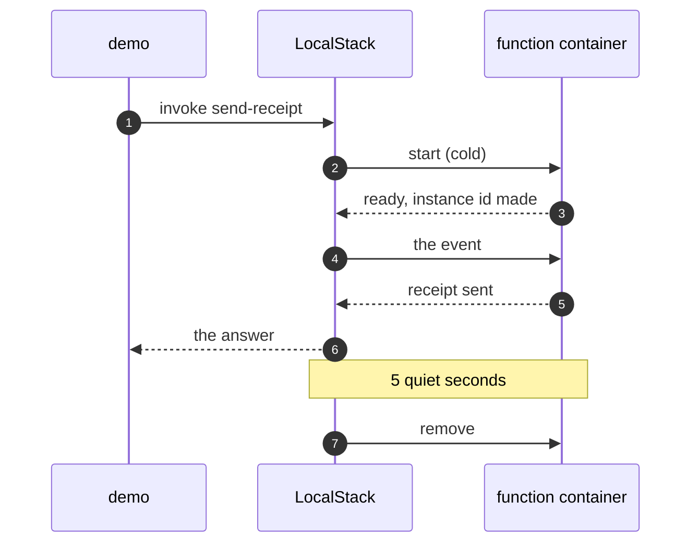

# Serverless with LocalStack Pattern — Sequence Diagram

Written for a listener with the screen off.

Say it in words. The demo asks the Lambda API to invoke the receipt function. There is no warm copy, so LocalStack starts a container from the Python runtime image, which takes several hundred milliseconds. The function runs once at start, making its instance id, and then handles the event. The answer comes back. Five quiet seconds later, LocalStack removes the container.

Mermaid source

The load-bearing sentence: **the platform starts and removes the container, and the function only handles the event.**
