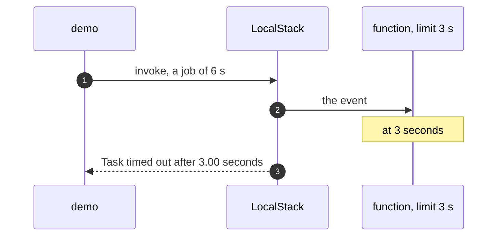

# Serverless with LocalStack Pattern — UML Sequence Diagrams

Four sequences.

## 1. A Time Limit

Mermaid source

```mermaid
sequenceDiagram
    autonumber
    participant D as demo
    participant L as LocalStack
    participant C as function, limit 3 s
    D->>L: invoke, a job of 6 s
    L->>C: the event
    Note over C: at 3 seconds
    L-->>D: Task timed out after 3.00 seconds
```

