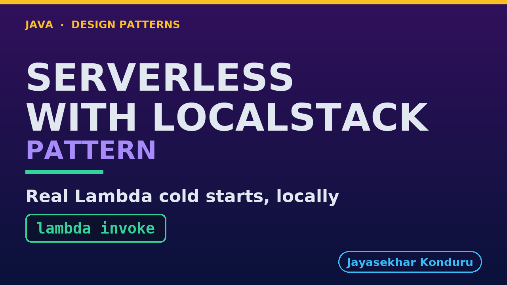

# YouTube — Serverless With Localstack Pattern

Everything needed to publish `video/serverless-with-localstack-pattern-explained.mp4`. Copy the fields straight out of this file.

Chapter timings are generated from the video's `.srt`. Re-run `python3 docs/make_youtube_docs.py serverless-with-localstack` after any change to the narration, or they will be wrong.

## Title

```
Serverless with LocalStack
```

26 characters — under the 60 YouTube shows before truncating in search results.

## Description

The first two lines are what a viewer sees above the fold, so they carry the hook rather than the boilerplate.

```
Learn the Serverless pattern in Java with AWS Lambda running on LocalStack, using the same online store. We upload a real function once, send five orders at the same time and watch five real containers start, then watch them disappear when the platform goes quiet, like taxis pulling in for a crowd and driving away afterwards. We hear a real cold start, a function that forgets what it knew between calls, and a job stopped at its time limit. We finish with the honest price of all three.

CHAPTERS
00:00 Introduction
01:02 The Partner Project
01:28 Before The First Line
02:02 A Machine That Is Always On
02:20 A Function Per Event
02:39 Scale Out, And Back To Zero
02:56 The Cold Start
03:15 No Memory Between Calls
03:39 The Bill
04:15 The Verdict
04:34 How To Recognise It
04:50 Where You Have Met This
05:03 What Was Used
05:16 What Is Real Here
05:33 When This Is Too Much
05:45 Thanks for Watching

SOURCE CODE, WRITTEN NOTES AND AN INTERACTIVE ANIMATION
https://github.com/jk-boot-up/java-design-patterns/tree/main/gradle-java/architectural-design-patterns/serverless-with-localstack-pattern

WHAT YOU NEED FIRST
Java 21 and a working knowledge of classes and interfaces. No prior design-pattern knowledge is assumed. The full prerequisites are in docs/prerequisites.md in the repository.
```

## Chapters

YouTube renders these as chapters only if there are at least three and the first is at `00:00`.

```
00:00 Introduction
01:02 The Partner Project
01:28 Before The First Line
02:02 A Machine That Is Always On
02:20 A Function Per Event
02:39 Scale Out, And Back To Zero
02:56 The Cold Start
03:15 No Memory Between Calls
03:39 The Bill
04:15 The Verdict
04:34 How To Recognise It
04:50 Where You Have Met This
05:03 What Was Used
05:16 What Is Real Here
05:33 When This Is Too Much
05:45 Thanks for Watching
```

## Tags

```
serverless, aws lambda, localstack, design patterns, java design patterns, gang of four, java 21, software design, clean code, object oriented design, java tutorial, ecommerce, programming tutorial
```

197 characters, under YouTube's 500 limit.

## Thumbnail



**Upload `docs/thumbnail.png`** — 1280×720, the size YouTube recommends, generated by `docs/make_thumbnails.py`. It is deliberately not the same image as the video's opening frame: a thumbnail is judged at about 360 pixels wide in a search result, so this one carries only the pattern name, one line of promise and one short piece of code, each set large enough to survive the shrink.

`video/poster.png` is the 1920×1080 opening frame, produced by the video build. It stays in the repository as the title card; it is not what gets uploaded.

YouTube will not pick the thumbnail up on its own — upload it under **Details → Thumbnail → Upload file**. A custom thumbnail requires a verified channel.

## Upload checklist

- [ ] Upload `video/serverless-with-localstack-pattern-explained.mp4` (1080p, H.264, 30 fps, AAC 48 kHz — already YouTube's recommended settings, no re-encode needed)
- [ ] Set the video language to **English** first, or the subtitle option may not appear
- [ ] Add subtitles: *Video elements → Add subtitles → Upload file → With timing* → `video/serverless-with-localstack-pattern-explained.srt`
- [ ] Upload `docs/thumbnail.png` as the thumbnail — do not let YouTube auto-pick a frame
- [ ] Paste the title, description and tags from above
- [ ] Add to the **Java Design Patterns** playlist, in learning order
- [ ] Wait for 1080p processing before sharing the link — code slides are unreadable at 360p

## Cards and end screen

End screen links to whichever pattern video goes up next — set it at upload time rather than assuming an order.

Add a card partway through pointing at the playlist, so a viewer who arrives at this pattern from search can find the rest of the series.

## Runtime

Approximately 06:26, narrated at 145 words per minute.
