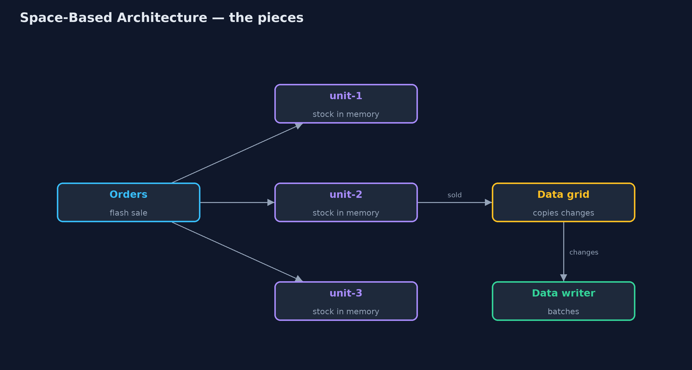
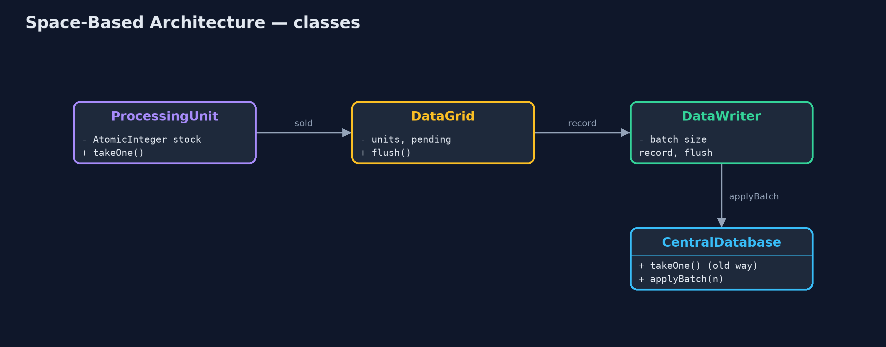

# Space-Based Architecture Pattern

```
src/main/java/com/jk/explore/spacebased/
├── CentralDatabase.java  Without the pattern: one database that every app server asks, one query at a time, 5 ms each
├── DataGrid.java         Keeps the units' copies in step: every change is queued, then copied to every other unit and handed to the database writer
├── DataWriter.java       Brings the database up to date in the background, a batch at a time, so no order ever waits for it
├── ProcessingUnit.java   The pattern's building block: a copy of the app with its own in-memory copy of the data it needs
└── SpaceBasedDemo.java   The five acts: everyone waits on one database, processing units with the data in memory, replication, the database kept up to date in the background, and the bill
```

**Give every copy of the application its own in-memory copy of the data, keep the copies in step through a data grid, and update the database in the background, so no request waits for it.**

Space-based architecture is a style for systems with huge, sudden load, such
as ticket sales or flash sales, where a central database would be the
bottleneck. The application runs as several processing units, and each unit
keeps the data it needs in its own memory. Units answer requests from memory;
every change is copied to the other units through a data grid, and a data
writer brings the database up to date in the background, in batches.

Add units and the system handles more load, because nothing in the request
path is shared. The price is that the copies can disagree for a moment, and
recent changes can be lost if a unit crashes.

## The idea in everyday terms

Think of pop-up stalls at a festival, all selling the same T-shirts. Each
stall keeps its own tally of stock and serves its own queue. The stalls radio
each sale to the others every few minutes, and head office updates its books
overnight. Nobody queues for head office. But two stalls can both sell the
last large T-shirt before the radio message gets through.

## The scenario

The online store runs a kettle flash sale. Three app servers handle the
orders, and every order checks and updates the stock in one central
database, 5 milliseconds a query, one at a time. Adding more app servers did
not help: every order still queued for the same database.

## Run

```bash
./gradlew run
```

The demo tells the story in 5 acts, each printing exact numbers that the tests check:

| Act | What it shows |
| --- | --- |
| 1. One database for everyone | 300 orders through three app servers take over 1.4 s; six app servers still take over 1.4 s. |
| 2. Processing units | Three units with the stock in memory serve 300 orders in under 0.3 s without touching the database. |
| 3. The data grid | Before replication each unit shows 900 (only its own sales); after, every unit shows 700. |
| 4. The database catches up | The data writer brings the database to 700 in 3 batches of 100, not 300 writes; no customer waited. |
| 5. The bill | With one kettle left, two units both sell it before replication; stock ends at -1. |

## Test

```bash
./gradlew test
```

6 tests in `DemoRunsTest`, `SpaceBasedTest`. Every number the demo prints is asserted, and nothing depends on the clock, so every run gives the same result.

## Technologies and versions

| Technology | Version | Used for |
| --- | --- | --- |
| Java | 21 | the code (toolchain set in `build.gradle`) |
| Gradle | 9.2.1 (wrapper) | build and run, nothing to install |
| JUnit | 5.10.2 | the tests |
| videokit | repository tool | the narrated video and animation: Piper `en_US-amy-medium`, speed 0.8, longer pauses (the approved `amy-slow` voice) |

## Learning Material

| Document | What it is for |
| --- | --- |
| [Problem statement](docs/problem-statement.md) | the situation and what the project must show |
| [Prerequisites](docs/prerequisites.md) | what you need to know first |
| [Space-Based Architecture, explained](docs/space-based-pattern-explained.md) | the acts in prose |
| [Session guide](docs/session.md) | a one-hour lesson with exercises |
| [Animated walkthrough](docs/animation.html) | the acts step by step, narrated |
| [Spec](docs/spec.md) | what this project must be true of |

### The pattern in one picture

Units serve from memory; the grid copies changes; the writer updates the database.



### Where each piece sits

Units report to the grid; the grid feeds the writer.



### How the data moves

Answered at once; copied and saved later.


### Who calls whom, in order

The customer is answered before anything is copied.


### Video

`video/space-based-pattern-explained.mp4` (with `.m4a` audio and `.srt` subtitles) is built by `video/build_video.sh`. Rendered media is not committed.

## What it costs

- **Copies can disagree for a moment.** Two units sold the last kettle before the grid caught up; stock ended at -1.
- **Recent changes can be lost.** A unit that crashes before the grid copies its sales loses them.
- **Complex to run.** Data grids, replication and background writers are hard to build and operate; products exist for a reason.

## When this is too much

For ordinary load, one database and a few app servers are far simpler and
always consistent. Space-based architecture is for extreme, spiky load where
a short delay in consistency is acceptable, and never for money that must not
be wrong even for a moment.

## Where you have already met this

- In-memory data grids such as Hazelcast, Apache Ignite and Oracle Coherence.
- Ticketing and flash-sale systems.
- The "tuple space" idea from JavaSpaces, where the name comes from.

## Where this sits

This project is in [architectural-design-patterns](..), next to
[Cell-Based Architecture](../cell-based-pattern), another way to scale by
splitting a system into independent copies.
