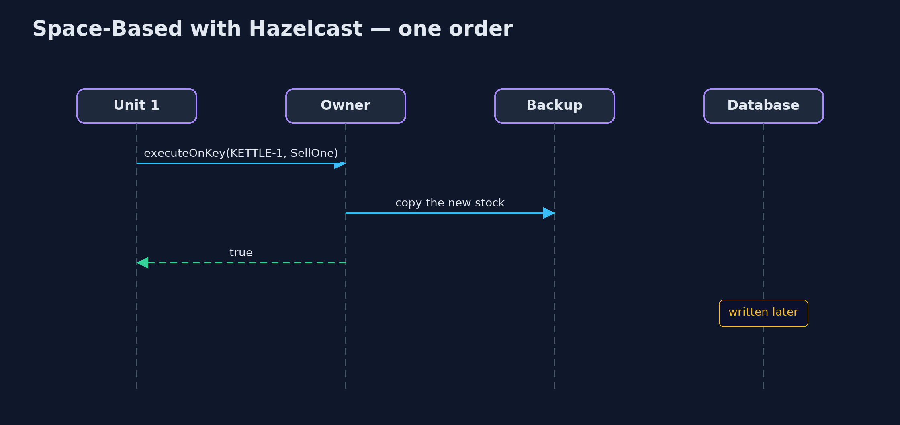

# Space-Based Architecture with Hazelcast Pattern

```
src/main/java/com/jk/explore/spacehazelcast/
├── Grid.java                     Three processing units, each a real Hazelcast cluster member running in this program, joined over the local network
├── HazelcastSpaceBasedDemo.java  The five acts, with three real Hazelcast members as the processing units
├── SellOne.java                  Sells one item, run by Hazelcast on the member that owns the key, one at a time for that key: two units cannot both sell the last kettle
├── SlowDatabase.java             The shop's database, standing in for a real one: every write takes 5 ms, one at a time
└── StockStore.java               Hazelcast's bridge to the database
```

**Keep the shop's stock in a real Hazelcast data grid spread across three processing units, sell with an entry processor that runs on the key's owner, write the database behind the scenes, and survive a unit crashing.**

This is the framework version of the Space-Based Architecture pattern. The
plain Java version, a separate project in this category, gives each
processing unit its own copy of the data and copies sales between them. Here
Hazelcast, a real in-memory data grid, holds the data: three Hazelcast
members, started inside the demo with nothing else installed, form a cluster,
and the stock is split across them with a backup copy of every entry.

Three Hazelcast features answer the plain version's open problems. An entry
processor runs "sell one" on the member that owns the item, one at a time, so
two units can no longer both sell the last kettle. Backups mean a crashed unit
loses nothing. And write-behind writes the database later, in the background,
keeping only the latest value.

## The idea in everyday terms

Think of a busy market with several stalls sharing one stock of goods.
Instead of every stall running to the warehouse for each sale, the goods are
spread among the stalls, each item looked after by one stall, with a partner
stall keeping a note of it in case the first closes. A clerk updates the
warehouse ledger at the end of each hour, not after every sale.

## The scenario

The online store's flash sale sends hundreds of kettle orders a second. Every
order used to update the stock in the database, which handles one write at a
time, so adding more app servers only made more of them queue for the same
database.

## Run

Nothing to install beyond a Java 21 JDK: Hazelcast runs embedded, and the demo
starts three cluster members inside one program, joined over the local
network.

```bash
./gradlew run
```

The demo tells the story in 5 acts, each printing exact numbers that the tests check:

| Act | What it shows |
| --- | --- |
| 1. One database for everyone | 300 kettle orders, each written to a database that takes 5 ms per write, take over 1.4 s; more app servers only queue for the same database. |
| 2. Stock in the grid | Three Hazelcast members form a cluster; 300 orders spread over them take under 1 s, with 0 database writes during the orders. |
| 3. One grid, not three copies | Every unit reads 700; each key has one owner and a backup, so there are no copies to keep in step. |
| 4. Write-behind | The database reaches 700 after at most 3 writes for 300 sales, because write-behind keeps only the latest value. |
| 5. The last kettle, a crash, and the bill | Two customers on two units try for the last kettle: sold 1 of 2. Unit 3 crashes and KETTLE-1 is still 700 from its backup. |

## Test

```bash
./gradlew test
```

1 tests in `DemoRunsTest`. Every result the demo prints is asserted, with three real Hazelcast members started inside the test. Timings are printed as thresholds, and the wait for the database is a bounded poll.

## What the simulation got right, and what it left out

The plain Java version got the idea right: keep the data in memory in each
processing unit, keep the database out of the request path, and write it in
the background. It also showed the two dangers: copies that disagree for a
moment let two units sell the last kettle, and a unit that crashes before its
sales are copied loses them. What it left out is how a real data grid removes
both. Hazelcast gives every key one owner, so there are no copies to
disagree; an entry processor sells on the owner, one at a time, so only one of
two buyers gets the last kettle; a backup copy on another member takes over
when a unit crashes; and write-behind coalesces three hundred updates into a
few database writes.

## Technologies and versions

| Technology | Version | Used for |
| --- | --- | --- |
| Java | 21 | the code (toolchain set in `build.gradle`) |
| Gradle | 9.2.1 (wrapper) | build and run, nothing to install |
| JUnit | 5.10.2 | the tests |
| Hazelcast | 5.7.0 (embedded) | the data grid: partitioned map, backups, entry processors, write-behind |
| videokit | repository tool | the narrated video and animation: Piper `en_US-amy-medium`, speed 0.8, longer pauses (the approved `amy-slow` voice) |

## Learning Material

| Document | What it is for |
| --- | --- |
| [Dependencies](docs/dependencies.md) | what the framework and infrastructure are, and why they are here |
| [Problem statement](docs/problem-statement.md) | the situation and what the project must show |
| [Prerequisites](docs/prerequisites.md) | what you need to know first |
| [Space-Based Architecture with Hazelcast, explained](docs/space-based-with-hazelcast-pattern-explained.md) | the acts in prose |
| [Session guide](docs/session.md) | a one-hour lesson with exercises |
| [Animated walkthrough](docs/animation.html) | the acts step by step, narrated |
| [Spec](docs/spec.md) | what this project must be true of |

### The pattern in one picture

Orders go to the grid; the database is written behind.


### Where each piece sits

A grid, a sale, and a store.


### How the data moves

Run on the owner, one at a time.


### Who calls whom, in order

The sale runs where the data lives.



### Video

`video/space-based-with-hazelcast-pattern-explained.mp4` (with `.m4a` audio and `.srt` subtitles) is built by `video/build_video.sh`. Rendered media is not committed.

## What it costs

- **Memory everywhere.** Every unit holds its share of the data, and a backup of another's.
- **A cluster to run.** Members must find each other, be sized, upgraded and watched.
- **Write-behind can lose the latest.** If the whole grid stops before write-behind runs, the last sales never reach the database.

## When this is too much

If the database keeps up with the load, a normal app with a database is far
simpler. Space-based designs pay off for bursts of load that a single
database cannot absorb, such as flash sales and ticket releases.

## Where you have already met this

- Hazelcast, Apache Ignite and Oracle Coherence data grids.
- Ticket-booking and trading systems that keep hot data in a grid.
- Caches with write-behind to a database.

## Where this sits

This project is in [architectural-design-patterns](..). It is the framework
version of the plain Java Space-Based Architecture project in the same
category, which is left unchanged.
