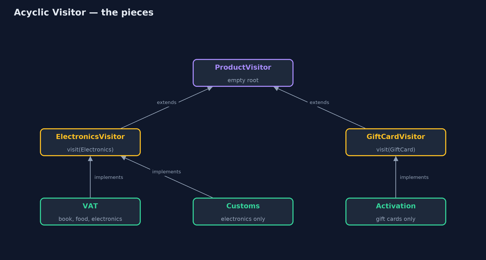
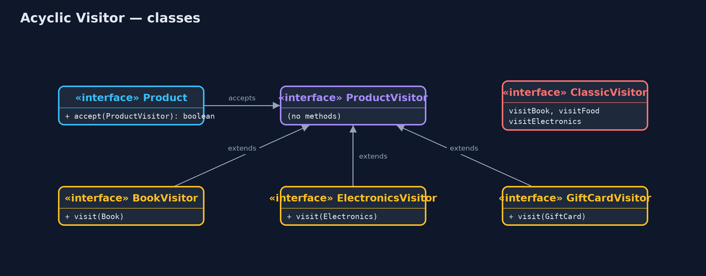
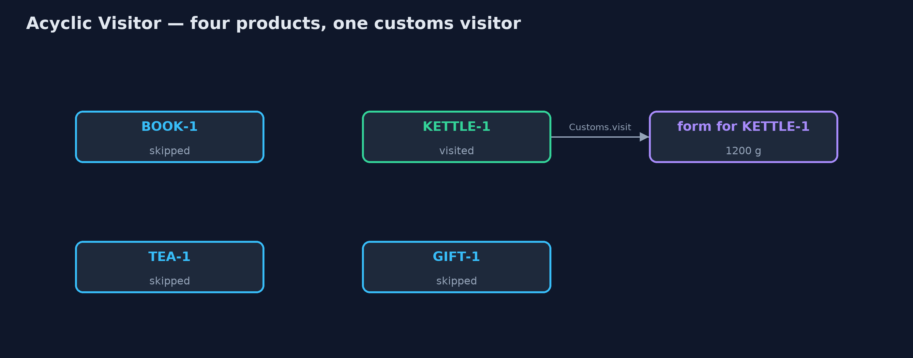
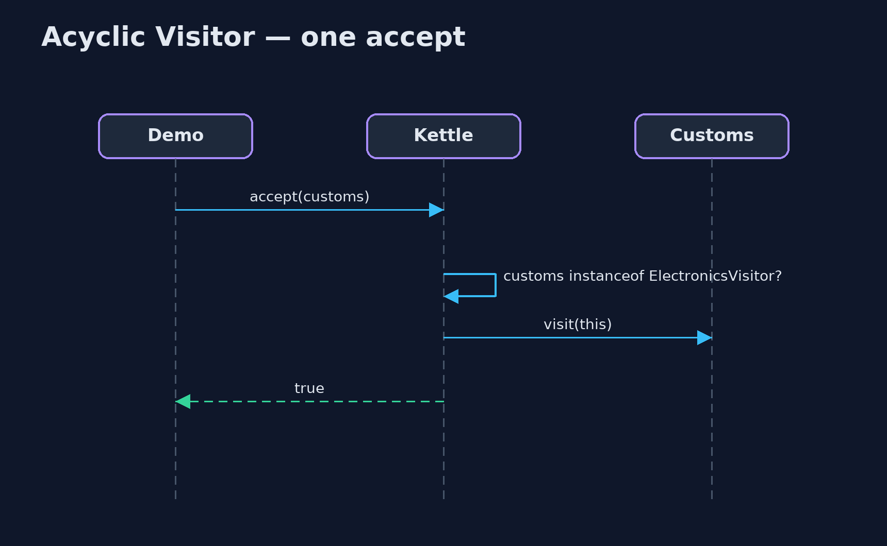

# Acyclic Visitor Pattern

```
src/main/java/com/jk/explore/acyclicvisitor/
├── AcyclicVisitorDemo.java  The five acts: the classic visitor, the acyclic visitor, a new product type, a visitor for one type, and the bill
├── ClassicVisitor.java      Without the pattern: the classic visitor names every product type, so every visitor must handle every type
├── ProductVisitor.java      The pattern's root: an empty interface every visitor wears
├── Products.java            The catalogue's product types
└── Visitors.java            The shop's visitors
```

**Give every product type its own tiny visitor interface, so each visitor handles only the types it cares about and a new type changes nothing that already exists.**

Acyclic Visitor is a variation of the Visitor pattern. A visitor is an
operation, such as working out VAT, kept outside the classes it works on. In
the classic Visitor, one visitor interface has a method for every type, so
every visitor must handle every type, and adding a type means changing the
interface and every visitor. The types depend on the visitor, and the visitor
depends on every type: a dependency cycle.

The acyclic version breaks the cycle. The root visitor interface is empty.
Each type gets its own one-method visitor interface, and each visitor
implements only the ones it cares about. A new type adds a new small interface,
and nothing that already exists has to change.

## The idea in everyday terms

Think of a hotel where staff wear a small badge for each language they speak.
A guest who speaks Italian looks for the Italian badge. Nobody is expected to
speak every language, and when the hotel starts welcoming Japanese guests, it
hands out a new badge to the staff who learn Japanese. Nobody else has to
change a thing.

## The scenario

The online store's catalogue has books, food and electronics. Operations such
as VAT and customs forms were written as classic visitors, each with a method
for every product type. The customs visitor had two empty methods just to
satisfy the interface. Then the shop started selling gift cards.

## Run

```bash
./gradlew run
```

The demo tells the story in 5 acts, each printing exact numbers that the tests check:

| Act | What it shows |
| --- | --- |
| 1. The classic visitor | ClassicVisitor has 3 methods, one per type; VAT is £6.00; customs has 2 empty methods; a gift card cannot be accepted. |
| 2. The acyclic visitor | One tiny visitor interface per type; the VAT visitor implements three of them and still works out £6.00. |
| 3. A new product type | Gift cards arrive with their own GiftCardVisitor; the VAT visitor skips GIFT-1 and the new activation visitor handles it. |
| 4. A visitor for one type | The customs visitor wears only ElectronicsVisitor and handles 1 of 4 products: a form for the 1200 g kettle. |
| 5. The bill | A VAT visitor that forgot FoodVisitor still compiles; tea is silently skipped at run time. One extra interface per type. |

## Test

```bash
./gradlew test
```

11 tests in `AcyclicVisitorTest`, `DemoRunsTest`. Every number the demo prints is asserted, and nothing depends on the clock, so every run gives the same result.

## Technologies and versions

| Technology | Version | Used for |
| --- | --- | --- |
| Java | 21 | the code (toolchain set in `build.gradle`) |
| Gradle | 9.2.1 (wrapper) | build and run, nothing to install |
| JUnit | 5.10.2 | the tests |
| videokit | repository tool | the narrated video and animation: Piper `en_US-amy-medium`, speed 0.8, longer pauses (the approved `amy-slow` voice) |

## Learning Material

| Document | What it is for |
| --- | --- |
| [Problem statement](docs/problem-statement.md) | the situation and what the project must show |
| [Prerequisites](docs/prerequisites.md) | what you need to know first |
| [Acyclic Visitor, explained](docs/acyclic-visitor-pattern-explained.md) | the acts in prose |
| [Session guide](docs/session.md) | a one-hour lesson with exercises |
| [Animated walkthrough](docs/animation.html) | the acts step by step, narrated |
| [Spec](docs/spec.md) | what this project must be true of |

### The pattern in one picture

Visitors wear only the small interfaces they need; products check before letting them in.



### Where each piece sits

The root names no product, so products depend only on their own small interface.



### How the data moves

Only the product whose interface the visitor wears lets it in.



### Who calls whom, in order

The product checks the badge, then visits.



### Video

`video/acyclic-visitor-pattern-explained.mp4` (with `.m4a` audio and `.srt` subtitles) is built by `video/build_video.sh`. Rendered media is not committed.

## What it costs

- **Mistakes found at run time.** A visitor that forgets an interface still compiles; the product is silently skipped.
- **One more interface per type.** Four product types means four small visitor interfaces.
- **A type check in every accept.** Each product asks "do you handle me?" with `instanceof` before visiting.

## When this is too much

When the set of types is fixed and every operation handles every type, the
classic Visitor gives compiler checks for free. And in modern Java, a sealed
interface with a `switch` over its records does the same job with even less
code. Acyclic Visitor is for type lists that keep growing, where most
operations only care about some of the types.

## Where you have already met this

- Robert C. Martin's description of Acyclic Visitor in "Pattern Languages of Program Design 3".
- Plug-in systems where each plug-in says which file types or events it can handle.
- Event listeners that implement only the listener interfaces for the events they care about.

## Where this sits

This project is in [behavioural](..), next to the classic
[Visitor](../visitor-pattern), which it adapts.
