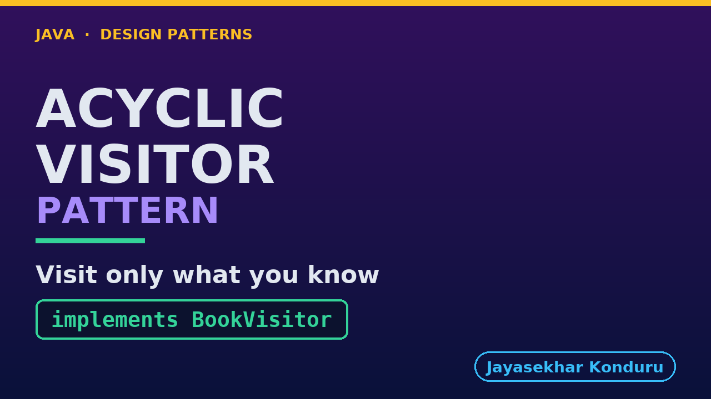

# YouTube — Acyclic Visitor Pattern

Everything needed to publish `video/acyclic-visitor-pattern-explained.mp4`. Copy the fields straight out of this file.

Chapter timings are generated from the video's `.srt`. Re-run `python3 docs/make_youtube_docs.py acyclic-visitor` after any change to the narration, or they will be wrong.

## Title

```
Acyclic Visitor
```

15 characters — under the 60 YouTube shows before truncating in search results.

## Description

The first two lines are what a viewer sees above the fold, so they carry the hook rather than the boilerplate.

```
Acyclic Visitor pattern in Java, explained with an online store catalogue of books, food and electronics, and later gift cards, where visitors work out VAT and customs forms. A visitor is an operation kept outside the classes it works on; in the acyclic version each type gets its own tiny visitor interface, so a new type changes nothing that already exists, like hotel staff wearing one badge per language they speak. We see what goes wrong with the classic visitor, fix it, add a product type without touching old code, and write a visitor for just one type. We finish with the bill.

CHAPTERS
00:00 Introduction
01:25 The Scenario
01:59 Act One — The classic visitor
02:44 Act Two — The acyclic visitor
03:28 Act Three — A new product type
04:06 Act Four — A visitor for one type
04:32 Act Five — The bill
04:59 The Pattern
05:31 Who Does What
06:01 Where You Have Seen It
06:28 When To Use It
06:56 Thanks for Watching

SOURCE CODE, WRITTEN NOTES AND AN INTERACTIVE ANIMATION
https://github.com/jk-boot-up/java-design-patterns/tree/main/gradle-java/behavioural/acyclic-visitor-pattern

WHAT YOU NEED FIRST
Java 21 and a working knowledge of classes and interfaces. No prior design-pattern knowledge is assumed. The full prerequisites are in docs/prerequisites.md in the repository.
```

## Chapters

YouTube renders these as chapters only if there are at least three and the first is at `00:00`.

```
00:00 Introduction
01:25 The Scenario
01:59 Act One — The classic visitor
02:44 Act Two — The acyclic visitor
03:28 Act Three — A new product type
04:06 Act Four — A visitor for one type
04:32 Act Five — The bill
04:59 The Pattern
05:31 Who Does What
06:01 Where You Have Seen It
06:28 When To Use It
06:56 Thanks for Watching
```

## Tags

```
acyclic visitor, visitor pattern, behavioural patterns, open closed principle, java, design patterns, java design patterns, gang of four, java 21, software design, clean code, object oriented design, java tutorial, ecommerce, programming tutorial
```

246 characters, under YouTube's 500 limit.

## Thumbnail



**Upload `docs/thumbnail.png`** — 1280×720, the size YouTube recommends, generated by `docs/make_thumbnails.py`. It is deliberately not the same image as the video's opening frame: a thumbnail is judged at about 360 pixels wide in a search result, so this one carries only the pattern name, one line of promise and one short piece of code, each set large enough to survive the shrink.

`video/poster.png` is the 1920×1080 opening frame, produced by the video build. It stays in the repository as the title card; it is not what gets uploaded.

YouTube will not pick the thumbnail up on its own — upload it under **Details → Thumbnail → Upload file**. A custom thumbnail requires a verified channel.

## Upload checklist

- [ ] Upload `video/acyclic-visitor-pattern-explained.mp4` (1080p, H.264, 30 fps, AAC 48 kHz — already YouTube's recommended settings, no re-encode needed)
- [ ] Set the video language to **English** first, or the subtitle option may not appear
- [ ] Add subtitles: *Video elements → Add subtitles → Upload file → With timing* → `video/acyclic-visitor-pattern-explained.srt`
- [ ] Upload `docs/thumbnail.png` as the thumbnail — do not let YouTube auto-pick a frame
- [ ] Paste the title, description and tags from above
- [ ] Add to the **Java Design Patterns** playlist, in learning order
- [ ] Wait for 1080p processing before sharing the link — code slides are unreadable at 360p

## Cards and end screen

End screen links to whichever pattern video goes up next — set it at upload time rather than assuming an order.

Add a card partway through pointing at the playlist, so a viewer who arrives at this pattern from search can find the rest of the series.

## Runtime

Approximately 07:47, narrated at 145 words per minute.
