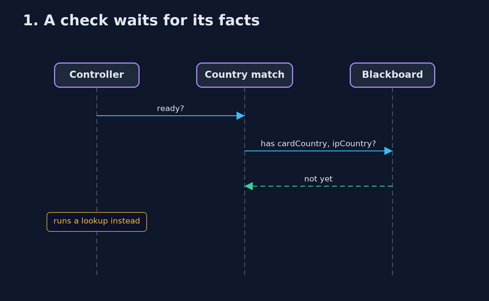
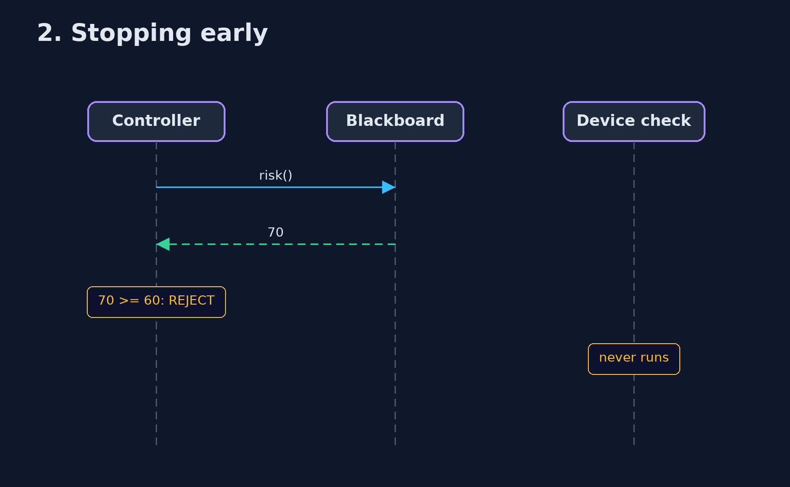

# Blackboard Pattern — UML Sequence Diagrams

## 1. 1. A check waits for its facts

Country match is not ready until both countries are posted.

## 2. 2. Stopping early

The expensive check is never asked.

