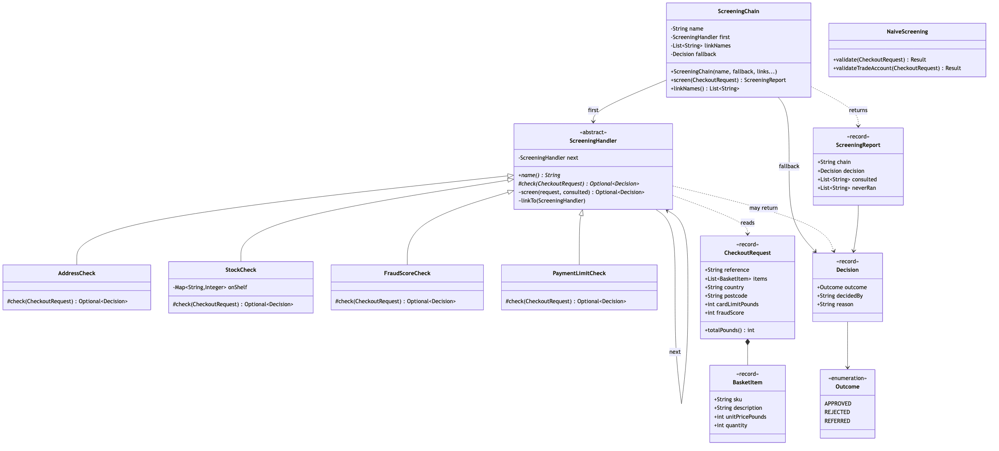

# Chain of Responsibility Pattern

Demonstrates the Behavioural **Chain of Responsibility** design pattern using
the screening an online shop runs before it accepts an order as an example.

Nine classes, and four of them are the checks. If you read one file, read
`ScreeningHandler` — it is about twenty lines and it is the entire pattern.

- `ScreeningHandler` — the abstract link, and the whole pattern. It holds one
  field, the successor, and declares one method for subclasses to write:
  `check`, returning `Optional<Decision>`. Empty means *no opinion, pass it
  on*; a present `Decision` means *I am answering, and the chain stops here*.
  The walk itself, `screen`, is written once and is `final`, so the bug the
  textbook version invites — a handler that declines and forgets to call the
  successor — cannot be written here.
- `AddressCheck` / `StockCheck` / `FraudScoreCheck` / `PaymentLimitCheck` —
  one check each, and nothing else. `FraudScoreCheck` is the one worth reading
  twice: it has three answers, rejecting above 80, referring between 55 and 79,
  and saying nothing below that. A link stops the chain whenever it is willing
  to take responsibility for the answer, and the chain does not care which of
  the three answers it was.
- `ScreeningChain` — the wiring. It links the handlers, hands the request to
  the first one, and then does nothing until somebody answers: there is no loop
  in it, no index, and no count. The constructor requires a fallback and there
  is no constructor without one, so falling off the end of the chain is a
  policy somebody named rather than a silent `null`.
- `Decision` / `Outcome` — the answer, carrying who made it, so "which check
  rejected this?" is a field rather than a substring of a message.
- `ScreeningReport` — the evidence. It names the link that answered **and** the
  links that never ran, which is the observable difference between this pattern
  and a validator that collects every problem with a request.
- `NaiveScreening` — the trap, kept for contrast. Four checks welded into one
  method with an early return on each. Its happy path is correct on purpose:
  the argument is ordering and drift, not incompetence. The payment check sits
  above the fraud check, so a suspicious order is reported as a card problem;
  and `validateTradeAccount` is the copy made to drop the card limit, which
  lost the address check on the way.
- `CheckoutRequest` / `BasketItem` — the supporting types. Amounts are whole
  pounds held as `int`, because a money type would be one more class to learn
  before reaching the pattern. The request is immutable, so no link can change
  what the next one sees.
- `CheckoutScreeningDemo` — runnable entry point that shows the welded method
  giving the wrong reason, the same four checks as links, what stopping early
  actually saves, the same links in a different order reproducing the naive
  bug, and a second policy built by leaving one link out.

## Run

```bash
./gradlew run
```

```text

========================================================================
1.  The naive method — four checks in one method
========================================================================
R2001   £329    GB   SW1A 1AA card limit £250    fraud 92
   -> REJECTED — card limit exceeded, please try another card
      Both things are true. It reports the card, because the card is
      checked first. The customer tries another card and it works.

R2003   £90     GB   M1 4BT   card limit £2000   fraud 64
   -> ACCEPTED — nothing objected
      A score of 64 is the case a person should look at. The return
      type is a boolean, so there is nowhere to put that answer.

R2004   £360    GB   JE2 3AB  card limit £0      fraud 20
   -> ACCEPTED — nothing objected
      The trade method is a copy with the card check removed on
      purpose — and the address check removed by accident.
      Two desks are on their way to Jersey.

========================================================================
2.  The same checks, as a chain
========================================================================
standard: address -> stock -> fraud-score -> payment-limit -> [APPROVED by default]

R2001   £329    GB   SW1A 1AA card limit £250    fraud 92
   -> REJECTED  by fraud-score    risk score 92 is at or above the 80 limit
              never ran: payment-limit

R2002   £45     GB   JE3 8QX  card limit £2000   fraud 10
   -> REJECTED  by address        no courier covers JE3 8QX
              never ran: stock, fraud-score, payment-limit

R2003   £90     GB   M1 4BT   card limit £2000   fraud 64
   -> REFERRED  by fraud-score    risk score 64 is in the 55-79 review band
              never ran: payment-limit

   Read the "never ran" lines. Those are not checks that were
   ignored — they are checks that never executed. No warehouse
   query, no risk model call, nothing billed for.

========================================================================
3.  Same links, one different order
========================================================================
payment-before-fraud: address -> stock -> payment-limit -> fraud-score -> [APPROVED by default]

R2001   £329    GB   SW1A 1AA card limit £250    fraud 92
   -> REJECTED  by payment-limit  £329 is above the £250 card limit
              never ran: fraud-score

   That is the naive answer again, reproduced exactly — and the only
   thing that changed is the order of two arguments. The naive
   behaviour was never wrong. It was a setting you could not change
   without editing the checks.

========================================================================
4.  A different policy, by wiring only
========================================================================
trade-account: address -> stock -> fraud-score -> [APPROVED by default]

R2004   £360    GB   JE2 3AB  card limit £0      fraud 20
   -> REJECTED  by address        no courier covers JE2 3AB
              never ran: stock, fraud-score

   The card check is left out because trade accounts are invoiced.
   Nothing was copied, so nothing could drift, so the address check
   is still there — and Jersey is caught.

And the honest note: if your checks and their order never change,
write the four ifs. This pattern earns its keep when the order is
something you need to change without editing any of the checks.
```

Section 1 and section 2 screen the same order, R2001. The difference between
them is the whole project: in the first, the answer depends on which check the
author happened to type first; in the second, the answer depends on a line of
wiring you can print, test and change. Section 3 then proves the point by
reproducing the naive answer with the same four link classes and a different
argument order.

## Test

```bash
./gradlew test
```

21 tests across three classes.

`ScreeningChainTest` asserts the things only a chain gives you. A test that
merely checks the *outcome* — "a Jersey order is rejected" — passes against
`NaiveScreening` just as happily and proves nothing about the pattern. These
assert that a link behind the decision **never ran**, that the same links in two
orders give two different answers, that an unclaimed order gets the fallback the
wiring named, and that a link declared inside the test file joins a chain
compiled before it existed.

`ChecksTest` makes the isolation argument by omission: every test builds one
check and asks it one question. The fraud tests pass an ordinary address and a
card with plenty of headroom, because `FraudScoreCheck` does not look at either.

`NaiveScreeningTest` pins the bugs as *passing* tests — the card message that
hides a risk score of 92, the grey band that gets accepted because a boolean has
nowhere else to put it, and the Jersey order the standard method catches and the
copied trade method does not.

## Learning Material

Start here if you are new to the pattern — the docs are ordered as a
learning path.

| Document | What it covers |
| --- | --- |
| [`docs/prerequisites.md`](docs/prerequisites.md) | What to know and install before you start |
| [`docs/problem-statement.md`](docs/problem-statement.md) | The problem the pattern solves, and why the naive approach hurts |
| [`docs/chain-of-responsibility-pattern-explained.md`](docs/chain-of-responsibility-pattern-explained.md) | The pattern itself, the code walked through, pitfalls, and comparisons |
| [`docs/class-diagram.md`](docs/class-diagram.md) | Static structure — and why it is also the Decorator diagram |
| [`docs/uml-diagram.md`](docs/uml-diagram.md) | Runtime call flow, including the calls that never happen |
| [`docs/animation.html`](docs/animation.html) | Animated, step-by-step walkthrough — open in a browser. Optional narration via the **Narration** button |
| [`docs/session.md`](docs/session.md) | A 60-minute guided session plan for teaching it |
| [`docs/youtube.md`](docs/youtube.md) | Title, description, chapters and thumbnail for publishing the video |
| [`docs/thumbnail.png`](docs/thumbnail.png) | The 1280×720 image to upload as the YouTube thumbnail |
| [`docs/spec.md`](docs/spec.md) | The project specification — problem, code, video and publishing quality bar. Also as [`spec.html`](docs/spec.html) |
| [`video/`](video/) | A narrated video, plus the script and build pipeline |

### The pattern in one picture



### Video

`video/chain-of-responsibility-pattern-explained.mp4` — 1080p, narrated. An
audio-only version is alongside it. See [`video/README.md`](video/README.md) to
rebuild or re-record it.
