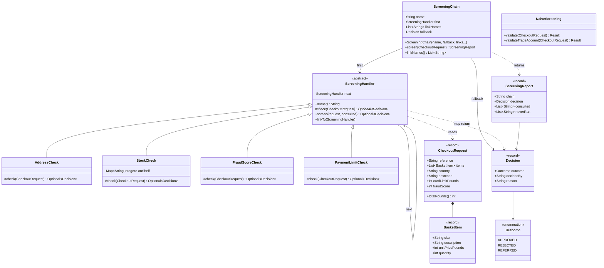

# Class Diagram

Nine classes, and four of them are the checks. If you want to understand the
pattern and nothing else, read `ScreeningHandler` — it is about twenty lines and
everything else on this diagram exists to give it something to do.

## The Self-Reference Is The Pattern

`ScreeningHandler --> ScreeningHandler : next` is the one line of this diagram
worth covering the rest to look at. Everything else is supporting cast.

That single field is what turns four independent checks into a sequence. It is
also the pattern's one structural cost: because a link holds its own successor,
a link **instance** belongs to exactly one chain. Build a second chain from
fresh instances rather than reusing the ones already wired into the first.

## What Each Link Does

| Link | Rejects | Refers | Says nothing when |
| --- | --- | --- | --- |
| `AddressCheck` | unserved country or postcode | — | the courier goes there |
| `StockCheck` | any line short on the shelf | — | every line can be picked |
| `FraudScoreCheck` | score ≥ 80 | score 55–79 | score < 55 |
| `PaymentLimitCheck` | total above the card limit | — | the card covers it |

Read the last column. **Saying nothing is the normal case**, and it is what makes
the chain composable: a link with no opinion is invisible to everything
downstream of it.

Note also that a link is not obliged to reject. It stops the chain whenever it
is willing to take responsibility for the answer — the outcome inside the
decision is none of the chain's business, which is why `FraudScoreCheck` can
return `REFERRED` without the base class knowing such an answer exists.

## This Is Also The Decorator Diagram

An abstract class, a `next` field of its own type, several concrete subclasses.
Draw the same picture for `decorator-pattern`'s pricing wrappers and you will not
be able to tell them apart, because structurally they are the same.

The difference does not appear until you read `screen`: the call to `next` is
inside an `if`. In a decorator it is not.
[`chain-of-responsibility-pattern-explained.md`](chain-of-responsibility-pattern-explained.md)
turns that into a question you can ask before writing either one.
