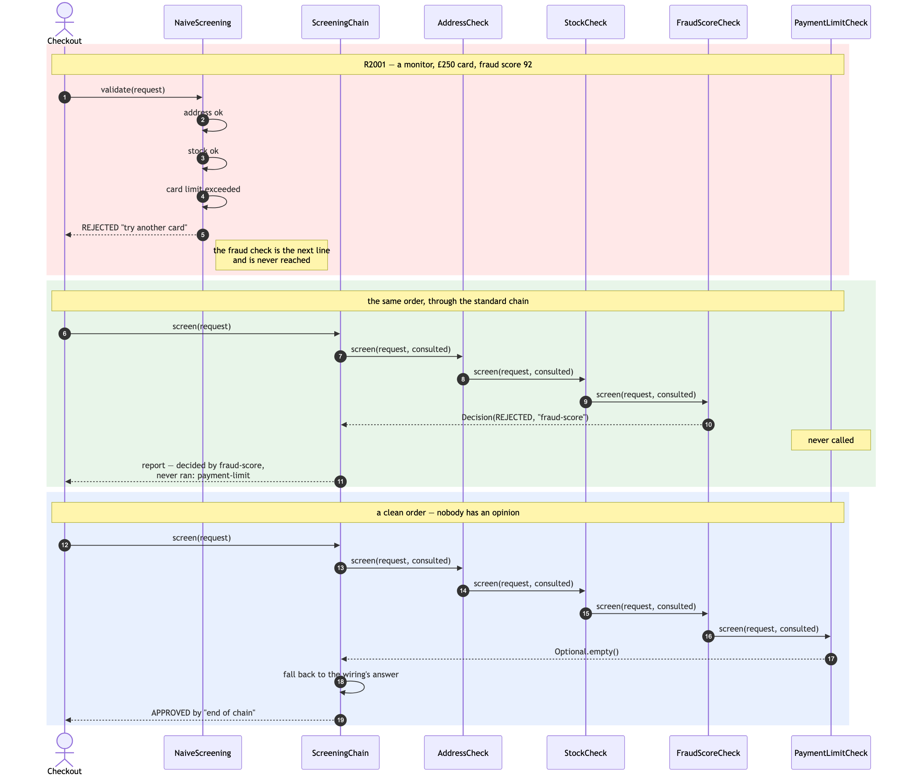
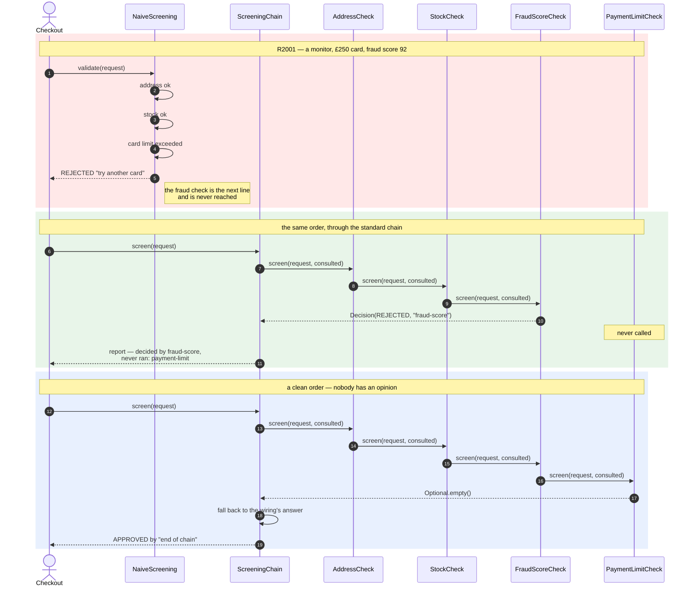
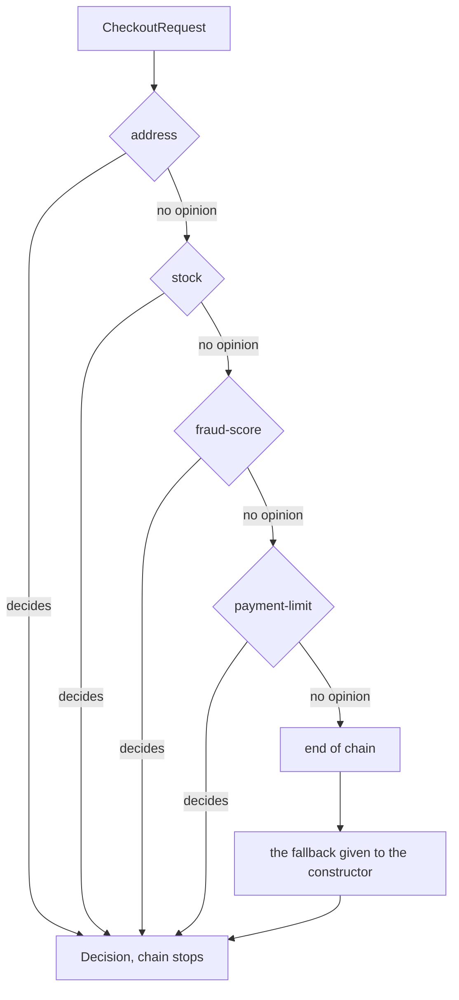
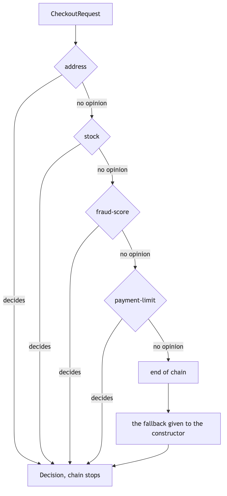

# Sequence Diagram

The interaction, which for a behavioural pattern matters more than the class
diagram. Three blocks: the naive method answering the wrong question, the same
order through a chain, and an order nobody claims.

## Reading It

**The red block** is the bug from
[`problem-statement.md`](problem-statement.md). Nothing goes wrong in it. Every
step is correct, the method returns a true statement about the card, and the
customer is told something actionable. The failure is the step that is missing,
and it is missing because of where it was typed.

**The green block** is the same four checks in the same program, and the
interesting arrow is the one that is not drawn. `PaymentLimitCheck` appears in
the diagram and is never called. That absence is the pattern: work behind a
decision is not merely irrelevant, it does not happen, and the report says so.

Note also that `Chain` appears twice and only twice — at the start and at the
end. It hands the order to the first link and does not see it again until
somebody answers. There is no loop in `ScreeningChain.screen`, no index, and no
knowledge of how many links exist.

**The blue block** is the liability. Four links, all consulted, none of them
willing to decide. Something still has to answer the customer, and what that
something says was chosen at wiring time — it is the `fallback` argument, and
there is no constructor without one.

## The Same Interaction, As A Flow

Where the order can go, once, per screening:

Every diamond has the same two exits, which is why the links can be reordered
without any of them being edited: no link knows which diamond it is.

