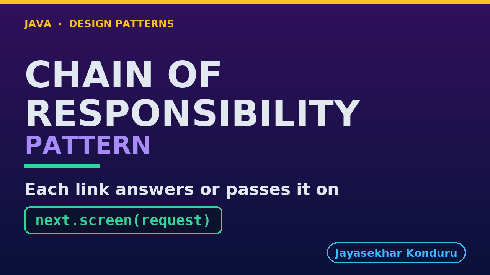

# YouTube — Chain Of Responsibility Pattern

Everything needed to publish `video/chain-of-responsibility-pattern-explained.mp4`. Copy the fields straight out of this file.

Chapter timings are generated from the video's `.srt`. Re-run `python3 docs/make_youtube_docs.py chain-of-responsibility` after any change to the narration, or they will be wrong.

## Title

```
Chain of Responsibility - Checkout Screening
```

44 characters — under the 60 YouTube shows before truncating in search results.

## Description

The first two lines are what a viewer sees above the fold, so they carry the hook rather than the boilerplate.

```
Learn the Chain of Responsibility design pattern in Java 21 by building the checks an online store runs before it accepts an order — is the address deliverable, can the warehouse pick it, what does the fraud model think, does the card cover the total. We start with the problem: four checks welded into one method with an early return on each, where the card check sits above the fraud check, so an order scoring 92 is rejected as "card limit exceeded, please try another card" (they do, and it ships); a boolean answer with nowhere to put the review band the risk model exists to produce; and a copy made for trade accounts that quietly lost the address check and sent two desks to an island no courier serves. Then we build the pattern: one small class per check, a chain with no loop in it that cannot be constructed without saying what "nobody decided" means, a link with three answers instead of two, and a report naming both the link that answered and the links that never ran at all. Swapping two arguments reproduces the naive answer exactly, and the trade flow becomes the standard flow with one link left out rather than a copied method. Also covers what really separates Chain of Responsibility from Decorator when the two have identical class diagrams — one question you can ask before writing either — and the honest cost: the policy is no longer readable in one place, and you now need a report to answer "which link rejected this?". No prior design-pattern knowledge needed. Full source code and written notes are in the repository.

CHAPTERS
00:00 Introduction
00:53 The Scenario
01:30 Look Closely at One Order
02:06 The Naive Approach — Four Checks, One Method
02:55 Why That Hurts
03:39 The Chain of Responsibility Pattern
04:11 An Analogy
04:51 The Roles
05:27 The Handler — And the Line That Is Written Once
06:17 The Chain — And What Silence Means
07:01 Two Links — And the One With Three Answers
07:44 The Tests — Asserting What Did NOT Happen
08:27 Running It
09:18 What to Remember
10:26 Thanks for Watching

SOURCE CODE, WRITTEN NOTES AND AN INTERACTIVE ANIMATION
https://github.com/jk-boot-up/java-design-patterns/tree/main/gradle-java/behavioural/chain-of-responsibility-pattern

WHAT YOU NEED FIRST
Java 21 and a working knowledge of classes and interfaces. No prior design-pattern knowledge is assumed. The full prerequisites are in docs/prerequisites.md in the repository.
```

## Chapters

YouTube renders these as chapters only if there are at least three and the first is at `00:00`.

```
00:00 Introduction
00:53 The Scenario
01:30 Look Closely at One Order
02:06 The Naive Approach — Four Checks, One Method
02:55 Why That Hurts
03:39 The Chain of Responsibility Pattern
04:11 An Analogy
04:51 The Roles
05:27 The Handler — And the Line That Is Written Once
06:17 The Chain — And What Silence Means
07:01 Two Links — And the One With Three Answers
07:44 The Tests — Asserting What Did NOT Happen
08:27 Running It
09:18 What to Remember
10:26 Thanks for Watching
```

## Tags

```
chain of responsibility, handler chain java, validation pipeline, design patterns, java design patterns, gang of four, java 21, software design, clean code, object oriented design, java tutorial, ecommerce, programming tutorial
```

227 characters, under YouTube's 500 limit.

## Thumbnail



**Upload `docs/thumbnail.png`** — 1280×720, the size YouTube recommends, generated by `docs/make_thumbnails.py`. It is deliberately not the same image as the video's opening frame: a thumbnail is judged at about 360 pixels wide in a search result, so this one carries only the pattern name, one line of promise and one short piece of code, each set large enough to survive the shrink.

`video/poster.png` is the 1920×1080 opening frame, produced by the video build. It stays in the repository as the title card; it is not what gets uploaded.

YouTube will not pick the thumbnail up on its own — upload it under **Details → Thumbnail → Upload file**. A custom thumbnail requires a verified channel.

## Upload checklist

- [ ] Upload `video/chain-of-responsibility-pattern-explained.mp4` (1080p, H.264, 30 fps, AAC 48 kHz — already YouTube's recommended settings, no re-encode needed)
- [ ] Set the video language to **English** first, or the subtitle option may not appear
- [ ] Add subtitles: *Video elements → Add subtitles → Upload file → With timing* → `video/chain-of-responsibility-pattern-explained.srt`
- [ ] Upload `docs/thumbnail.png` as the thumbnail — do not let YouTube auto-pick a frame
- [ ] Paste the title, description and tags from above
- [ ] Add to the **Java Design Patterns** playlist, in learning order
- [ ] Wait for 1080p processing before sharing the link — code slides are unreadable at 360p

## Cards and end screen

End screen links to **Iterator Pattern**, the next video in the learning order.

Add a card partway through pointing at the playlist, so a viewer who arrives at this pattern from search can find the rest of the series.

## Runtime

Approximately 11:00, narrated at 145 words per minute.
