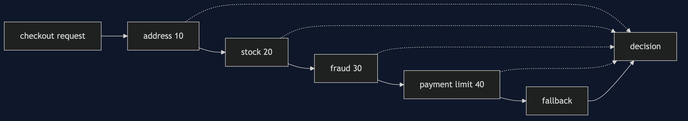
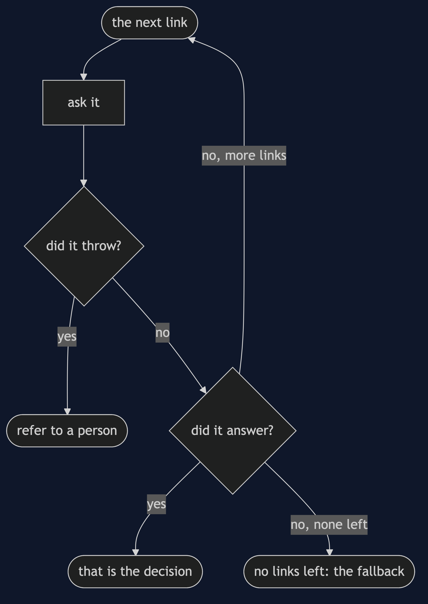
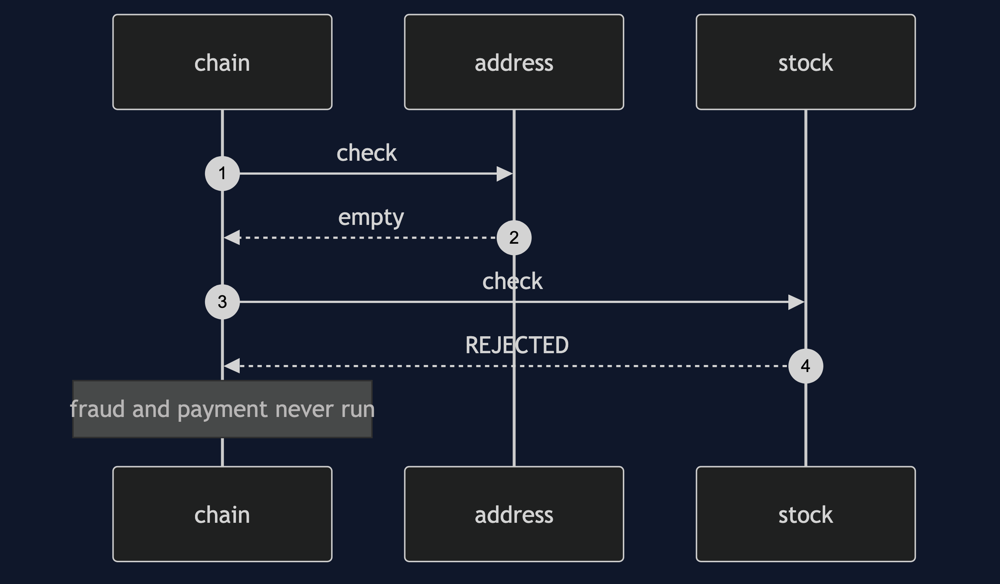
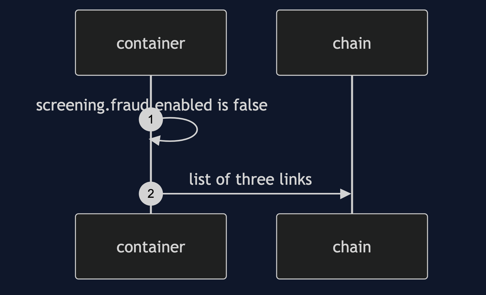

# Chain of Responsibility with Spring Pattern

```
src/main/java/com/jk/explore/chainspring/
├── ScreeningApplication.java     the Spring Boot entry point and the six acts
├── ScreeningCheck.java           the link
├── AddressCheck.java  StockCheck.java  FraudScoreCheck.java  PaymentLimitCheck.java
├── ScreeningChain.java           walks the injected list
└── CheckoutRequest.java  Decision.java  Outcome.java
```

**In Spring the links are beans and the container sorts them. The order lives in annotations, and a link can be dropped by a property.**

This project is the framework version of [Chain of Responsibility](../chain-of-responsibility-pattern). That project built the mechanism by hand. This one shows the same idea inside Spring Boot. It does not re-teach the pattern. It shows what Spring Boot adds, the failures that are its own, and what it costs.

## Run

```bash
./gradlew run
```

Six acts. The partner project, Chain of Responsibility, built the mechanism by hand. Here the same idea runs through Spring Boot, and every count comes from real output.

```
ONE. Spring builds the chain.
  order: [address, stock, fraud, payment-limit].
  the order comes from @Order numbers on four different classes.
TWO. Five requests.
  asha   APPROVED  by fallback       no check had an opinion
  erin   REJECTED  by address        the address does not exist
         never ran: [stock, fraud, payment-limit]
  ben    REJECTED  by stock          an item is out of stock
         never ran: [fraud, payment-limit]
  carol  REJECTED  by fraud          fraud score 90
         never ran: [payment-limit]
  dev    REFERRED  by payment-limit  over the single-payment limit
THREE. The order is the cost.
  paid fraud-service calls for five requests, cheap checks first, as @Order has it: 3.
  the same checks with the paid one first [fraud, address, stock, payment-limit]: 5.
FOUR. A link that throws.
  asha   REFERRED  by fraud          fraud check failed: fraud service unavailable
  the chain turned an exception into a referral, and the caller saw no error.
FIVE. Switched off by a property.
  order: [address, stock, payment-limit].
  carol  APPROVED  by fallback       no check had an opinion
  no code changed, and the risky customer is no longer stopped.
SIX. Nobody answers.
  asha   APPROVED  by fallback       no check had an opinion
  asha   REFERRED  by fallback       no check had an opinion
  the fallback is a named setting, screening.fallback, not an accident.
```

## Test

```bash
./gradlew test
```

2 test classes, 8 test methods, offline, with each Spring context started inside the test, and no server.

## Technologies and versions

| What | Version | Why it is here |
| --- | --- | --- |
| Java | 21 | The repository standard, via the Gradle toolchain block |
| Gradle | 9.2.1 | The wrapper in this directory; no separate install needed |
| Spring Boot | 4.1.1 | The container and its ordered list injection |
| JUnit 5 | 5.10.2 | Test runner |

See [`docs/dependencies.md`](docs/dependencies.md).

## Learning Material

| Document | What it covers |
| --- | --- |
| [`docs/problem-statement.md`](docs/problem-statement.md) | The partner's screening, and what is new |
| [`docs/chain-of-responsibility-with-spring-pattern-explained.md`](docs/chain-of-responsibility-with-spring-pattern-explained.md) | A chain the container orders |
| [`docs/class-diagram.md`](docs/class-diagram.md) | The types |
| [`docs/architecture-diagram.md`](docs/architecture-diagram.md) | Request, ordered links, decision |
| [`docs/data-flow-diagram.md`](docs/data-flow-diagram.md) | What a request meets, link by link |
| [`docs/sequence-diagram.md`](docs/sequence-diagram.md) | Written for a listener with the screen off |
| [`docs/uml-diagram.md`](docs/uml-diagram.md) | Four sequences |
| [`docs/animation.html`](docs/animation.html) | The six acts in a browser |
| [`docs/prerequisites.md`](docs/prerequisites.md) | What you need to know |
| [`docs/session.md`](docs/session.md) | A one-hour taught session |
| [`docs/spec.md`](docs/spec.md) | The generated specification |
| [`docs/youtube.md`](docs/youtube.md) | Title, description and chapters |
| [`docs/dependencies.md`](docs/dependencies.md) | What Spring Boot is, what it costs, and that skipping this project loses none of the pattern |

### The pattern in one picture


### Where each piece sits



### How one request moves



### Who calls whom, in order


### All four sequences






### Video

Built from [`video/scenes.py`](video/scenes.py) by
[`video/build_video.sh`](video/build_video.sh). The rendered file is not
committed; see the repository README for why.

## Where you have already met this

Servlet filters, Spring Security's filter chain, and validation pipelines.

## When this is too much

For two checks that never change, an if statement is clearer than a chain.

## Where this sits

This project pairs with [Chain of Responsibility](../chain-of-responsibility-pattern), and is a framework version in [`behavioural`](..).
