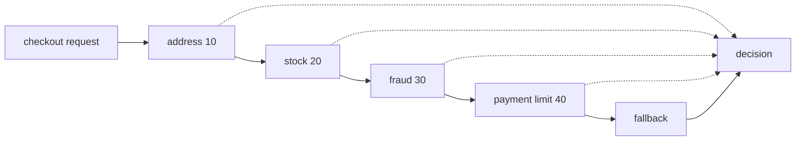

# Chain of Responsibility with Spring Pattern — Architecture Diagram

The container sorts the links. The chain walks them until one answers.

Mermaid source

```mermaid
flowchart LR
    R["checkout request"] --> A["address 10"]
    A --> S["stock 20"]
    S --> F["fraud 30"]
    F --> P["payment limit 40"]
    P --> B["fallback"]
    A -.-> D["decision"]
    S -.-> D
    F -.-> D
    P -.-> D
    B --> D
```

