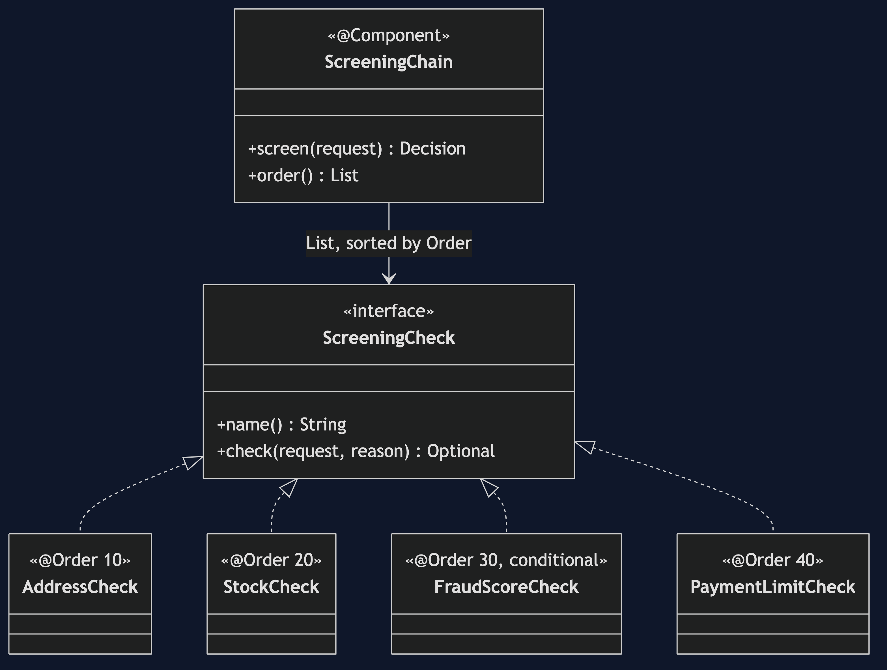
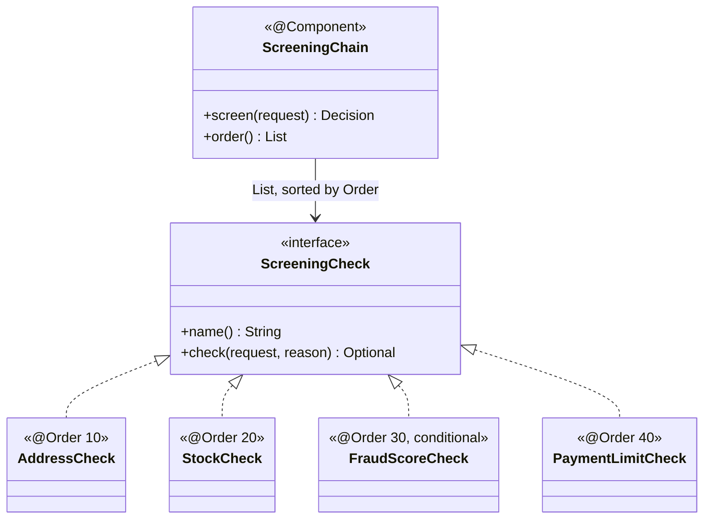

# Chain of Responsibility with Spring Pattern — Class Diagram

The links are beans. The chain walks the list Spring injects.

Mermaid source

```mermaid
classDiagram
    class ScreeningCheck {
        <<interface>>
        +name() String
        +check(request, reason) Optional
    }
    class AddressCheck {
        <<@Order 10>>
    }
    class StockCheck {
        <<@Order 20>>
    }
    class FraudScoreCheck {
        <<@Order 30, conditional>>
    }
    class PaymentLimitCheck {
        <<@Order 40>>
    }
    class ScreeningChain {
        <<@Component>>
        +screen(request) Decision
        +order() List
    }
    ScreeningCheck <|.. AddressCheck
    ScreeningCheck <|.. StockCheck
    ScreeningCheck <|.. FraudScoreCheck
    ScreeningCheck <|.. PaymentLimitCheck
    ScreeningChain --> ScreeningCheck : List, sorted by Order
```

