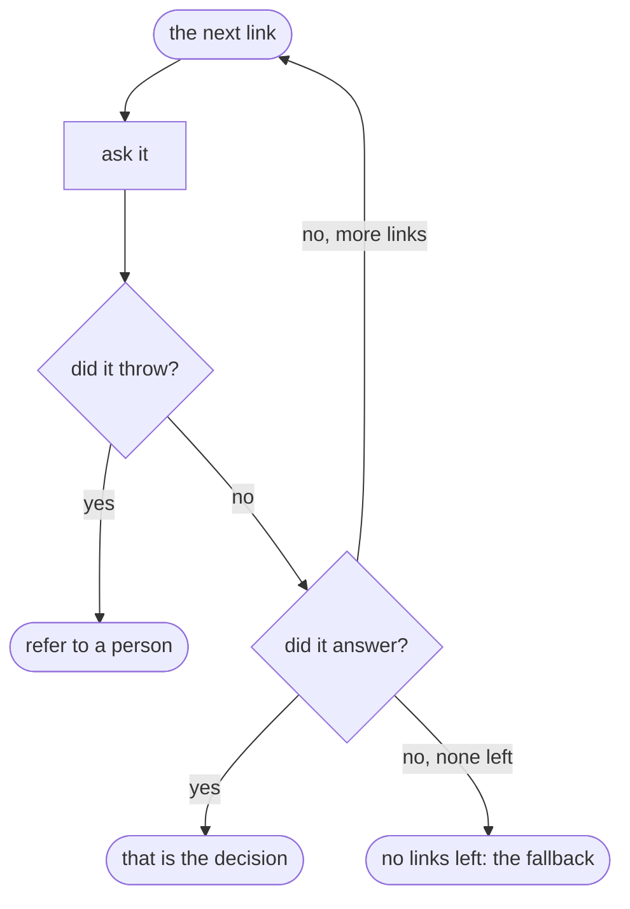

# Chain of Responsibility with Spring Pattern — Data Flow Diagram

What the walker does at each link.

Mermaid source

```mermaid
flowchart TD
    Next(["the next link"])
    Ask["ask it"]
    Threw{"did it throw?"}
    Ans{"did it answer?"}
    Refer(["refer to a person"])
    Done(["that is the decision"])
    Fall(["no links left: the fallback"])
    Next --> Ask --> Threw
    Threw -- yes --> Refer
    Threw -- no --> Ans
    Ans -- yes --> Done
    Ans -- no, more links --> Next
    Ans -- no, none left --> Fall
```

