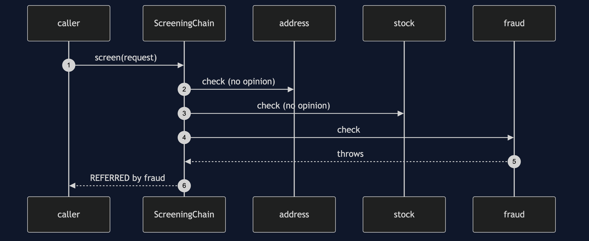
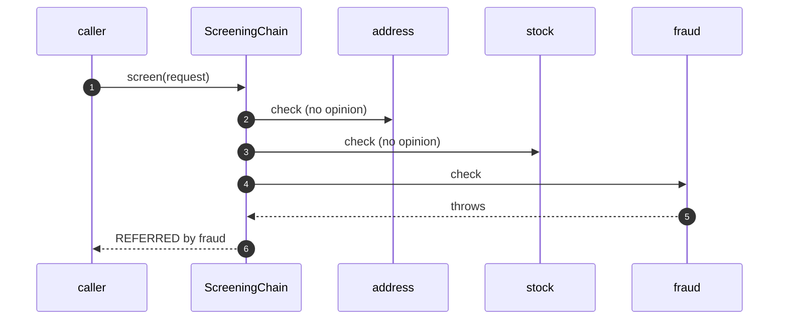

# Chain of Responsibility with Spring Pattern — Sequence Diagram

Written for a listener with the screen off.

Say it in words. A request comes in. The chain asks the address check, which has no opinion. It asks the stock check, which has no opinion. It asks the fraud check, which throws, because the service is down. The chain catches the exception and answers, referred, naming the fraud check. The payment limit check never runs.

Mermaid source

The load-bearing sentence: **the walker decides what a failing link means.**
