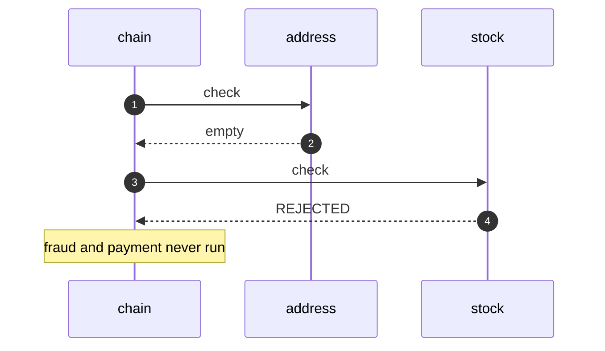
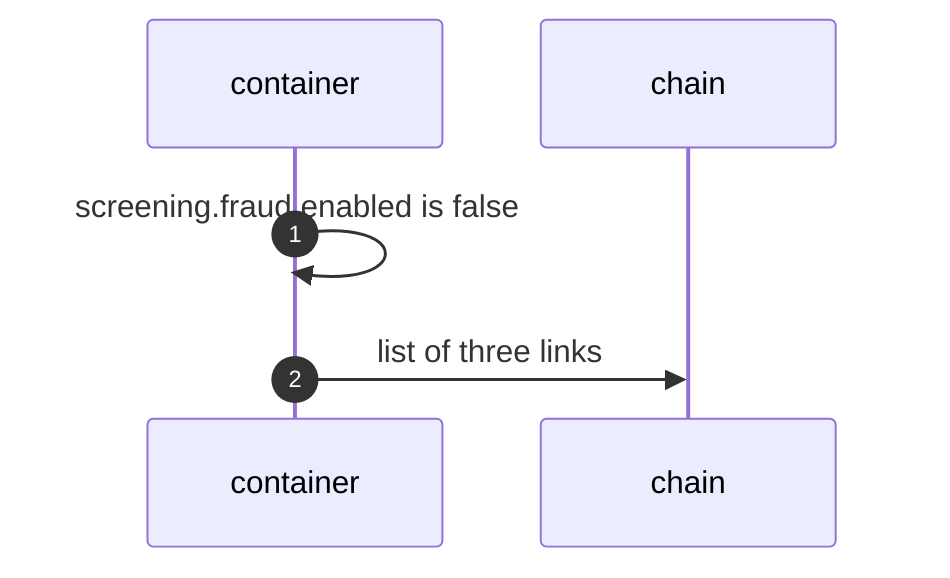

# Chain of Responsibility with Spring Pattern — UML Sequence Diagrams

Four sequences.

## 1. An Early Answer

Mermaid source

```mermaid
sequenceDiagram
    autonumber
    participant C as chain
    participant A as address
    participant S as stock
    C->>A: check
    A-->>C: empty
    C->>S: check
    S-->>C: REJECTED
    Note over C: fraud and payment never run
```

## 2. Fraud Switched Off

Mermaid source

```mermaid
sequenceDiagram
    autonumber
    participant C as container
    participant N as chain
    C->>C: screening.fraud.enabled is false
    C->>N: list of three links
```

