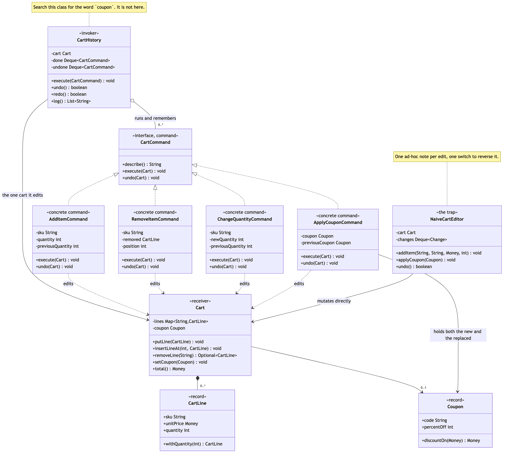
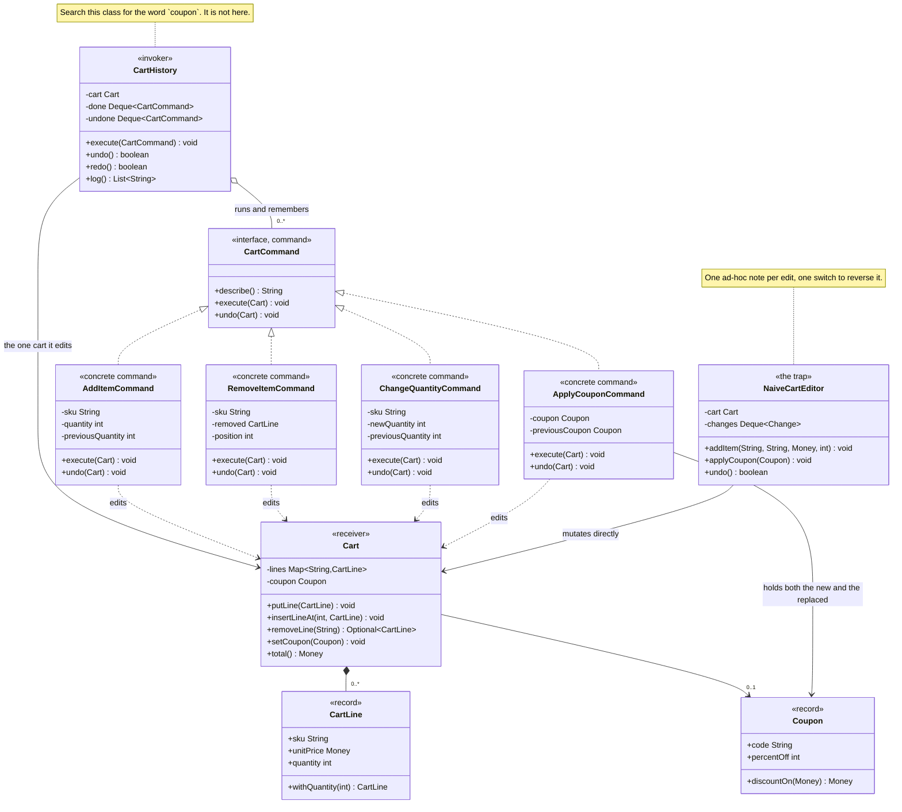

# Command Pattern — Class Diagram

Shows the static structure. `CartHistory` holds `CartCommand`s and knows
nothing about coupons or quantities — search the class for either word and it
is not there. `Cart` is the receiver and has never heard of a command. Only
the four concrete commands know both sides, and each knows only its own edit.
`NaiveCartEditor` is drawn alongside with its ad-hoc note and its `switch`,
which is exactly what the pattern is buying its way out of.

Mermaid source

## Notes

**The aggregation from `CartHistory` to `CartCommand` is the pattern.** The
invoker holds a stack of the interface and does exactly two things with an
element: execute it, undo it. A fifth kind of edit adds an implementation and
changes nothing here.

**`Cart` has no arrow pointing at a command.** The receiver is entirely
unaware it is being driven this way, which is what lets the same cart be
edited directly in a test, or by the naive editor, without any of it knowing.

**The private fields on the concrete commands carry the undo state**, and
they are the interesting part of the diagram. `previousQuantity`,
`previousCoupon`, `removed` and `position` are all things the command learns
*during* `execute` — not constructor arguments. A field the constructor does
not set is the visible sign of a command that captures state at run time,
which is the rule that keeps undo correct.

**`ApplyCouponCommand` points at `Coupon` twice over**, once for the coupon
it applies and once for the coupon it replaced. That second reference is the
whole difference between correct undo and a customer silently losing a
discount.

**The single arrow out of `NaiveCartEditor` is the cost, not the saving.** It
mutates the cart directly, so the only record of what happened is the private
note it keeps beside it — a structure that has to grow a field for every kind
of edit, and a `switch` case to match.

See [`uml-diagram.md`](uml-diagram.md) for an execute and an undo in
sequence, which is where the captured state becomes visible.
