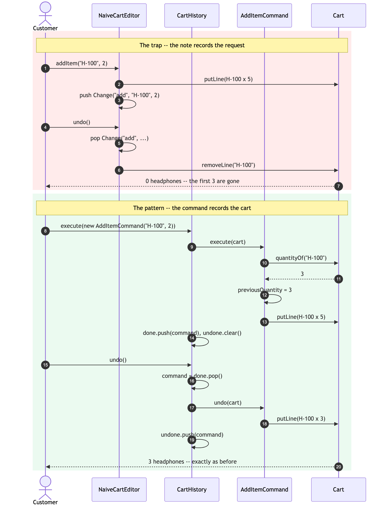
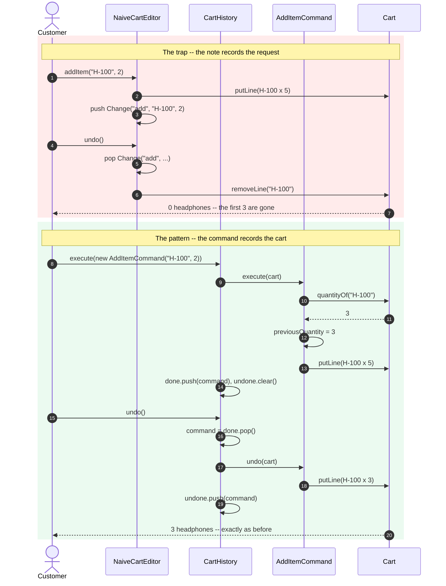

# Command Pattern — Sequence Diagram

Two runs of the same scenario: a customer who already has 3 headphones and a
`WELCOME10` coupon adds 2 more, applies a better coupon, and then undoes
twice.

The first half is the naive editor. The second half is the pattern. The
divergence is entirely in **what gets written down at step 3**.

Mermaid source

## Reading It

**Steps 1 to 7 — the naive run.** Everything here is reasonable. The editor
changes the cart, writes down what it was asked to do, and reverses it later
by reading that note. The note says `add 2 of H-100`, so undo removes H-100.
The cart had 3 before anybody asked for anything, and no one wrote that down.

**Steps 10 to 12 are the whole pattern.** `AddItemCommand` asks the cart what
is there *before* changing it, and keeps the answer. It is one line of code,
it happens inside `execute`, and it is the difference between the two halves
of this diagram.

**Step 14 — the invoker's bookkeeping.** `done.push` makes the edit undoable
and `undone.clear()` discards any redo branch, because taking a new action
makes the old future unreachable. Neither line mentions what kind of edit it
just ran.

**Step 17 — undo is a message to the command, not a decision by the
invoker.** `CartHistory` has no idea whether the cart is about to lose a
line, gain one, or change a coupon. It pops an object and sends it `undo`.

**Step 20** is the assertion in
`NaiveCartEditorTest.thePatternRestoresTheSameEdit`, and step 7 is the
assertion in `theNaiveEditorLosesTheEarlierQuantity` right above it. The two
tests sit next to each other on purpose.

## What Is Not Drawn

**The coupon half of the same story.** `ApplyCouponCommand` runs the
identical shape one step later: capture `previousCoupon` during `execute`,
restore it during `undo`. Drawing it twice would add nothing — which is
itself the point, since both commands were written independently and neither
knows the other exists.

**Redo.** It is `execute` again on the command popped off the other stack —
the same messages as steps 9 to 13, with the same capture happening again.

**Failure.** If a command throws inside `execute`, `CartHistory` never
reaches `done.push`, so the failed edit is not undoable. There is nothing to
draw, and that absence is the design.

See [`class-diagram.md`](class-diagram.md) for the static structure, and
[`animation.html`](animation.html) to step through the two stacks one message
at a time.
