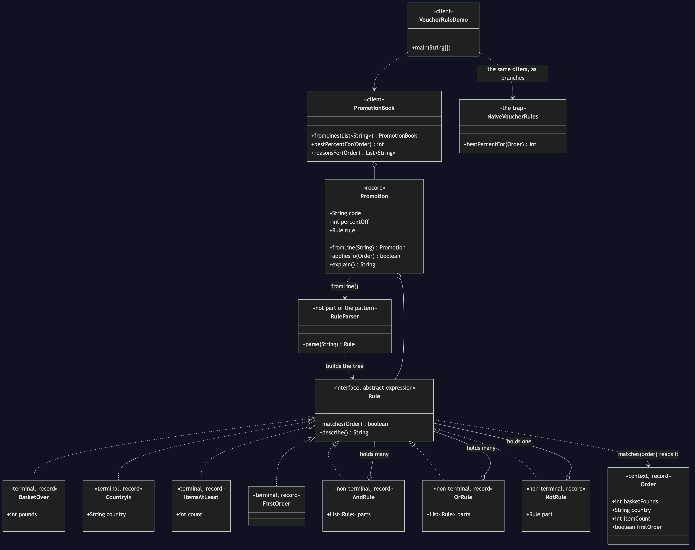

# Interpreter Pattern

Demonstrates the Behavioural **Interpreter** design pattern using an online
shop's promotion rules as an example. Marketing wants to launch an offer on
Friday; the pattern is what turns that from a code change into a line of text.

- `Rule` — the abstract expression. Two methods: `matches(Order)` and
  `describe()`. Every rule in the project is one of these, from the smallest to
  the largest, which is exactly what lets a big rule be built out of small ones.
- `BasketOver`, `CountryIs`, `ItemsAtLeast`, `FirstOrder` — the terminal
  expressions. Each is a leaf: one comparison, and no other rule inside it.
- `AndRule`, `OrRule`, `NotRule` — the non-terminal expressions. They hold
  other rules and answer by asking them. None of them knows how deep the tree
  below it goes, because none of them ever has to look.
- `Order` — the context: one order, and everything a rule may ask about. Its
  four accessors are also the whole vocabulary of the language.
- `RuleParser` — turns `"country is UK and basket over 50"` into a tree.
  Strictly speaking this is not part of the pattern; it is here because a rule
  language nobody can write in is not much of a language.
- `Promotion` and `PromotionBook` — a code, a percentage and a rule, read from
  a line of text. The book asks each promotion whether it applies; it contains
  no mention of countries, baskets or item counts anywhere.
- `NaiveVoucherRules` — the trap, kept for contrast. Every promotion as a
  hand-written Java branch, each one a copy of the one above it. Two of the
  copies are subtly wrong.
- `VoucherRuleDemo` — runnable entry point putting the same three orders
  through both.

## Run

```bash
./gradlew run
```

Which prints:

```text
=== the rules, as the shop wrote them ===
  SAVE10 (10% off) applies when country is UK and basket over 50
  SAVE15 (15% off) applies when country is UK and basket over 100
  FREESHIP (5% off) applies when country is UK and items at least 3

=== rules written as Java branches ===
  £120, UK, 4 items, returning shopper
      discount: 15%
  £120, US, 2 items, returning shopper
      discount: 15%
  £30, UK, 3 items, returning shopper
      discount: 0%
  the second order is overseas and gets 15% anyway,
  and the third one qualifies but is offered nothing.
  No exception was thrown for either.

=== the same rules, read as a language ===
  £120, UK, 4 items, returning shopper
      discount: 15%
      because SAVE10 (10% off) applies when country is UK and basket over 50
      because SAVE15 (15% off) applies when country is UK and basket over 100
      because FREESHIP (5% off) applies when country is UK and items at least 3
  £120, US, 2 items, returning shopper
      discount: 0%
  £30, UK, 3 items, returning shopper
      discount: 5%
      because FREESHIP (5% off) applies when country is UK and items at least 3

=== marketing wants one more, and it is Friday ===
  added: BIGBASKET | 20 | basket over 200 or items at least 10
  £90, UK, 12 items, returning shopper
      discount: 20%
  One line of text. No new class, and nothing recompiled.

=== and a rule with a typo in it ===
  refused: I do not understand "basket ovr 50"
  on Wednesday, when it is cheap — not at checkout on Friday.
```

## Test

```bash
./gradlew test
```

21 tests across 4 classes. `RuleTest` builds trees by hand, so the nesting is
visible in the test itself, and checks that a rule made of rules is used
exactly like a small one. `RuleParserTest` covers the grammar — that `and`
binds tighter than `or`, that `not` takes the condition after it, and that a
written rule survives a round trip through the tree unchanged, which is the
guarantee the audit log rests on. `PromotionBookTest` shows a promotion shape
nobody anticipated being added as one line of text. `NaiveVoucherRulesTest`
pins the two hand-written bugs in place rather than fixing them.

## Learning Material

Start here if you are new to the pattern — the docs are ordered as a
learning path.

| Document | What it covers |
| --- | --- |
| [`docs/prerequisites.md`](docs/prerequisites.md) | What to know and install before you start |
| [`docs/problem-statement.md`](docs/problem-statement.md) | The problem the pattern solves, and why the naive approach hurts |
| [`docs/interpreter-pattern-explained.md`](docs/interpreter-pattern-explained.md) | The pattern itself, the code walked through, pitfalls, and comparisons |
| [`docs/class-diagram.md`](docs/class-diagram.md) | Static structure |
| [`docs/uml-diagram.md`](docs/uml-diagram.md) | Runtime call flow |
| [`docs/animation.html`](docs/animation.html) | Animated, step-by-step walkthrough — open in a browser. Optional narration via the **Narration** button |
| [`docs/session.md`](docs/session.md) | A 60-minute guided session plan for teaching it |
| [`docs/youtube.md`](docs/youtube.md) | Title, description, chapters and thumbnail for publishing the video |
| [`docs/thumbnail.png`](docs/thumbnail.png) | The 1280×720 image to upload as the YouTube thumbnail |
| [`docs/spec.md`](docs/spec.md) | The project specification — problem, code, video and publishing quality bar. Also as [`spec.html`](docs/spec.html) |
| [`video/`](video/) | A narrated video, plus the script and build pipeline |

### The pattern in one picture



### Video

`video/interpreter-pattern-explained.mp4` — 1080p, narrated. An audio-only
version is alongside it. See [`video/README.md`](video/README.md) to
rebuild or re-record it.
