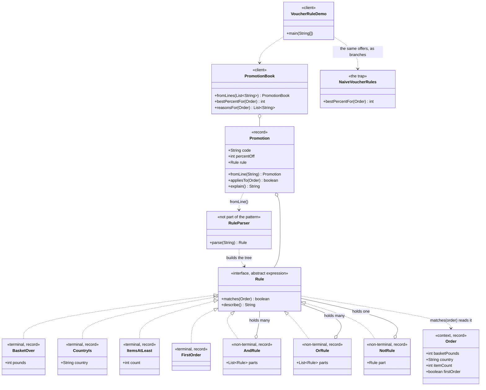

# Interpreter Pattern — Class Diagram

Shows the static structure: one interface, four leaves, three connectives, and
the order they are all asked about. The version that writes the same promotions
as Java branches is drawn alongside, and the difference between one growing
method and a family of tiny classes is the whole argument.

Mermaid source

## Notes

- `Rule` is the **abstract expression**, and it is the reason the picture works.
  Two methods, no fields, and every other rule class in the project is one of
  these. That is what lets a rule of any shape sit wherever a rule is expected.
- The four **terminal expressions** are the leaves. Each holds a value and one
  comparison, and none of them holds another `Rule` — look at the diagram and
  they have no line going back into `Rule` at all. `FirstOrder` is a record with
  no components, which costs nothing and gives it a free `equals`, so a test can
  compare two parsed trees for equality.
- The three **non-terminal expressions** are the only classes with an aggregation
  line back into `Rule`, and that single loop in the diagram is the recursion.
  `AndRule` holding `Rule` means it can hold another `AndRule`, or an `OrRule`,
  or a leaf — and it never learns which, because it only ever calls `matches`.
- **The tree is the sentence.** `country is UK and basket over 50` is not stored
  as a string anywhere; it is an `AndRule` holding a `CountryIs` and a
  `BasketOver`. `describe()` walks back down and rebuilds the words, which is why
  the audit log and the code the checkout obeys cannot drift apart.
- `Order` is the **context** — the thing a sentence is interpreted against. Every
  arrow into it comes from a terminal, because only leaves ask questions. Keeping
  it to four accessors keeps the language to four nouns.
- `RuleParser` is marked as not part of the pattern on purpose. Trees can be
  built by hand, and `RuleTest` does exactly that. The parser turns the pattern
  into a feature marketing can use, but the pattern is the tree.
- `PromotionBook` is a client and contains no mention of countries, baskets or
  item counts. It asks each promotion whether it applies. Every fact about *when*
  an offer applies lives in a line of text.
- `NaiveVoucherRules` is the same three promotions as hand-written branches, and
  it holds two copy-paste mistakes: SAVE15 never got the UK check written, so
  overseas orders take 15%, and FREESHIP inherited a `firstOrder()` test from a
  retired offer, so returning shoppers are offered nothing. Both are pinned by
  passing tests rather than fixed.
