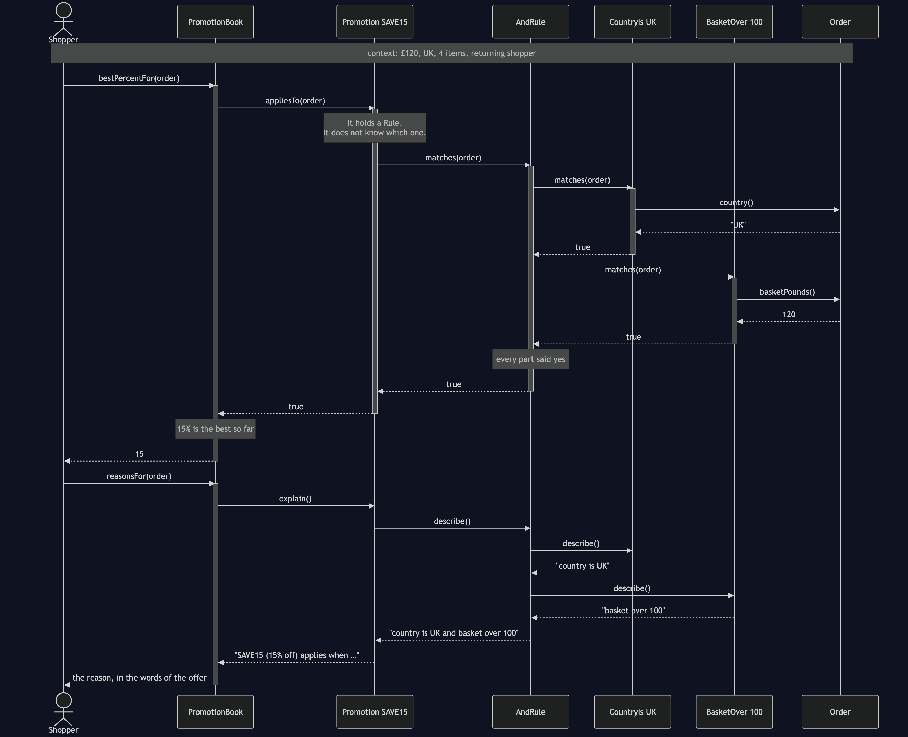
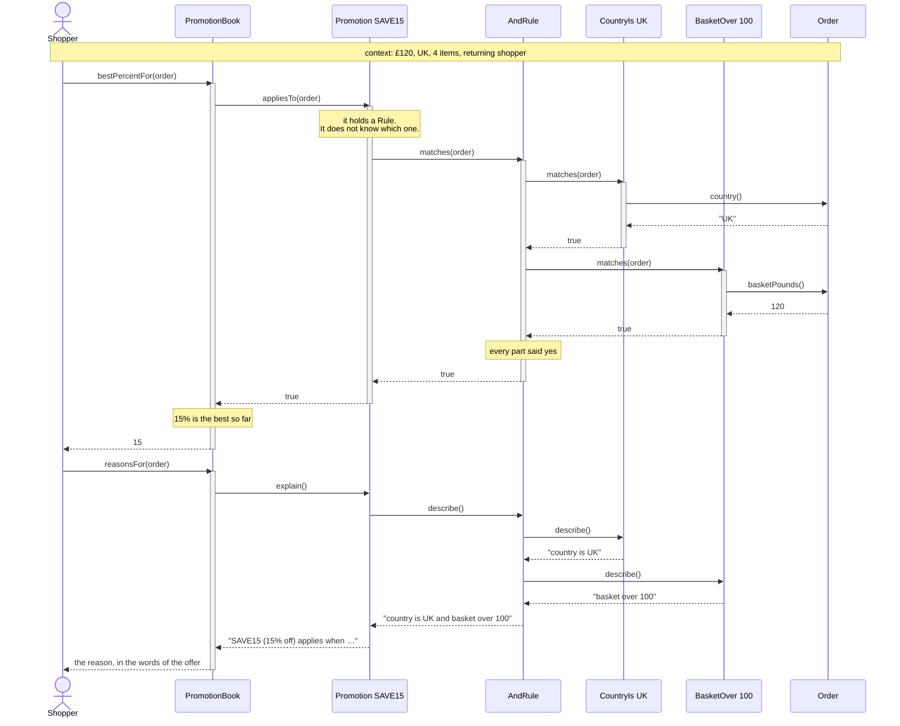

# Interpreter Pattern — UML Sequence Diagram

Shows the runtime interaction behind one evaluated rule. The order is £120 from
the UK with four items, and the promotion being checked is
`country is UK and basket over 100`. Follow how little each participant knows:
the book asks the promotion, the promotion asks the top of the tree, and the top
of the tree asks its parts.

Mermaid source

## Notes

- **Every arrow points downwards, and none points sideways.** The book talks to
  promotions, a promotion talks to its one rule, and a connective talks to its
  parts. No participant reaches past its own children, which is why a rule three
  levels deep needs no new code anywhere above it.
- **`AndRule` does not know who it asked.** The two `matches` calls out of it are
  the same call; that one of them landed on a country check and the other on a
  basket check is invisible to it. Replace either part with a whole nested
  `OrRule` and this diagram grows a branch without a single line changing.
- **Only leaves touch the context.** Every arrow into `Order` comes from a
  terminal. The connectives never read the order at all, which is what keeps them
  reusable across a language they know nothing about.
- **`matches` short-circuits.** `AndRule` returns `false` on the first part that
  says no, so on the US order the `CountryIs` check ends the evaluation and
  `BasketOver` is never asked. The diagram for that order is shorter, and that is
  the loop in `AndRule` doing it, not any cleverness in the parser.
- **The second half is the same walk, for words instead of a verdict.**
  `describe()` visits exactly the nodes `matches()` did and returns the sentence
  the offer was written in. Because it is rebuilt from the objects the checkout
  obeyed — not remembered from the line that was read in — the audit log cannot
  disagree with the decision.
- **The tree was built earlier, and once.** `RuleParser` appears nowhere in this
  diagram: parsing happened when the promotion was saved. A typo would have been
  refused then, on a Wednesday, rather than mispricing an order on Friday.
- Compare with `NaiveVoucherRules`: there is no diagram to draw. One method, a
  run of `if` statements, no participants and no messages — and no place for
  anything to explain itself, which is precisely why its two wrong answers came
  out silently.
