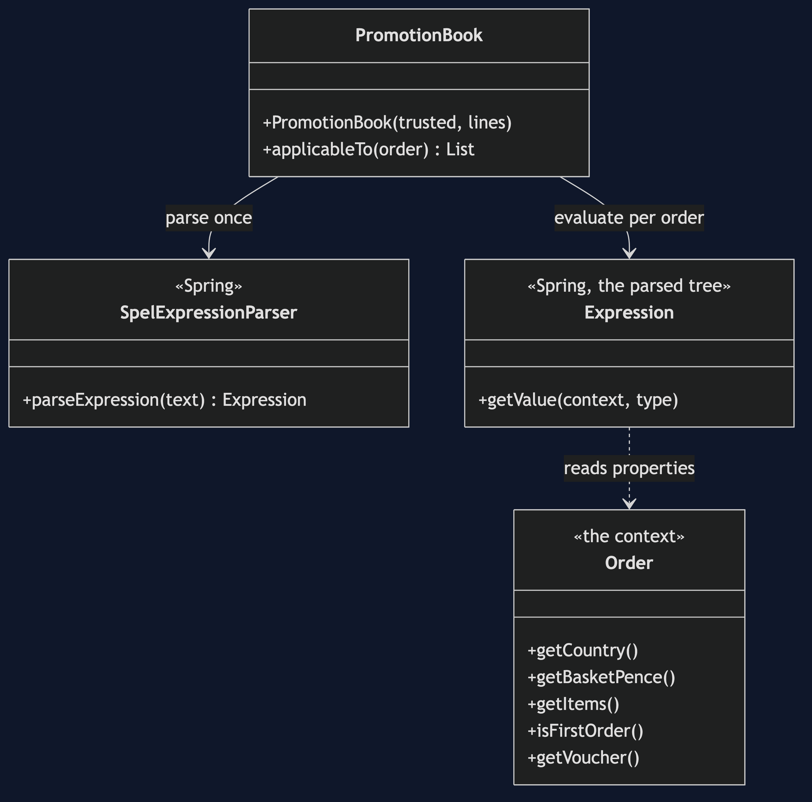
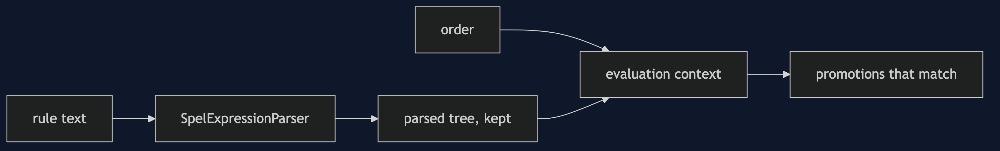
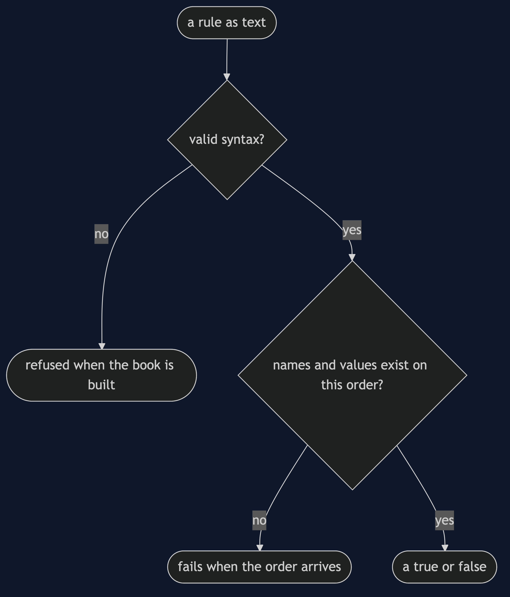
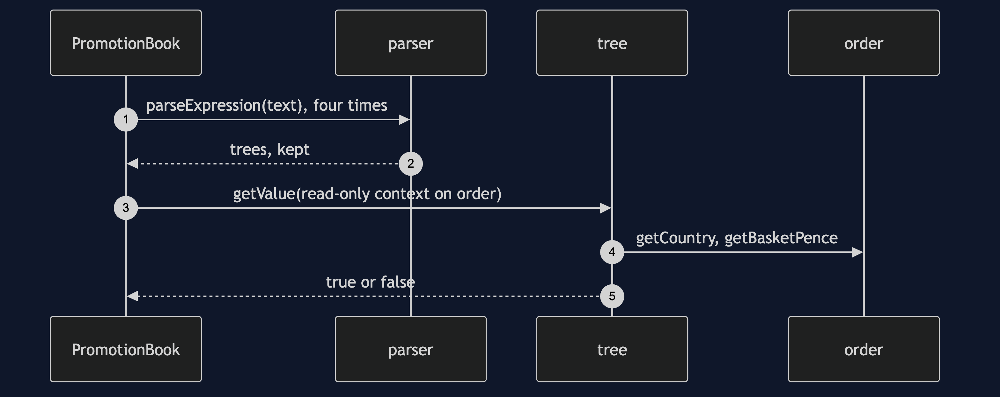
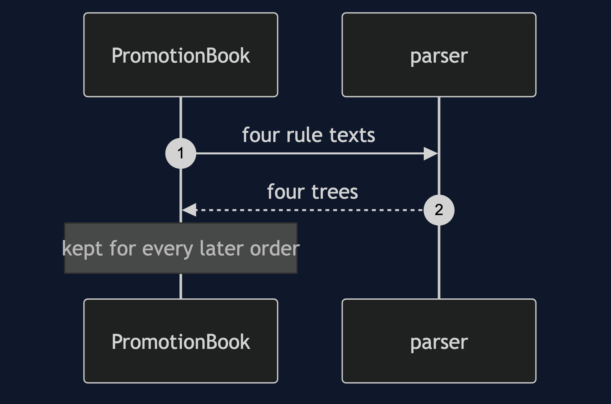
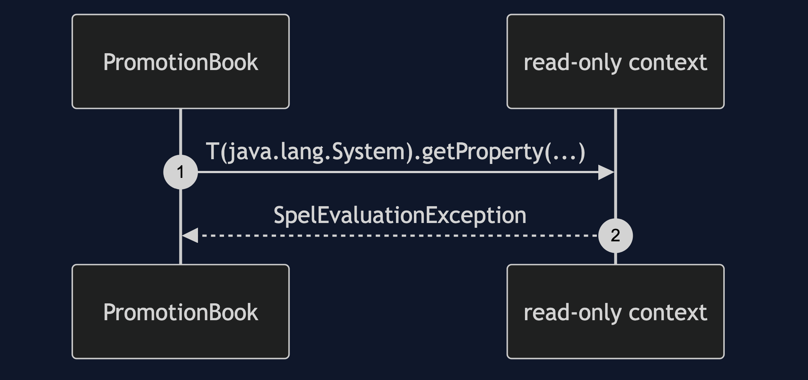

# Interpreter with SpEL Pattern

```
src/main/java/com/jk/explore/interpreterspel/
├── SpelPromotionsApplication.java   the entry point and the six acts
├── PromotionBook.java               parses each rule once, evaluates it per order
└── Order.java                       the context, with getters SpEL can read
```

**SpEL is a ready-made Interpreter. The rules stay text, and the library does the parsing and the tree. What you choose is the evaluation context.**

This project is the framework version of [Interpreter](../interpreter-pattern). That project built the mechanism by hand. This one shows the same idea inside Spring Expression Language. It does not re-teach the pattern. It shows what Spring Expression Language adds, the failures that are its own, and what it costs.

## Run

```bash
./gradlew run
```

Six acts. The partner project, Interpreter, built the mechanism by hand. Here the same idea runs through Spring Expression Language, and every count comes from real output.

```
ONE. The rules are text.
  WELCOME10 | 10 | firstOrder
  UKBIG | 15 | country == 'UK' and basketPence > 5000
  BULK | 20 | items >= 5 or basketPence > 20000
  NOTUK | 5 | !(country == 'UK')
  asha  (UK, 60.00, 2 items):            [UKBIG (15% off)]
  ben   (DE, 30.00, 1 item, first):      [WELCOME10 (10% off), NOTUK (5% off)]
  carol (UK, 250.00, 6 items):           [UKBIG (15% off), BULK (20% off)]
TWO. The language came free.
  a conditional, a pattern match and a remainder, and nothing new was written:
  ben:   [VOUCHER (8% off)]
  asha:  [MODULO (1% off)]
THREE. A typo in the language, and a typo in a name.
  a rule that is not a valid expression is refused when the book is built: SpelParseException.
  a misspelled property is accepted when the book is built.
  it fails when the first order arrives: SpelEvaluationException.
FOUR. The language can reach the whole program.
  with the full context, a rule can call any static method: [HOSTILE (99% off)].
  with the read-only context it is refused: SpelEvaluationException.
  it also refuses a method call, voucher.length(): SpelEvaluationException. a rule can only read properties.
  rules written by marketing are input. Use the read-only context.
FIVE. Missing values.
  asha has no voucher, and voucher.empty fails: SpelEvaluationException.
  with the safe-navigation operator, asha: [], ben: [LONGVOUCHER (8% off)].
SIX. Parsed once, used many times.
  1000 orders through the same four parsed rules: 1500 promotions applied.
  the tree was built four times, at startup, not four thousand.
```

## Test

```bash
./gradlew test
```

2 test classes, 8 test methods, offline, with each Spring context started inside the test, and no server.

## Technologies and versions

| What | Version | Why it is here |
| --- | --- | --- |
| Java | 21 | The repository standard, via the Gradle toolchain block |
| Gradle | 9.2.1 | The wrapper in this directory; no separate install needed |
| spring-expression | 7.0.x | SpEL, version managed by the Spring Boot plugin |
| JUnit 5 | 5.10.2 | Test runner |

See [`docs/dependencies.md`](docs/dependencies.md).

## Learning Material

| Document | What it covers |
| --- | --- |
| [`docs/problem-statement.md`](docs/problem-statement.md) | The partner's promotions, and what is new |
| [`docs/interpreter-with-spel-pattern-explained.md`](docs/interpreter-with-spel-pattern-explained.md) | A ready-made interpreter, and its choices |
| [`docs/class-diagram.md`](docs/class-diagram.md) | The types |
| [`docs/architecture-diagram.md`](docs/architecture-diagram.md) | Text, tree and order |
| [`docs/data-flow-diagram.md`](docs/data-flow-diagram.md) | When a rule can fail |
| [`docs/sequence-diagram.md`](docs/sequence-diagram.md) | Written for a listener with the screen off |
| [`docs/uml-diagram.md`](docs/uml-diagram.md) | Four sequences |
| [`docs/animation.html`](docs/animation.html) | The six acts in a browser |
| [`docs/prerequisites.md`](docs/prerequisites.md) | What you need to know |
| [`docs/session.md`](docs/session.md) | A one-hour taught session |
| [`docs/spec.md`](docs/spec.md) | The generated specification |
| [`docs/youtube.md`](docs/youtube.md) | Title, description and chapters |
| [`docs/dependencies.md`](docs/dependencies.md) | What Spring Expression Language is, what it costs, and that skipping this project loses none of the pattern |

### The pattern in one picture



### Where each piece sits



### How one request moves



### Who calls whom, in order



### All four sequences






### Video

Built from [`video/scenes.py`](video/scenes.py) by
[`video/build_video.sh`](video/build_video.sh). The rendered file is not
committed; see the repository README for why.

## Where you have already met this

Every `@Value("#{...}")` and every `@PreAuthorize`. Each is a SpEL expression.

## When this is too much

For a fixed handful of rules, plain Java is simpler and checked by the compiler.

## Where this sits

This project pairs with [Interpreter](../interpreter-pattern), and is a framework version in [`behavioural`](..).
