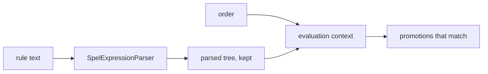

# Interpreter with SpEL Pattern — Architecture Diagram

Text is parsed once into trees. Each order is evaluated against the trees.

Mermaid source

```mermaid
flowchart LR
    T["rule text"] --> P["SpelExpressionParser"]
    P --> E["parsed tree, kept"]
    O["order"] --> X["evaluation context"]
    E --> X
    X --> R["promotions that match"]
```

