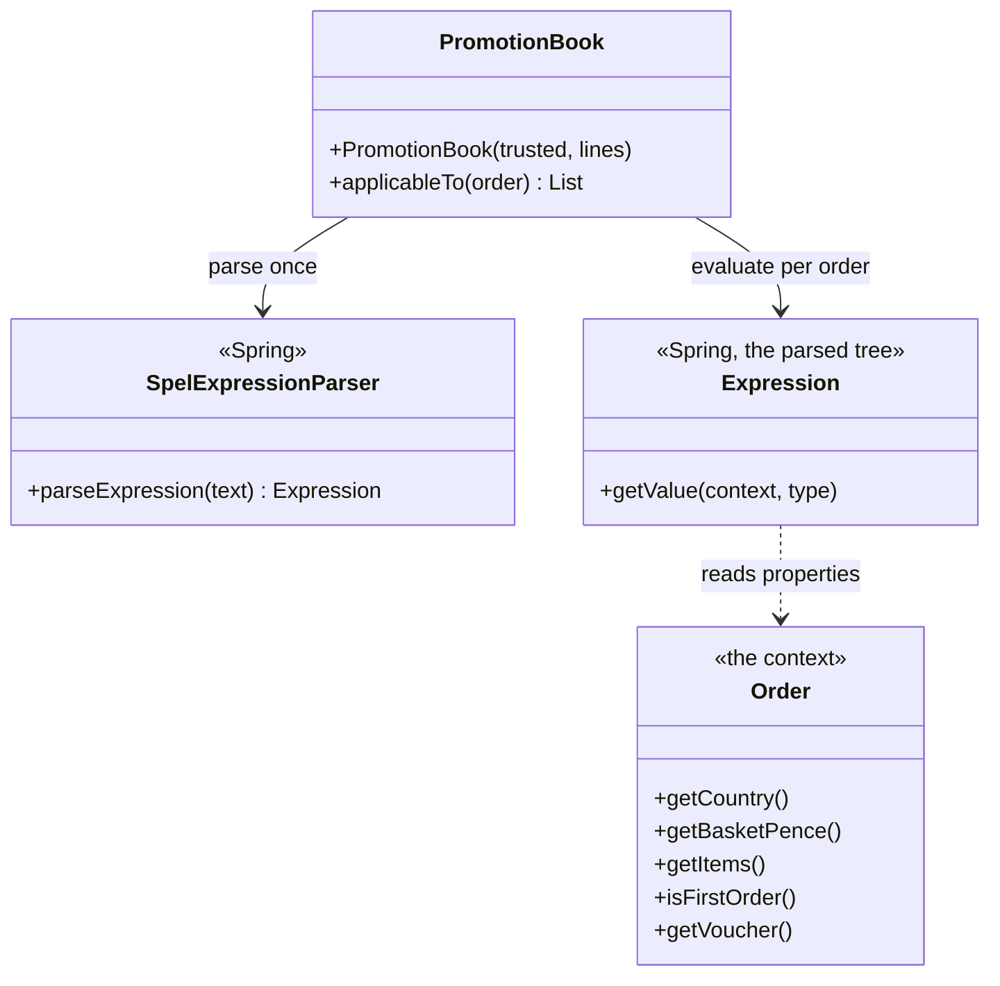

# Interpreter with SpEL Pattern — Class Diagram

`PromotionBook` parses once and evaluates many times. `Order` is the context.

Mermaid source

```mermaid
classDiagram
    class PromotionBook {
        +PromotionBook(trusted, lines)
        +applicableTo(order) List
    }
    class SpelExpressionParser {
        <<Spring>>
        +parseExpression(text) Expression
    }
    class Expression {
        <<Spring, the parsed tree>>
        +getValue(context, type)
    }
    class Order {
        <<the context>>
        +getCountry()
        +getBasketPence()
        +getItems()
        +isFirstOrder()
        +getVoucher()
    }
    PromotionBook --> SpelExpressionParser : parse once
    PromotionBook --> Expression : evaluate per order
    Expression ..> Order : reads properties
```

