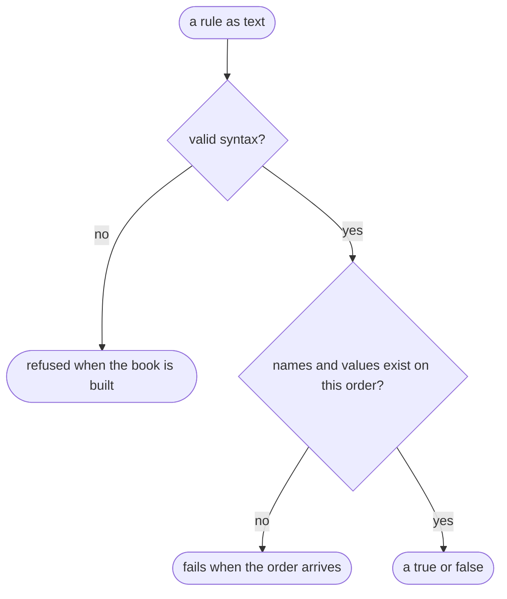

# Interpreter with SpEL Pattern — Data Flow Diagram

When each kind of mistake is found.

Mermaid source

```mermaid
flowchart TD
    Rule(["a rule as text"])
    Parse{"valid syntax?"}
    Build(["refused when the book is built"])
    Eval{"names and values exist on this order?"}
    Late(["fails when the order arrives"])
    Ok(["a true or false"])
    Rule --> Parse
    Parse -- no --> Build
    Parse -- yes --> Eval
    Eval -- no --> Late
    Eval -- yes --> Ok
```

