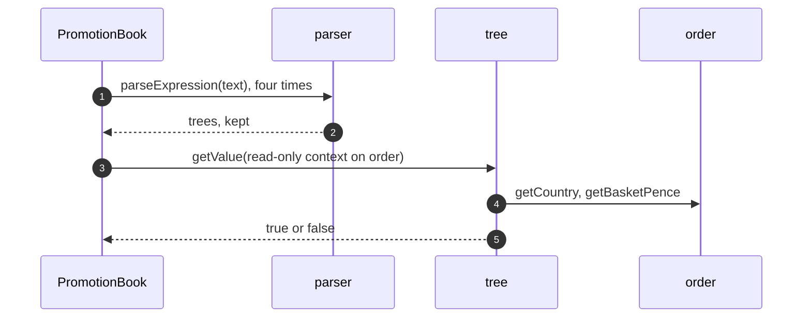

# Interpreter with SpEL Pattern — Sequence Diagram

Written for a listener with the screen off.

Say it in words. The promotion book is built from four lines of text. For each line, the parser makes a tree, and the book keeps it. Later an order arrives. The book creates a read-only context around the order, and asks each tree for its value. Each tree reads the properties it needs from the order, and answers true or false. The book collects the true ones.

Mermaid source

The load-bearing sentence: **parsing happens once, evaluation once per order.**
