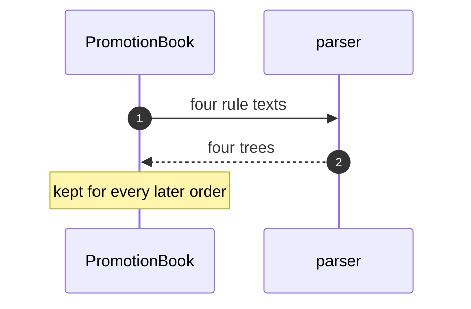
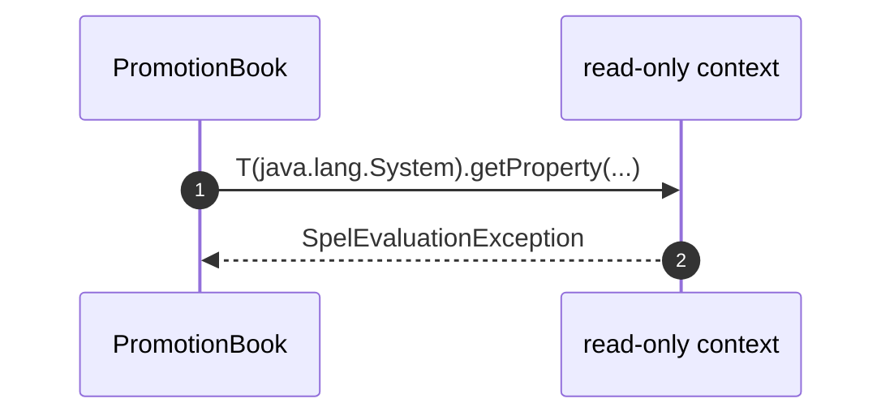

# Interpreter with SpEL Pattern — UML Sequence Diagrams

Four sequences.

## 1. Parse Once

Mermaid source

```mermaid
sequenceDiagram
    autonumber
    participant B as PromotionBook
    participant P as parser
    B->>P: four rule texts
    P-->>B: four trees
    Note over B: kept for every later order
```

## 2. A Refused Static Call

Mermaid source

```mermaid
sequenceDiagram
    autonumber
    participant B as PromotionBook
    participant C as read-only context
    B->>C: T(java.lang.System).getProperty(...)
    C-->>B: SpelEvaluationException
```

