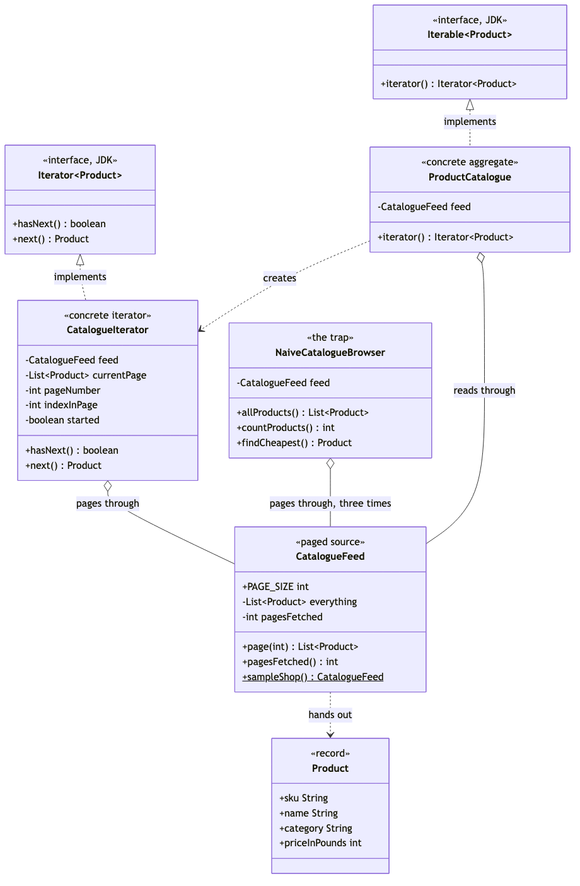
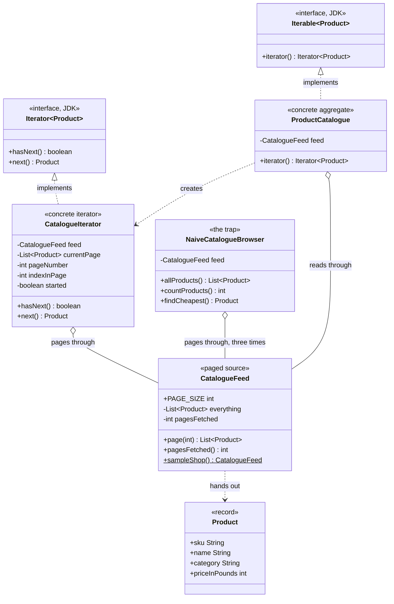

# Iterator Pattern — Class Diagram

Shows the static structure: `ProductCatalogue` implements the JDK's
`Iterable` and hands out a fresh `CatalogueIterator` on request; the iterator
is the only class that knows `CatalogueFeed` deals in pages. The naive
alternative — three methods each with their own hand-written page loop — is
drawn alongside to show what the pattern buys you.

Mermaid source

## Notes

- `Iterable` and `Iterator` are the **Aggregate** and **Iterator** roles, and
  we did not write either of them. They are `java.lang.Iterable` and
  `java.util.Iterator`. This is the one GoF pattern the language ships with,
  and plugging into the JDK's version is what earns the for-each loop.
- `ProductCatalogue` is the **Concrete Aggregate**. Look at what it does not
  have: no page number, no current position, no `next()`. It creates
  iterators and holds nothing about where anybody has got to, which is what
  makes two simultaneous walks possible.
- `CatalogueIterator` is the **Concrete Iterator**, and every field on it is
  position. It is the only class in the project containing a page loop. It is
  package-private, so nothing outside the package can name the type — callers
  see a `java.util.Iterator` and no more.
- The dependency from `ProductCatalogue` to `CatalogueIterator` is *creates*,
  drawn as a dashed arrow, not aggregation: the catalogue does not keep the
  iterators it hands out. Once you have one, it is yours.
- `CatalogueFeed` is the awkward storage the pattern exists to hide. Two
  classes touch it — the iterator, and the naive browser. Everything else in
  the shop is written in terms of `Product`.
- `NaiveCatalogueBrowser` shares no supertype with any of it. Note that it
  aggregates `CatalogueFeed` directly and implements neither JDK interface —
  it cannot be used in a for-each loop, and each of its three methods
  re-derives the paging on its own. That relationship, drawn once but written
  three times in the code, is the clearest indication of what the pattern
  removed.
