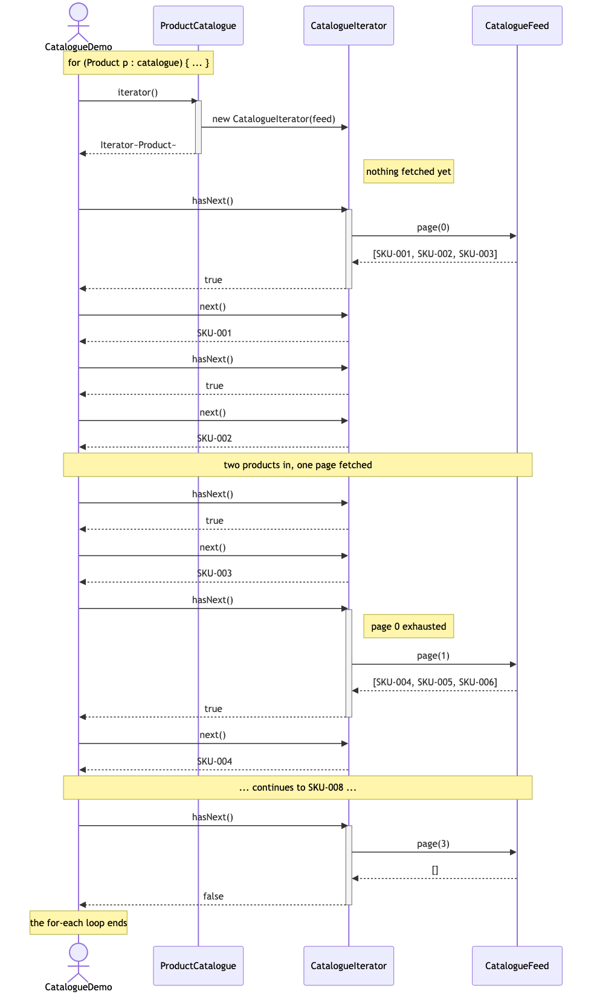
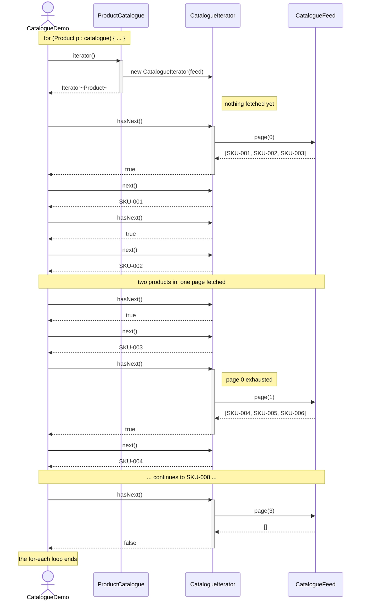

# Iterator Pattern — UML Sequence Diagram

Shows the runtime interaction behind a single for-each loop. The important
thing to follow is *when the feed is touched*: page 0 is fetched on the first
`hasNext()`, page 1 only when the walk runs off the end of page 0, and if the
caller stops early the remaining pages are never requested at all.

Mermaid source

## Notes

- **The catalogue appears once and then drops out.** `iterator()` is called a
  single time, at the top of the loop, and after that every message goes to
  the iterator. The aggregate is not in the conversation, which is why it can
  safely be shared.
- **The first fetch happens on `hasNext()`, not on `iterator()`.** That one
  line of sequence is the laziness the tests assert. If the fetch moved into
  the constructor, the diagram would gain an arrow to `Feed` above the
  `Iterator~Product~` return, and stopping early would stop saving anything.
- **`hasNext()` sometimes fetches and sometimes does not.** Three of the
  calls above are pure position arithmetic; two of them cross a page
  boundary and go to the feed. The caller cannot tell the difference, and
  that is the point of the pattern.
- **The empty page is the terminator.** The final `page(3)` returning `[]` is
  the only way the feed has of saying "that is everything", and translating
  it into a plain `false` is work the caller no longer does.
- **Stopping early truncates the diagram.** Break after SKU-002 and
  everything below the "two products in, one page fetched" note simply never
  happens — no `page(1)`, no `page(2)`, no `page(3)`.
- Compare with `NaiveCatalogueBrowser`: the same messages to `Feed`, but
  originating from the client, and drawn three times because there are three
  methods each with their own copy of the loop.
