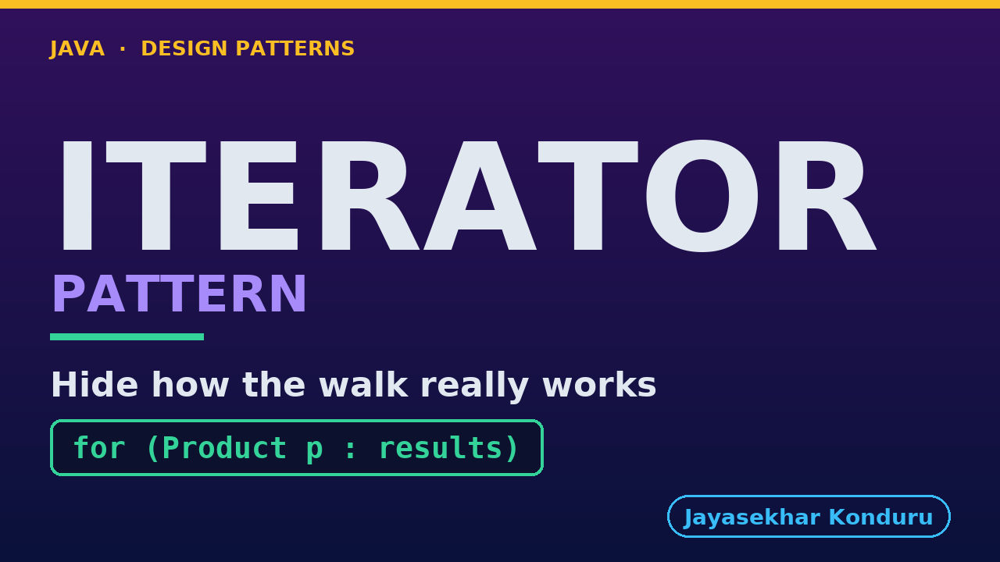

# YouTube — Iterator Pattern

Everything needed to publish `video/iterator-pattern-explained.mp4`. Copy the fields straight out of this file.

Chapter timings are generated from the video's `.srt`. Re-run `python3 docs/make_youtube_docs.py iterator` after any change to the narration, or they will be wrong.

## Title

```
Iterator Pattern in Java - Paging the Catalog
```

45 characters — under the 60 YouTube shows before truncating in search results.

## Description

The first two lines are what a viewer sees above the fold, so they carry the hook rather than the boilerplate.

```
Learn the Iterator design pattern in Java 21 by building the product catalogue of an online shop — one that lives in the warehouse system and hands its products over three at a time, with no size, no "are there more pages", and an empty page as the only way of saying "that is everything". We start with the problem: three methods that each write the page loop out by hand, and two of them get it wrong. One hard-codes the number of pages, so it silently under-counts the day a tenth product is added. The other starts at page one instead of page zero, never sees the cheapest item in the shop, and returns a real product at a real price that simply is not the cheapest — no exception, no log, just a wrong answer that can live in production for a year. Then we build the pattern: `ProductCatalogue` implements `Iterable` in four lines and holds no position at all, and a package-private `CatalogueIterator` holds every bit of it. That is the split the whole pattern turns on, and the video spends real time on why the position must not live on the collection — the book knows what is in it, the bookmark knows where you are. We look at the one `hasNext()` that is now the only page loop in the project, why it is a `while` and not an `if`, why the first fetch belongs there rather than in the constructor, and why it has to be safe to call twice. Two tests carry the argument: one asserts what was *not* fetched (two products consumed, one page of three requested), and one runs two iterators over one catalogue and shows that advancing either leaves the other untouched. Also covers where `for (Product p : catalogue)` actually comes from, how iterators, index loops and streams differ — streams are built on this, not an alternative to it — and the honest cost: if you already have a `List`, it already has an iterator, and writing your own around it is pure ceremony. No prior design-pattern knowledge needed. Full source code and written notes are in the repository.

CHAPTERS
00:00 Introduction
00:46 The Scenario
01:23 Look Closely at One Method
02:05 The Naive Approach — Three Methods, Three Page Loops
02:47 Why That Hurts
03:32 The Iterator Pattern
04:13 An Analogy
04:53 The Roles
05:40 The Aggregate — Notice What Is Missing
06:21 The Iterator — The Only Page Loop in the Project
07:14 The Tests — Asserting What Was NOT Fetched
08:03 Running It
08:46 What to Remember
09:46 Thanks for Watching

SOURCE CODE, WRITTEN NOTES AND AN INTERACTIVE ANIMATION
https://github.com/jk-boot-up/java-design-patterns/tree/main/gradle-java/behavioural/iterator-pattern

WHAT YOU NEED FIRST
Java 21 and a working knowledge of classes and interfaces. No prior design-pattern knowledge is assumed. The full prerequisites are in docs/prerequisites.md in the repository.
```

## Chapters

YouTube renders these as chapters only if there are at least three and the first is at `00:00`.

```
00:00 Introduction
00:46 The Scenario
01:23 Look Closely at One Method
02:05 The Naive Approach — Three Methods, Three Page Loops
02:47 Why That Hurts
03:32 The Iterator Pattern
04:13 An Analogy
04:53 The Roles
05:40 The Aggregate — Notice What Is Missing
06:21 The Iterator — The Only Page Loop in the Project
07:14 The Tests — Asserting What Was NOT Fetched
08:03 Running It
08:46 What to Remember
09:46 Thanks for Watching
```

## Tags

```
iterator pattern, iterable java, lazy pagination, design patterns, java design patterns, gang of four, java 21, software design, clean code, object oriented design, java tutorial, ecommerce, programming tutorial
```

211 characters, under YouTube's 500 limit.

## Thumbnail



**Upload `docs/thumbnail.png`** — 1280×720, the size YouTube recommends, generated by `docs/make_thumbnails.py`. It is deliberately not the same image as the video's opening frame: a thumbnail is judged at about 360 pixels wide in a search result, so this one carries only the pattern name, one line of promise and one short piece of code, each set large enough to survive the shrink.

`video/poster.png` is the 1920×1080 opening frame, produced by the video build. It stays in the repository as the title card; it is not what gets uploaded.

YouTube will not pick the thumbnail up on its own — upload it under **Details → Thumbnail → Upload file**. A custom thumbnail requires a verified channel.

## Upload checklist

- [ ] Upload `video/iterator-pattern-explained.mp4` (1080p, H.264, 30 fps, AAC 48 kHz — already YouTube's recommended settings, no re-encode needed)
- [ ] Set the video language to **English** first, or the subtitle option may not appear
- [ ] Add subtitles: *Video elements → Add subtitles → Upload file → With timing* → `video/iterator-pattern-explained.srt`
- [ ] Upload `docs/thumbnail.png` as the thumbnail — do not let YouTube auto-pick a frame
- [ ] Paste the title, description and tags from above
- [ ] Add to the **Java Design Patterns** playlist, in learning order
- [ ] Wait for 1080p processing before sharing the link — code slides are unreadable at 360p

## Cards and end screen

End screen links to whichever pattern video goes up next — set it at upload time rather than assuming an order.

Add a card partway through pointing at the playlist, so a viewer who arrives at this pattern from search can find the rest of the series.

## Runtime

Approximately 10:22, narrated at 145 words per minute.
