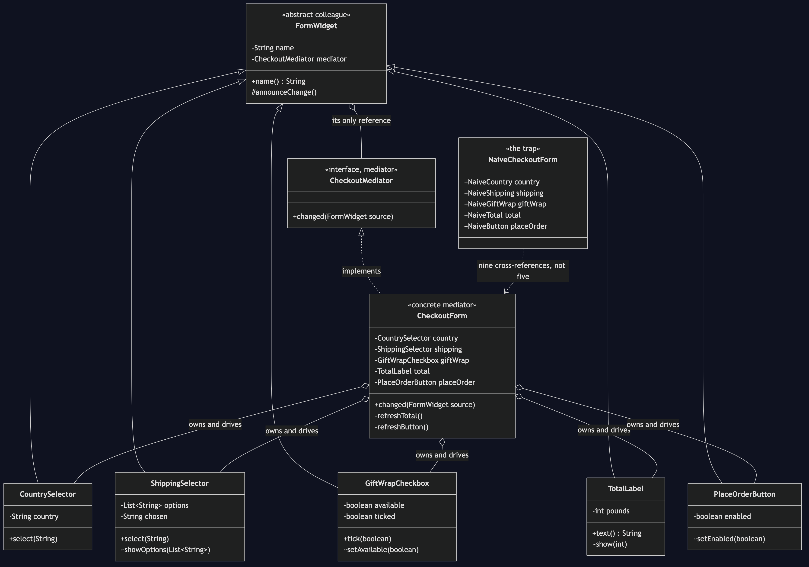
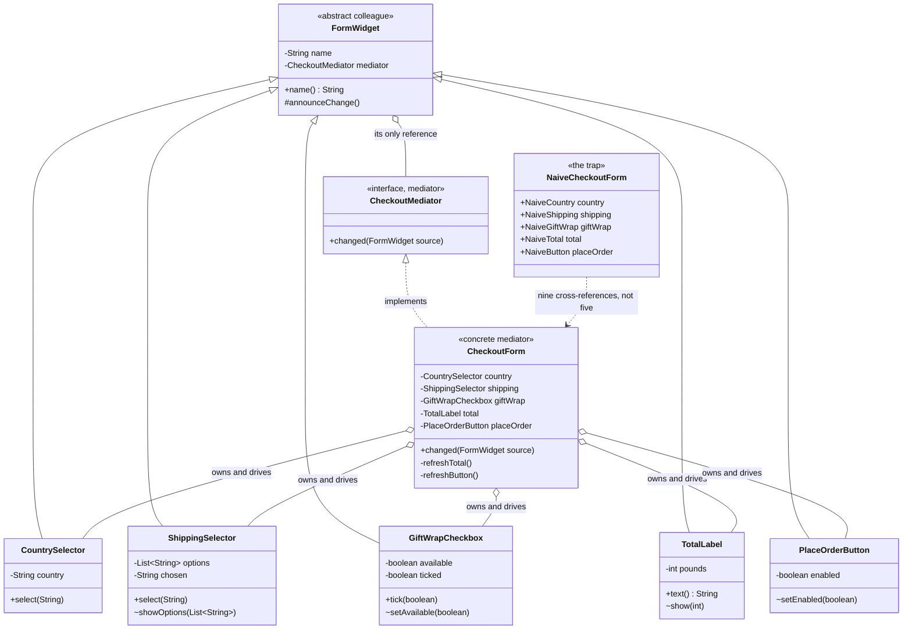

# Mediator Pattern — Class Diagram

Shows the static structure: five widgets, each holding exactly one reference,
and all five pointing at the same `CheckoutForm`. The tangled alternative —
where each widget holds the widgets it affects — is drawn alongside, and the
difference between the two pictures is the whole argument.

Mermaid source

## Notes

- `CheckoutMediator` is the **Mediator** role and it has one method. That is
  not an abbreviation for teaching; a mediator interface really can be this
  small, because its job is to be told, not to be asked.
- `FormWidget` is the **Colleague** role. Its two fields are a name and a
  mediator, and that is deliberate: a widget has no field capable of holding
  another widget, so it could not reach across the form even if a future
  change tried to. `WidgetIsolationTest` asserts this by reflection rather
  than trusting the comment.
- `CheckoutForm` is the **Concrete Mediator**, and it is the only class in the
  project that is allowed to be complicated. All five arrows into it point the
  same way, which is why the diagram is a star rather than a web.
- The widget-to-mediator arrows are aggregation and the mediator-to-widget
  arrows are aggregation too, so the reference is mutual. That is normal for
  this pattern and is not the coupling being complained about — the point is
  that a widget's *only* neighbour is the hub.
- `showOptions`, `setAvailable`, `show` and `setEnabled` are package-private
  on purpose. They are how the mediator pushes state down, and no caller
  outside the package can invoke them, so the form's rules cannot be bypassed
  from the outside.
- `NaiveCheckoutForm` gathers the tangle into a single file only so it can be
  read at a glance. Count the fields: its country widget holds four other
  widgets, shipping holds three, gift wrap holds two — nine references where
  the mediated version has five, on a form with five controls. The count is
  what grows quadratically, and it is why the sixth control is the one that
  breaks a form like this.
