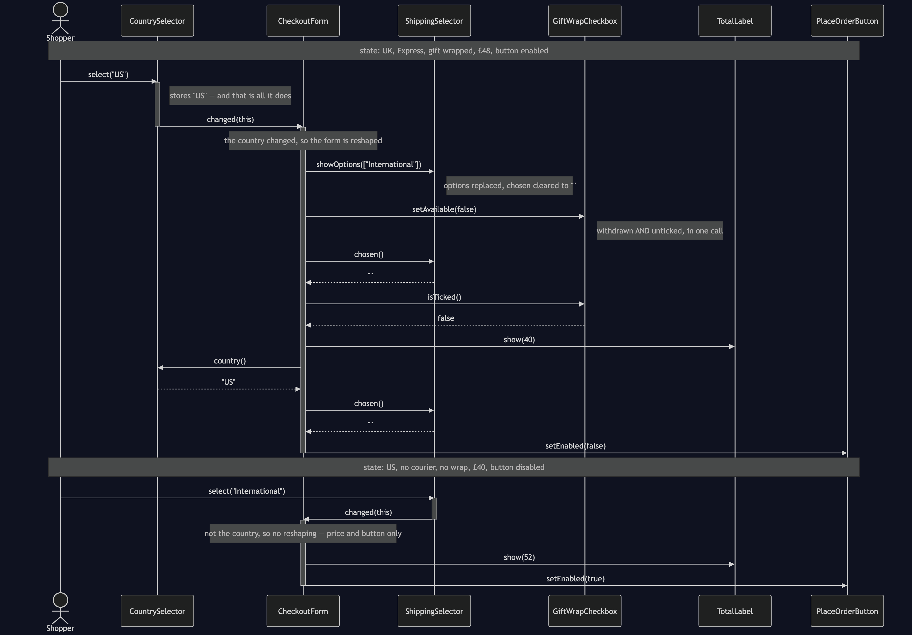
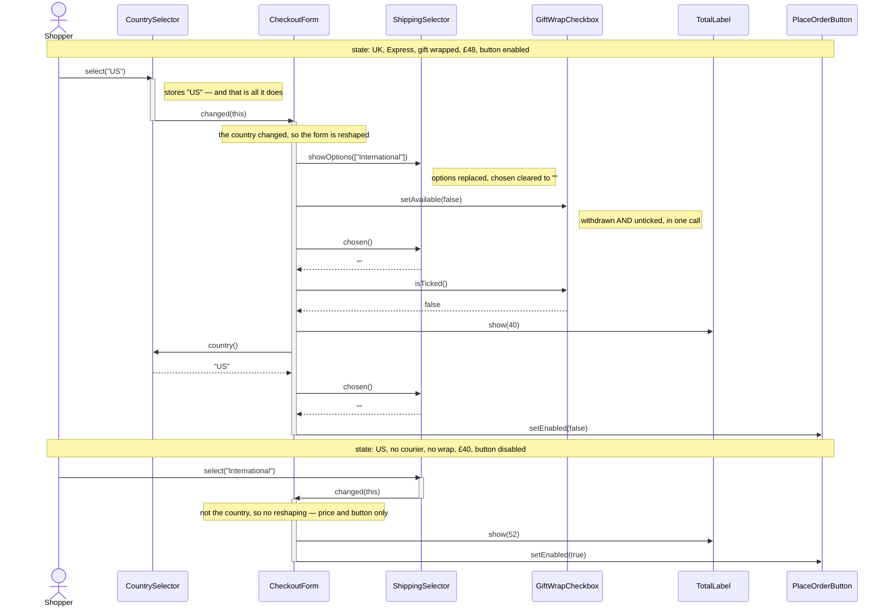

# Mediator Pattern — UML Sequence Diagram

Shows the runtime interaction behind one click. The shopper has a UK order
with Express shipping and gift wrap ticked, and changes the delivery country
to the United States. Follow how far the widget's own involvement goes: it
records the new country, says so, and stops.

Mermaid source

## Notes

- **Every arrow into `CheckoutForm` is `changed`.** There is one inbound
  message in the whole diagram, sent by whichever widget the shopper touched.
  Widgets do not have a vocabulary for talking to the form beyond "something
  about me is different now".
- **Every arrow out of `CheckoutForm` is the form pushing state down.** No
  widget calls another. Draw a line down the middle of the diagram and every
  message crosses it.
- **The two branches of `changed` are visible as two shapes.** The country
  change reshapes the form and then reprices it; the shipping change only
  reprices it. That difference is the single `if` in `changed`, and it is the
  only branching in the pattern.
- **`setAvailable(false)` does two things in one message**, and that is the
  fix for the tangled version's first bug. Withdrawing the offer and clearing
  the tick cannot be separated, because there is only one call that does
  either.
- **The button is re-checked after every change, unconditionally.** Nothing
  decides whether it *needs* re-checking. That is what stops the second bug:
  the mediator does not have to notice that clearing the shipping method
  affects the button, because it re-asks the question every time regardless.
- Compare with `NaiveCheckoutForm`: the same messages arrive at the same
  widgets, but they originate from `NaiveCountry`, so the diagram has no
  centre. Each new widget adds arrows to and from every widget it touches,
  and the picture stops being readable at about six participants — which is
  roughly where a real checkout form starts.
