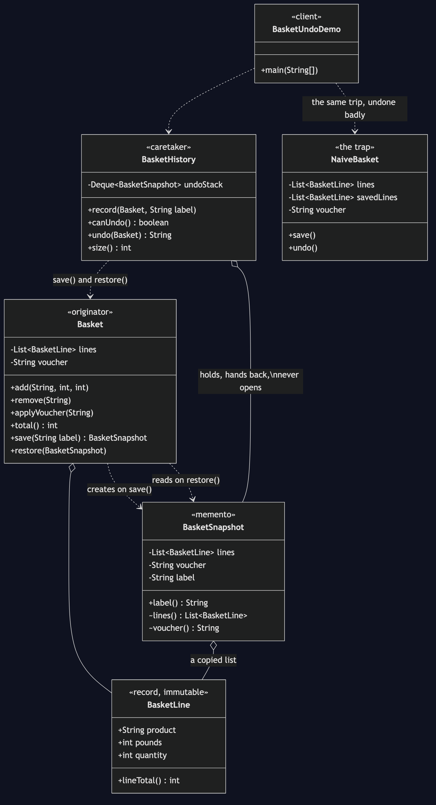

# Memento Pattern

Demonstrates the Behavioural **Memento** design pattern using an online shop's
basket as an example. The feature is an undo button; the pattern is what lets
you build it without opening the basket up to do it.

- `Basket` — the originator. It knows what its state is (its lines and its
  voucher), so it is the only class that writes a snapshot and the only class
  that reads one back. `save` and `restore` are six lines, and they are the
  only six in the project aware of what a basket contains.
- `BasketSnapshot` — the memento: a sealed copy. `List.copyOf` in its
  constructor is what makes it a photograph rather than a window. `label()` is
  public so an undo menu can display "undo: removed the laptop stand";
  `lines()`, `voucher()` and the constructor are package-private, so only
  `Basket` can use them. That is the wide-and-narrow interface the pattern
  asks for, built out of access modifiers and nothing else.
- `BasketHistory` — the caretaker. A stack of snapshots, capped at twenty. It
  hands them back without ever being able to open one, and does its entire job
  without knowing that a basket contains anything at all.
- `BasketLine` — a record: product, unit price in whole pounds, quantity. Its
  immutability is load-bearing; it is what makes the shallow copy safe.
- `NaiveBasket` — the trap, kept for contrast. `savedLines = lines` records
  *where* the list is rather than *what is in it*, so undo clears the very list
  it is about to restore from. And the voucher was never saved at all.
- `BasketUndoDemo` — runnable entry point putting the same shopping trip and
  the same mistake through both baskets.

## Run

```bash
./gradlew run
```

Which prints:

```text
=== undo without a snapshot ===
  the basket the shopper built:
    2 x USB-C cable  £18
    1 x Laptop stand  £34
    1 x Desk mat  £18
    voucher: SAVE5
    total: £65
  after removing the laptop stand by mistake:
    2 x USB-C cable  £18
    1 x Desk mat  £18
    voucher: SAVE5
    total: £31
  after pressing undo:
    (the basket is empty)
    voucher: SAVE5
    total: £0
  ^ the stand did not come back, and neither did anything else
  and on a fresh basket, undoing a cleared voucher:
    voucher: (none)    total: £0
  ^ the voucher stays cleared. Even with the aliasing fixed it would,
    because save() never wrote the voucher down in the first place.

=== undo with a snapshot ===
  ... the same trip, the same mistake ...
  after pressing undo (removed the laptop stand):
    2 x USB-C cable  £18
    1 x Laptop stand  £34
    1 x Desk mat  £18
    voucher: SAVE5
    total: £65
```

No exception was thrown in the first half. The shopper simply lost their
basket.

## Test

```bash
./gradlew test
```

16 tests across 4 classes. `BasketTest` covers what undo promises, including
that later changes cannot reach back into an older snapshot — the aliasing bug
written as an assertion — and that restoring does not use a snapshot up.
`BasketHistoryTest` covers multi-level undo, the labels, the twenty-step cap
and the empty-stack error. `SnapshotEncapsulationTest` asserts the *structure*
by reflection: it fails naming any public method on `BasketSnapshot` outside a
short allowed list, so a getter added in a hurry breaks the build rather than
quietly widening the crack. `NaiveBasketTest` pins the wrong answers in place
on purpose, so the cost of the alternative is stated by the build.

## Learning Material

Start here if you are new to the pattern — the docs are ordered as a
learning path.

| Document | What it covers |
| --- | --- |
| [`docs/prerequisites.md`](docs/prerequisites.md) | What to know and install before you start |
| [`docs/problem-statement.md`](docs/problem-statement.md) | The problem the pattern solves, and why the naive approach hurts |
| [`docs/memento-pattern-explained.md`](docs/memento-pattern-explained.md) | The pattern itself, the code walked through, pitfalls, and comparisons |
| [`docs/class-diagram.md`](docs/class-diagram.md) | Static structure |
| [`docs/uml-diagram.md`](docs/uml-diagram.md) | Runtime call flow |
| [`docs/animation.html`](docs/animation.html) | Animated, step-by-step walkthrough — open in a browser. Optional narration via the **Narration** button |
| [`docs/session.md`](docs/session.md) | A 60-minute guided session plan for teaching it |
| [`docs/youtube.md`](docs/youtube.md) | Title, description, chapters and thumbnail for publishing the video |
| [`docs/thumbnail.png`](docs/thumbnail.png) | The 1280×720 image to upload as the YouTube thumbnail |
| [`docs/spec.md`](docs/spec.md) | The project specification — problem, code, video and publishing quality bar. Also as [`spec.html`](docs/spec.html) |
| [`video/`](video/) | A narrated video, plus the script and build pipeline |

### The pattern in one picture



### Video

`video/memento-pattern-explained.mp4` — 1080p, narrated. An audio-only
version is alongside it. See [`video/README.md`](video/README.md) to
rebuild or re-record it.
