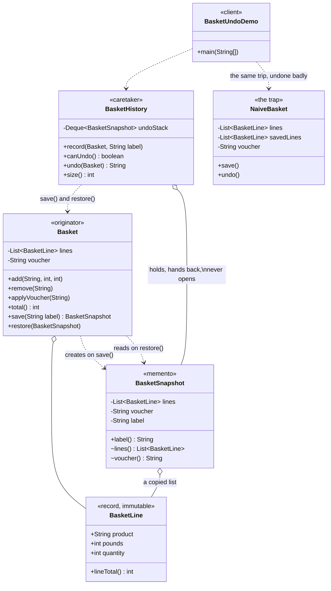

# Memento Pattern — Class Diagram

Shows the static structure: the basket that can copy itself, the snapshot that
holds the copy, and the history that stacks snapshots up without ever being
able to look inside one. The version that tries to do undo without a snapshot
is drawn alongside, and the difference between the two pictures is the whole
argument.

Mermaid source

## Notes

- `Basket` is the **Originator**. It is the only class that knows what the
  basket's state actually is, which is why it is the only class that writes a
  snapshot and the only class that reads one back. Add a third field tomorrow —
  a delivery date, a gift message — and there is exactly one pair of methods to
  change, and undo keeps working.
- `BasketSnapshot` is the **Memento**, and the interesting thing about it is the
  access modifiers. `label()` is public, so a history list can show "undo:
  removed the laptop stand". `lines()` and `voucher()` are package-private, so
  only `Basket` — which shares the package — can get the state back out. This is
  the pattern's *wide and narrow interface* idea, built out of nothing more
  exotic than Java's default access. `SnapshotEncapsulationTest` asserts it by
  reflection rather than trusting the comment.
- `BasketHistory` is the **Caretaker**, and it is defined by what it cannot do.
  It stacks snapshots up and hands them back, and undo works without it knowing
  that a basket contains lines, or a voucher, or anything at all.
- The snapshot's list is built with `List.copyOf`, so it is both a copy and
  unmodifiable. `BasketLine` is a record, so the things inside that list cannot
  be edited either. Those two facts together are what make the copy shallow and
  still safe — a snapshot is a photograph, not a window.
- `NaiveBasket` is the same feature written without a memento, and it holds the
  two mistakes this pattern exists to prevent. `savedLines = lines` records
  *where* the list is rather than *what is in it*, so undo clears the very list
  it is restoring from and the basket comes back empty. And the voucher is never
  captured at all — not refused, just never thought of, which is the kind of bug
  no code review can find because there is no line to review.
