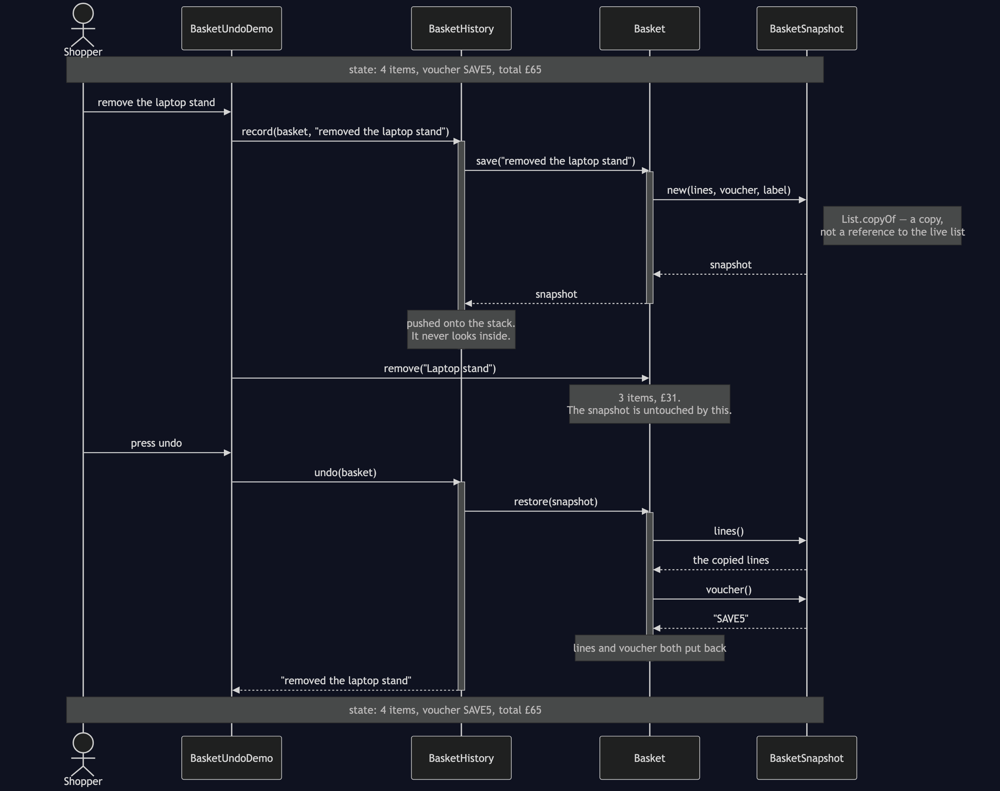
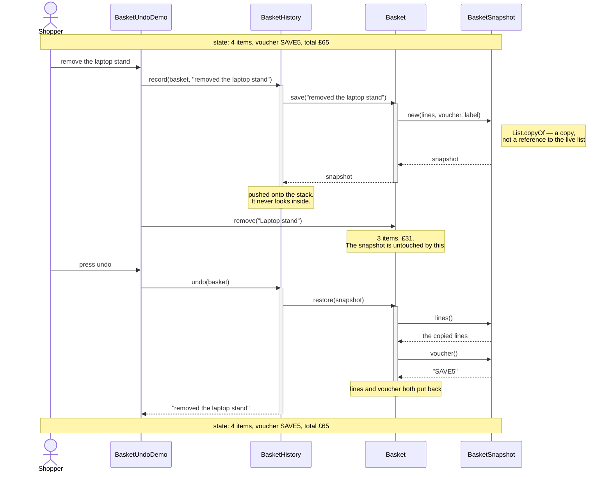

# Memento Pattern — UML Sequence Diagram

Shows the runtime interaction behind one undo. The shopper has three products
and a voucher, removes the laptop stand by mistake, and presses undo. Follow
how little the history knows: it asks for a snapshot, keeps it, and later hands
the same object back.

Mermaid source

## Notes

- **The history never opens a snapshot.** Every arrow into `BasketSnapshot`
  comes from `Basket`. The caretaker's whole job fits in "hold this, and give
  it back later", and it manages that without knowing what a basket contains.
- **The copy happens at the moment of saving**, in the snapshot's constructor.
  Everything the shopper does afterwards happens to the live list, and cannot
  reach the copy. That single `List.copyOf` is the difference between undo
  working and undo emptying the basket.
- **`restore` puts back both fields.** Lines and voucher travel together,
  because they are both state and the pattern's rule is that a snapshot is
  complete. The naive version restores one of them and silently forgets the
  other.
- **The snapshot is not consumed by being restored.** `restore` reads from it
  and leaves it as it was, so the same snapshot could be restored twice — which
  is what makes redo, or a branching history, possible later without changing
  any of these three classes.
- **The label goes in at save time, not at undo time.** That is what lets a
  history list say "undo: removed the laptop stand" while still being unable to
  read a single thing about the basket itself.
- Compare with `NaiveBasket`: the same shopper does the same three things, but
  there is no snapshot participant at all. `save()` writes down where the live
  list is, so the "before" and "after" states are the same object, and by the
  time undo runs there is nothing left to restore from.
