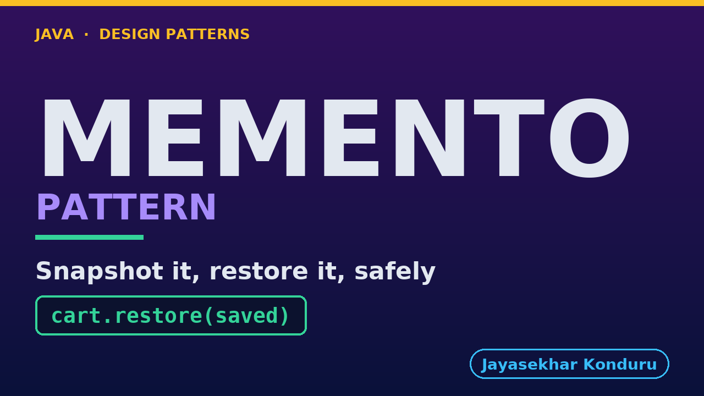

# YouTube — Memento Pattern

Everything needed to publish `video/memento-pattern-explained.mp4`. Copy the fields straight out of this file.

Chapter timings are generated from the video's `.srt`. Re-run `python3 docs/make_youtube_docs.py memento` after any change to the narration, or they will be wrong.

## Title

```
Memento Pattern in Java - Restoring a Saved Cart
```

48 characters — under the 60 YouTube shows before truncating in search results.

## Description

The first two lines are what a viewer sees above the fold, so they carry the hook rather than the boilerplate.

```
Memento pattern in Java: a memento is a sealed copy of an object's state: the object takes the copy itself and hands it to someone else to keep, like a save point in a video game. Explained by adding an undo button to an online shop's basket. We show how one misplaced equals sign makes undo empty the whole basket, how to let a caretaker keep your state without ever seeing inside it, and how two interfaces do that with no framework at all. We finish with tests on the structure and the one honest cost of the pattern.

CHAPTERS
00:00 Introduction
00:54 The Scenario
01:26 Look Closely at One Line
02:03 The Naive Approach — Undo Without a Snapshot
02:34 Why That Hurts
03:23 The Memento Pattern
03:59 An Analogy
04:42 The Roles
05:17 The Memento — Two Interfaces, No Framework
06:02 The Originator and the Caretaker
06:54 The Tests — Asserting the Structure, Not Just the Behaviour
07:30 Running It
08:15 What to Remember
09:21 Thanks for Watching

SOURCE CODE, WRITTEN NOTES AND AN INTERACTIVE ANIMATION
https://github.com/jk-boot-up/java-design-patterns/tree/main/gradle-java/behavioural/memento-pattern

WHAT YOU NEED FIRST
Java 21 and a working knowledge of classes and interfaces. No prior design-pattern knowledge is assumed. The full prerequisites are in docs/prerequisites.md in the repository.
```

## Chapters

YouTube renders these as chapters only if there are at least three and the first is at `00:00`.

```
00:00 Introduction
00:54 The Scenario
01:26 Look Closely at One Line
02:03 The Naive Approach — Undo Without a Snapshot
02:34 Why That Hurts
03:23 The Memento Pattern
03:59 An Analogy
04:42 The Roles
05:17 The Memento — Two Interfaces, No Framework
06:02 The Originator and the Caretaker
06:54 The Tests — Asserting the Structure, Not Just the Behaviour
07:30 Running It
08:15 What to Remember
09:21 Thanks for Watching
```

## Tags

```
memento pattern, snapshot undo java, encapsulation, design patterns, java design patterns, gang of four, java 21, software design, clean code, object oriented design, java tutorial, ecommerce, programming tutorial
```

213 characters, under YouTube's 500 limit.

## Thumbnail



**Upload `docs/thumbnail.png`** — 1280×720, the size YouTube recommends, generated by `docs/make_thumbnails.py`. It is deliberately not the same image as the video's opening frame: a thumbnail is judged at about 360 pixels wide in a search result, so this one carries only the pattern name, one line of promise and one short piece of code, each set large enough to survive the shrink.

`video/poster.png` is the 1920×1080 opening frame, produced by the video build. It stays in the repository as the title card; it is not what gets uploaded.

YouTube will not pick the thumbnail up on its own — upload it under **Details → Thumbnail → Upload file**. A custom thumbnail requires a verified channel.

## Upload checklist

- [ ] Upload `video/memento-pattern-explained.mp4` (1080p, H.264, 30 fps, AAC 48 kHz — already YouTube's recommended settings, no re-encode needed)
- [ ] Set the video language to **English** first, or the subtitle option may not appear
- [ ] Add subtitles: *Video elements → Add subtitles → Upload file → With timing* → `video/memento-pattern-explained.srt`
- [ ] Upload `docs/thumbnail.png` as the thumbnail — do not let YouTube auto-pick a frame
- [ ] Paste the title, description and tags from above
- [ ] Add to the **Java Design Patterns** playlist, in learning order
- [ ] Wait for 1080p processing before sharing the link — code slides are unreadable at 360p

## Cards and end screen

End screen links to whichever pattern video goes up next — set it at upload time rather than assuming an order.

Add a card partway through pointing at the playlist, so a viewer who arrives at this pattern from search can find the rest of the series.

## Runtime

Approximately 09:59, narrated at 145 words per minute.
