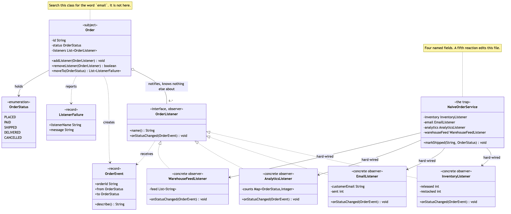

# Observer Pattern

Demonstrates the Behavioural **Observer** design pattern using order status
changes in an online shop as an example.

- `OrderListener` — the observer. One interface: `name()` identifies the
  listener in a failure report, `onStatusChanged(OrderEvent)` is the
  reaction. Deliberately no priority, no ordering hint and no filter
  predicate, because each of those would let one listener make claims about
  the others.
- `Order` — the subject. Keeps a list of listeners, and announces every real
  transition to all of them. It has no field named after any of them, and no
  way to ask which ones are attached.
- `InventoryListener` / `EmailListener` / `AnalyticsListener` /
  `WarehouseFeedListener` — the concrete observers. Releasing stock,
  emailing the customer, counting the funnel, and writing the pick line.
  They hold different state, want different events, and know nothing about
  each other.
- `OrderEvent` — the message. A record of the order id, the status it came
  from and the status it moved to. It carries no reference back to the
  `Order`, so a listener cannot change the subject halfway through a
  notification.
- `ListenerFailure` — what comes back when a listener throws: the listener's
  name and the message, so an exception raised inside an anonymous list is
  still attributable.
- `NaiveOrderService` / `OrderStatus` — the trap, kept for contrast. Four
  calls in a row with nothing between them, so the day the mail server times
  out the order ships and the warehouse is never told.
- `OrderEventsDemo` — runnable entry point that shows the outage, the same
  failure isolated behind the pattern, and a fifth listener attached without
  `Order` being touched.

## Run

```bash
./gradlew run
```

Which prints:

```text
=== 1. The trap: an order service that calls each system by name ===

Shipping A-1001 through NaiveOrderService, with a broken mail server:
  [inventory] released the reservation for A-1001
  !! SMTP timeout after 30s
  analytics recorded : 0 event(s)
  warehouse feed     : []
  The order shipped. The warehouse was never told.

=== 2. The pattern: the order announces, the listeners decide ===

Order A-1002 starts at Placed with 4 listeners attached.

order.moveTo(PAID)
  [email] to grace@example.com: Payment received for A-1002
  [analytics] recorded A-1002: Placed -> Paid
  [warehouse-feed] wrote "A-1002,PAID"

order.moveTo(SHIPPED)
  [inventory] released the reservation for A-1002
  [email] to grace@example.com: Your order A-1002 is on its way
  [analytics] recorded A-1002: Paid -> Shipped
  [warehouse-feed] wrote "A-1002,SHIPPED"

order.moveTo(DELIVERED)
  [email] to grace@example.com: Your order A-1002 has arrived
  [analytics] recorded A-1002: Shipped -> Delivered

order.moveTo(DELIVERED)  <- already there
  (no event, so nobody is told twice)

=== 3. A fifth reaction, added without touching Order ===

order.moveTo(DELIVERED) with a listener defined in this file:
  [analytics] recorded A-1003: Placed -> Delivered
  [loyalty-points] credited 120 points for A-1003

=== 4. One listener throws; the others still run ===

Same broken mail server, this time behind the pattern:
  [inventory] released the reservation for A-1004
  [analytics] recorded A-1004: Placed -> Shipped
  [warehouse-feed] wrote "A-1004,SHIPPED"
  failures reported  : [email failed: SMTP timeout after 30s]
  order status       : Shipped
  The warehouse was told anyway.

=== 5. What the listeners ended up holding ===

inventory      released 1, restocked 0
email          sent 3 message(s)
analytics      3 event(s), of which 1 shipment(s)
warehouse-feed [A-1002,PAID, A-1002,SHIPPED]

Four different tallies from one sequence of transitions,
and Order knows about none of them.
```

Sections 1 and 4 use the same broken mail server. The difference between
them is the whole project.

## Test

```bash
./gradlew test
```

27 tests across 3 classes. `OrderTest` covers the subject in three `@Nested`
groups — notification, subscription, and failure isolation — including that
an unchanged status announces nothing, that the status is updated before the
listeners run, and that a listener can remove itself while being notified.
`OrderListenerTest` tests the four listeners on their own, in four `@Nested`
groups, and never mentions `Order` at all — which is itself the point.
`NaiveOrderServiceTest` holds the comparison: the same broken listener takes
the naive service down and is contained by the pattern, and a listener
defined entirely inside the test works unchanged against `Order`.

## Learning Material

Start here if you are new to the pattern — the docs are ordered as a
learning path.

| Document | What it covers |
| --- | --- |
| [`docs/prerequisites.md`](docs/prerequisites.md) | What to know and install before you start |
| [`docs/problem-statement.md`](docs/problem-statement.md) | The problem the pattern solves, and why the naive approach hurts |
| [`docs/observer-pattern-explained.md`](docs/observer-pattern-explained.md) | The pattern itself, the code walked through, pitfalls, and comparisons |
| [`docs/class-diagram.md`](docs/class-diagram.md) | Static structure |
| [`docs/uml-diagram.md`](docs/uml-diagram.md) | Runtime call flow |
| [`docs/animation.html`](docs/animation.html) | Animated, step-by-step walkthrough — open in a browser. Optional narration via the **Narration** button |
| [`docs/session.md`](docs/session.md) | A 60-minute guided session plan for teaching it |
| [`docs/youtube.md`](docs/youtube.md) | Title, description, chapters and thumbnail for publishing the video |
| [`docs/thumbnail.png`](docs/thumbnail.png) | The 1280×720 image to upload as the YouTube thumbnail |
| [`docs/spec.md`](docs/spec.md) | The project specification — problem, code, video and publishing quality bar. Also as [`spec.html`](docs/spec.html) |
| [`video/`](video/) | A narrated video, plus the script and build pipeline |

### The pattern in one picture



### Video

`video/observer-pattern-explained.mp4` — 1080p, narrated. An audio-only
version is alongside it. See [`video/README.md`](video/README.md) to
rebuild or re-record it.
