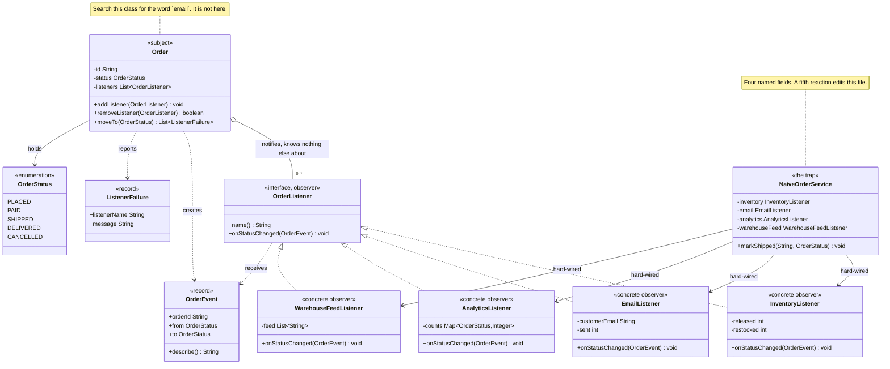

# Observer Pattern — Class Diagram

Shows the static structure. `Order` holds a list of `OrderListener` and knows
nothing else about the four things on it — search the class for "email" and it
is not there. The four listeners are peers: none of them knows the others
exist. `NaiveOrderService` is drawn alongside with its four named fields, which
is exactly what the pattern is buying its way out of.

Mermaid source

## Notes

**The aggregation from `Order` to `OrderListener` is the pattern.** It is
`0..*`, and the multiplicity matters in both directions: zero listeners is a
perfectly good order, and adding the thousandth changes no code in `Order`.

**The four listeners have no relationship to each other.** There is no arrow
between them because there is no dependency between them, and that is the
property the design exists to protect. A listener that needed to run after
another one would need an arrow, and at that point they are one listener.

**`OrderEvent` flows one way.** `Order` creates it and every listener receives
it; nothing hands a listener a reference back to the `Order`. That is the GoF
*push* model, chosen so that a listener cannot change the subject halfway
through a notification.

**`ListenerFailure` is returned, not thrown.** It is the visible half of the
decision that a broken listener must not stop the ones after it.

**The four `hard-wired` arrows out of `NaiveOrderService` are the cost.** Each
is a compile-time dependency on a concrete class, and a fifth reaction adds a
fifth arrow — plus an edit to `markShipped`, plus a re-test of everything that
called it.

See [`uml-diagram.md`](uml-diagram.md) for the sequence, which is where the
failure-isolation behaviour actually becomes visible.
