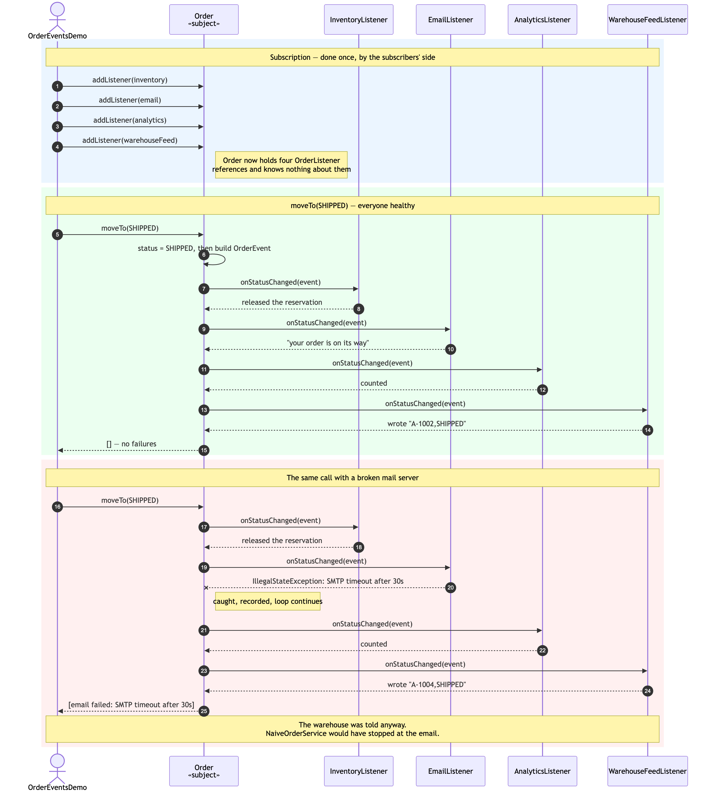
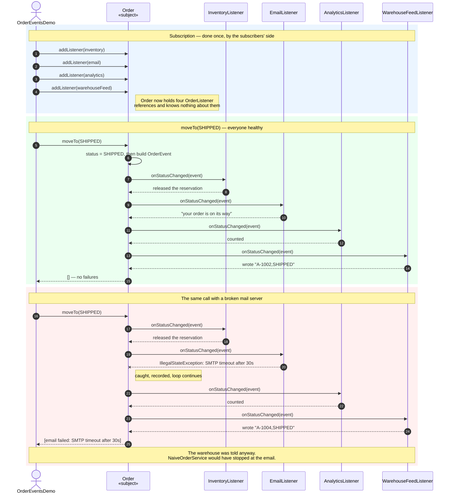

# Observer Pattern — Sequence Diagram

Shows the same call, `moveTo(SHIPPED)`, twice: once with every listener
healthy, and once with a mail server that times out. The second run is the
one worth staring at.

Mermaid source

## Notes

**Subscription happens once, and the subscribers' side drives it.** Steps 1 to
4 are the only place in the whole diagram where anyone names a concrete
listener class. After that, every message is sent through the interface.

**`Order` updates its own status before it notifies (step 6).** A listener that
does look at the order sees the world the event describes, not the one it
replaced.

**The four notifications are identical messages to four different objects.**
There is no branch in `Order` choosing what to send to whom — it is one loop
sending `onStatusChanged(event)` to whatever is on the list.

**Step 20 is the whole point of the third block.** `EmailListener` throws;
`Order` catches it, records a `ListenerFailure`, and carries straight on to
steps 21 through 24. Analytics is still counted and the warehouse feed is still
written. Under `NaiveOrderService` the sequence would end at step 20 with an
exception thrown at the caller, an order already marked shipped, and a parcel
nobody has been told to pick.

**The caller is handed the failures rather than an exception (step 25).** It
can log them, retry the named listener, or raise an alert — and it still has a
successfully shipped order to work with.

See [`class-diagram.md`](class-diagram.md) for the static structure.
