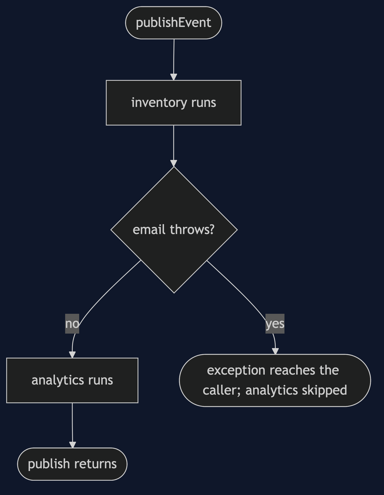
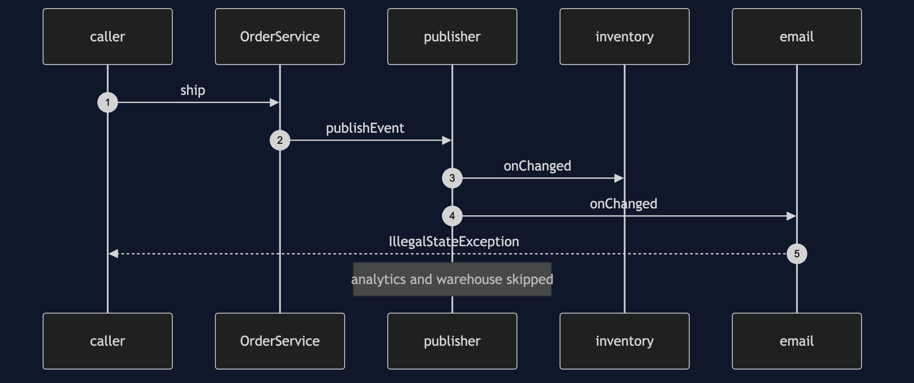

# Observer with Spring Pattern

```
src/main/java/com/jk/explore/observerspring/
├── OrderEventsApplication.java   the Spring Boot entry point and the six acts
├── OrderService.java             the subject: holds only a publisher
├── OrderStatusChanged.java  OrderRefunded.java     the two events
├── InventoryListener.java  EmailListener.java  AnalyticsListener.java   ordered observers
├── ShippedOnlyListener.java      filters by a condition
├── AuditListener.java            runs on another thread
└── Journal.java  Gate.java       what the demo reads back
```

**In Spring an observer is a method with an annotation. Delivery is synchronous by default, and nobody tells the publisher who is listening.**

This project is the framework version of [Observer](../observer-pattern). That project built the mechanism by hand. This one shows the same idea inside Spring Boot. It does not re-teach the pattern. It shows what Spring Boot adds, the failures that are its own, and what it costs.

## Run

```bash
./gradlew run
```

Six acts. The partner project, Observer, built the mechanism by hand. Here the same idea runs through Spring Boot, and every count comes from real output.

```
ONE. The subject knows nobody.
  inventory: released stock for ORD-000001 on main
  email: told the customer about ORD-000001
  analytics: counted ORD-000001 as SHIPPED
  warehouse feed: pick line for ORD-000001
TWO. On the caller's thread.
  the caller is main, and every listener above ran on it.
THREE. One listener fails.
  the caller got: mail server timed out.
  order shipped: true.
  inventory: released stock for ORD-000002 on main
  analytics and the warehouse feed never heard about ORD-000002.
FOUR. A listener on another thread.
  cancel() has returned. journal so far: [inventory: released stock for ORD-000003 on main, email: told the customer about ORD-000003, analytics: counted ORD-000003 as CANCELLED].
  after the gate opened: 1 audit line, on a thread named task-1.
FIVE. A listener that filters.
  shipped: the warehouse feed heard: true.
  cancelled: the warehouse feed heard: false.
SIX. An event nobody listens to.
  refund published. listeners that ran: 0. errors: 0.
  a publisher cannot tell whether anyone is listening.
```

## Test

```bash
./gradlew test
```

2 test classes, 6 test methods, offline, with each Spring context started inside the test, and no server.

## Technologies and versions

| What | Version | Why it is here |
| --- | --- | --- |
| Java | 21 | The repository standard, via the Gradle toolchain block |
| Gradle | 9.2.1 | The wrapper in this directory; no separate install needed |
| Spring Boot | 4.1.1 | The container and its events |
| JUnit 5 | 5.10.2 | Test runner |

See [`docs/dependencies.md`](docs/dependencies.md).

## Learning Material

| Document | What it covers |
| --- | --- |
| [`docs/problem-statement.md`](docs/problem-statement.md) | The partner's order, and what is new |
| [`docs/observer-with-spring-pattern-explained.md`](docs/observer-with-spring-pattern-explained.md) | Built-in events, and how delivery really behaves |
| [`docs/class-diagram.md`](docs/class-diagram.md) | The types |
| [`docs/architecture-diagram.md`](docs/architecture-diagram.md) | An order, a publisher and its listeners |
| [`docs/data-flow-diagram.md`](docs/data-flow-diagram.md) | What happens when a listener fails |
| [`docs/sequence-diagram.md`](docs/sequence-diagram.md) | Written for a listener with the screen off |
| [`docs/uml-diagram.md`](docs/uml-diagram.md) | Four sequences |
| [`docs/animation.html`](docs/animation.html) | The six acts in a browser |
| [`docs/prerequisites.md`](docs/prerequisites.md) | What you need to know |
| [`docs/session.md`](docs/session.md) | A one-hour taught session |
| [`docs/spec.md`](docs/spec.md) | The generated specification |
| [`docs/youtube.md`](docs/youtube.md) | Title, description and chapters |
| [`docs/dependencies.md`](docs/dependencies.md) | What Spring Boot is, what it costs, and that skipping this project loses none of the pattern |

### The pattern in one picture


### Where each piece sits


### How one request moves



### Who calls whom, in order



### All four sequences


### Video

Built from [`video/scenes.py`](video/scenes.py) by
[`video/build_video.sh`](video/build_video.sh). The rendered file is not
committed; see the repository README for why.

## Where you have already met this

Every Spring application that reacts to something: startup, a context refresh, or your own domain events.

## When this is too much

When there is one reaction and it must succeed, call it directly. An event is for reactions that may come and go.

## Where this sits

This project pairs with [Observer](../observer-pattern), and is a framework version in [`behavioural`](..).
