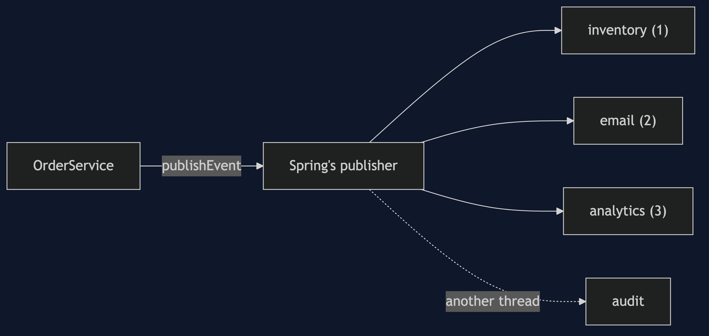
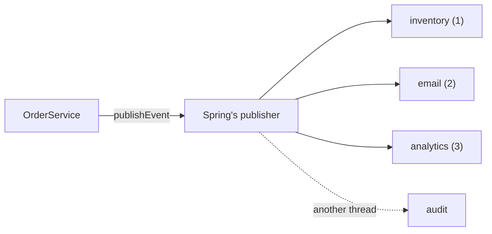

# Observer with Spring Pattern — Architecture Diagram

The order publishes. Spring finds the listeners by the event's type.

Mermaid source

```mermaid
flowchart LR
    O["OrderService"] -->|publishEvent| P["Spring's publisher"]
    P --> I["inventory (1)"]
    P --> E["email (2)"]
    P --> A["analytics (3)"]
    P -.->|another thread| U["audit"]
```

