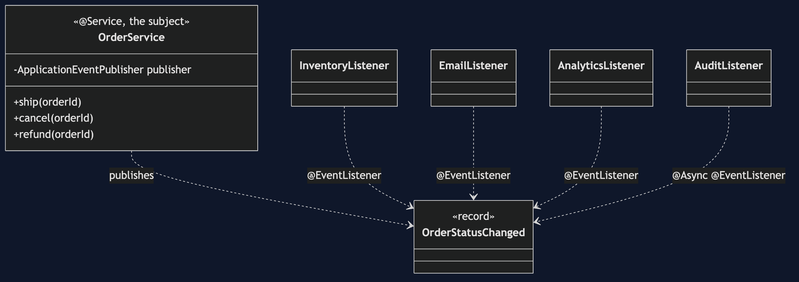
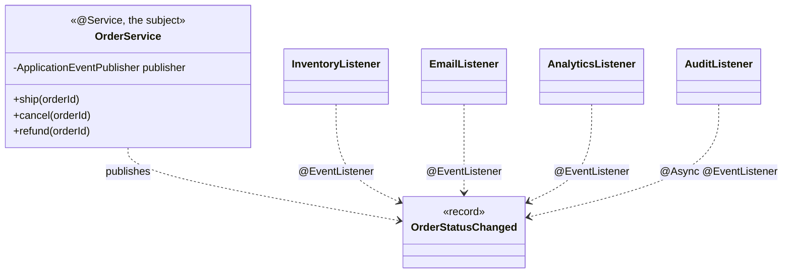

# Observer with Spring Pattern — Class Diagram

`OrderService` holds a publisher. Each listener is a bean with one annotated method.

Mermaid source

```mermaid
classDiagram
    class OrderService {
        <<@Service, the subject>>
        -ApplicationEventPublisher publisher
        +ship(orderId)
        +cancel(orderId)
        +refund(orderId)
    }
    class OrderStatusChanged {
        <<record>>
    }
    class InventoryListener
    class EmailListener
    class AnalyticsListener
    class AuditListener
    OrderService ..> OrderStatusChanged : publishes
    InventoryListener ..> OrderStatusChanged : @EventListener
    EmailListener ..> OrderStatusChanged : @EventListener
    AnalyticsListener ..> OrderStatusChanged : @EventListener
    AuditListener ..> OrderStatusChanged : @Async @EventListener
```

