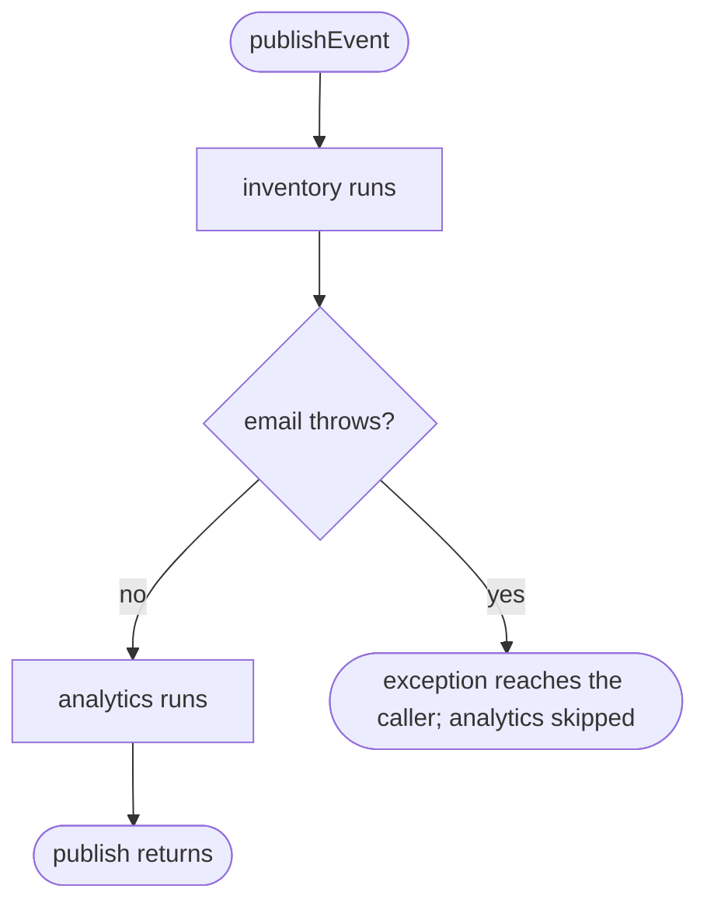

# Observer with Spring Pattern — Data Flow Diagram

What a synchronous publish does when a listener throws.

Mermaid source

```mermaid
flowchart TD
    Pub(["publishEvent"])
    L1["inventory runs"]
    L2{"email throws?"}
    L3["analytics runs"]
    Err(["exception reaches the caller; analytics skipped"])
    Ok(["publish returns"])
    Pub --> L1 --> L2
    L2 -- no --> L3 --> Ok
    L2 -- yes --> Err
```

