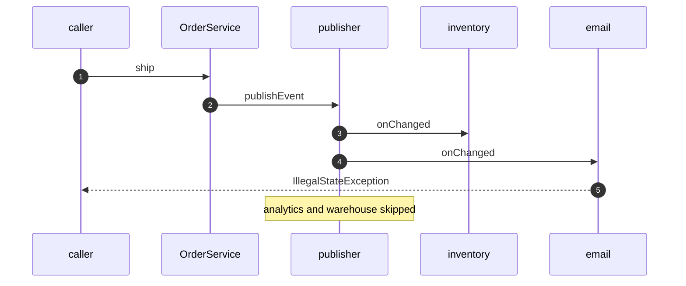

# Observer with Spring Pattern — Sequence Diagram

Written for a listener with the screen off.

Say it in words. The caller ships an order. The order marks itself shipped, then publishes the event. Inventory runs first and succeeds. Email runs second and throws. The exception travels back up through the publisher and the order, and lands on the caller. Analytics and the warehouse feed never run.

Mermaid source

The load-bearing sentence: **a synchronous publish is a method call, and a failure travels back to the caller.**
