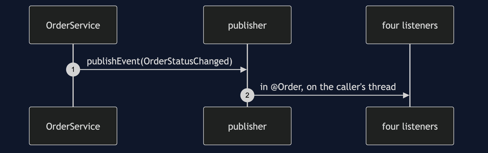
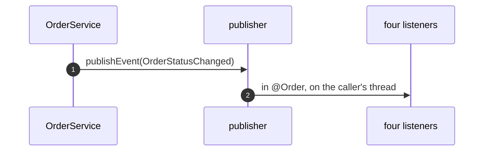
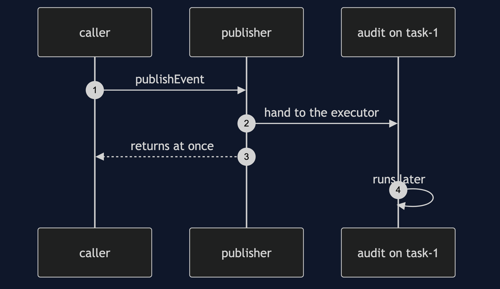
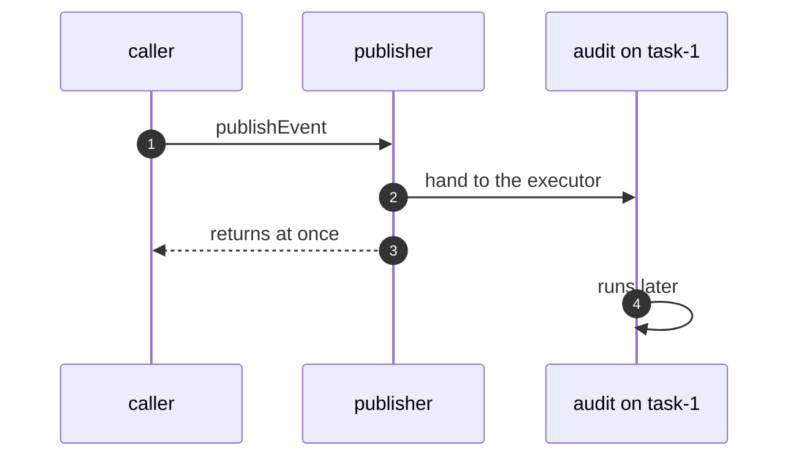

# Observer with Spring Pattern — UML Sequence Diagrams

Four sequences.

## 1. A Shipment

Mermaid source

```mermaid
sequenceDiagram
    autonumber
    participant O as OrderService
    participant P as publisher
    participant L as four listeners
    O->>P: publishEvent(OrderStatusChanged)
    P->>L: in @Order, on the caller's thread
```

## 2. An Async Listener

Mermaid source

```mermaid
sequenceDiagram
    autonumber
    participant C as caller
    participant P as publisher
    participant A as audit on task-1
    C->>P: publishEvent
    P->>A: hand to the executor
    P-->>C: returns at once
    A->>A: runs later
```

