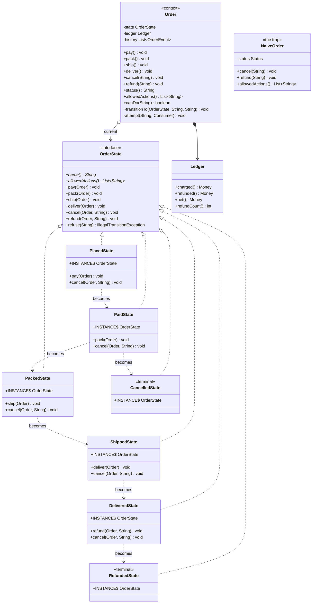

# State Pattern — Class Diagram

Shows the static structure. `Order` holds one `OrderState` and forwards every
request to it; seven classes implement that interface.

Read the picture with one thing in mind: **it is indistinguishable from a
Strategy diagram.** A context, an interface, some implementations. If you were
handed this drawing with the names removed you could not say which pattern it
is. The difference lives in the two dashed arrows at the bottom — states
naming other states — and in the fact that nobody outside chooses which one
`Order` is holding.

Mermaid source

## What Each Box Owns

| Class | Overrides | Refuses by not overriding |
| --- | --- | --- |
| `PlacedState` | `pay`, `cancel` | pack, ship, deliver, refund |
| `PaidState` | `pack`, `cancel` | pay, ship, deliver, refund |
| `PackedState` | `ship`, `cancel` | pay, pack, deliver, refund |
| `ShippedState` | `deliver`, `cancel`¹ | pay, pack, ship, refund |
| `DeliveredState` | `refund`, `cancel`¹ | pay, pack, ship, deliver |
| `CancelledState` | nothing | everything |
| `RefundedState` | nothing | everything |

¹ These two override `cancel` in order to *refuse it with a better reason*.
The inherited default would have said "the only thing it will accept is
deliver", which is true and unhelpful; the override says "it is already with
the courier — the customer must refuse delivery or return it".

The right-hand column is the part worth staring at. Those refusals are not
code. They are the absence of code, and that is why a rule nobody thought to
write ends up closed instead of open.

## What Is Deliberately Not On The Diagram

**A transition table.** There isn't one. The dashed arrows are the whole of
it, and they live in seven different files. This is the cost of the pattern
drawn honestly: the enum version has the entire lifecycle in one switch you
can read in ten seconds, and this version does not.

**An arrow from anything to a state.** Nothing outside the package constructs
or selects a state. `transitionTo` is package-private, and the states are the
only callers. Compare Strategy, where the caller picking the implementation is
the point.

**State fields.** Every state is stateless, so there is one `INSTANCE` of each
and all orders in the process share them. Two orders that are both `PAID` are
literally pointing at the same object, which `OrderLifecycleTest` asserts with
`assertSame`.

## The Eighth Box

`OrderStateDemo` declares an anonymous `AT-LOCKER` state inside the demo file.
It is not on the diagram because it is not in `src/main` — which is the point.
`Order` was compiled without it and accepts it anyway.

See [`uml-diagram.md`](uml-diagram.md) for what happens at run time, and
[`animation.html`](animation.html) to step through it.
