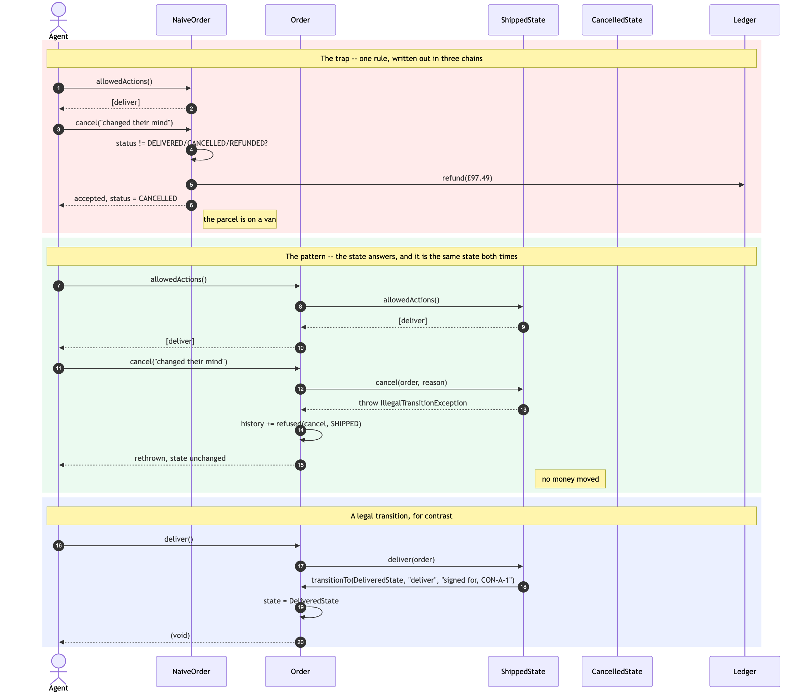
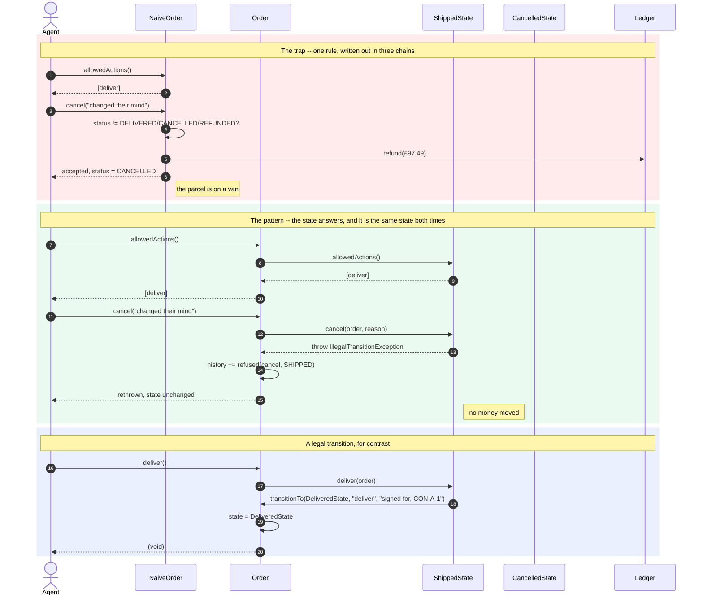
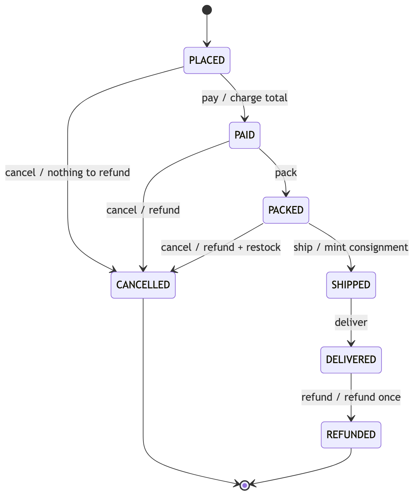
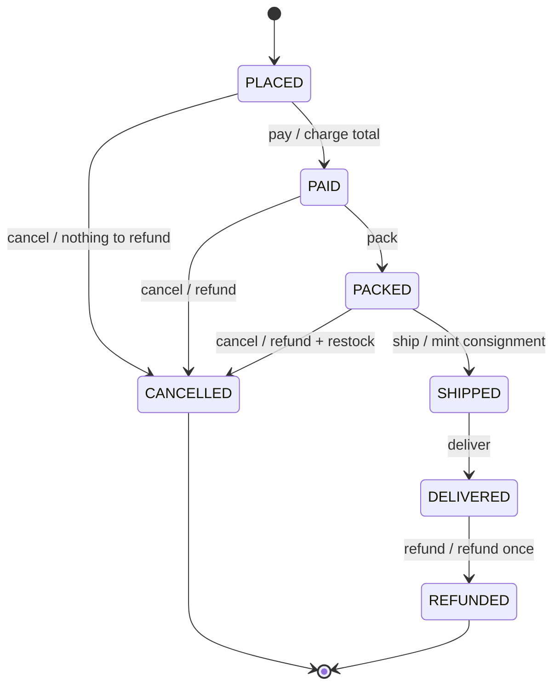

# State Pattern — Sequence Diagram

The same two requests — cancel a shipped order, then refund an already
cancelled one — sent first to `NaiveOrder` and then to `Order`.

Nothing about the requests changes. What changes is who answers them, and the
second half has no conditional in it anywhere.



<details>
<summary>Mermaid source</summary>



</details>

## Reading It

**The two lifelines that matter are `Order` and `ShippedState`.** Every arrow
leaving `Order` in the green block goes to the same place, whatever was asked.
There is no branch on the `Order` lifeline, because there is nothing on it to
branch on — `status` is not a field it reads, it is a question it forwards.

**The refusal travels back through `Order`, not around it.** `attempt` catches
the exception, appends a `refused` event to the history, and rethrows. So the
audit trail records the attempt whether or not it succeeded:

```
refund   CANCELLED  -> CANCELLED  refused: it is final, and nothing more can happen to it
```

**The `Ledger` lifeline is idle in the green block.** That is the whole
difference between the two halves rendered as an absence: in the red block the
shop pays out £97.49 for a parcel that is still in transit, and in the green
one nobody touches the money.

**Step 16 is the pattern.** `ShippedState` calls `transitionTo` on the very
object that called it, naming `DeliveredState`. The state change is the last
thing that happens, after the work, and it is caused by the work. That
returning arrow — the state deciding what the context becomes — is what a
Strategy sequence diagram never has.

## The State Machine It Implements



<details>
<summary>Mermaid source</summary>



</details>

Every arrow above is one overridden method. Every arrow that is *not* above —
and there are thirty-three of them, six actions across seven states minus the
nine drawn — is a method somebody did not override.

`NaiveOrder` implements this same picture with two extra arrows it did not
mean to draw: `SHIPPED --> CANCELLED` and `CANCELLED --> REFUNDED`.

## What Is Not Drawn

**The other six states' lifelines.** They would be idle. A request only ever
reaches one state, and that is the claim: there is no dispatcher consulting a
table, no chain being walked, and no second object involved in deciding.

**A failure path for `transitionTo`.** It cannot fail. By the time it is
called the work is done and the state has already decided; it appends an event
and assigns a field.

**`Order` validating anything.** It never does. The nearest it comes is
`attempt`, which knows the *name* of the action purely so it can write the
history entry, and does not know what the action means.

See [`class-diagram.md`](class-diagram.md) for the static structure, and
[`animation.html`](animation.html) to step through the lifecycle one request
at a time.
