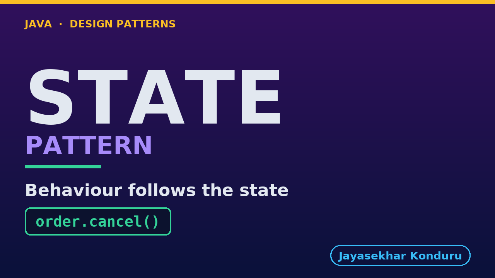

# YouTube — State Pattern

Everything needed to publish `video/state-pattern-explained.mp4`. Copy the fields straight out of this file.

Chapter timings are generated from the video's `.srt`. Re-run `python3 docs/make_youtube_docs.py state` after any change to the narration, or they will be wrong.

## Title

```
State Pattern in Java - The Order Lifecycle
```

43 characters — under the 60 YouTube shows before truncating in search results.

## Description

The first two lines are what a viewer sees above the fold, so they carry the hook rather than the boilerplate.

```
Learn the State design pattern in Java 21 by building the order lifecycle for an online store — placed, paid, packed, shipped, delivered, with cancellations and refunds. We start with the problem — a status field and one chain of conditionals per method, where `cancel` was phrased as "anything that has not arrived yet" and so refunds a parcel that is already on a van, `refund` was widened to accept cancelled orders and so pays the customer a second time, and a third copy written for the screen is correct and disagrees with both — and end with one class per state, an interface where every request refuses by default so a rule nobody wrote is a refusal rather than an accident, a context with no conditionals in it at all, an eighth state added without touching a single existing file, and a test that walks all seven states and all six actions to prove the buttons and the endpoints agree. Also covers what really separates State from Strategy when the two have identical class diagrams, and the honest cost — seven classes, and a transition table that no longer exists anywhere you can read it. No prior design-pattern knowledge needed. Full source code and written notes are in the repository.

CHAPTERS
00:00 Introduction
01:02 The Scenario
01:40 Look Closely at One Row
02:22 The Naive Approach — One Rule, Three Copies
03:28 Why That Hurts
04:15 The State Pattern
04:54 Everyday Analogy: The Vending Machine
05:36 The Roles
06:23 Every Request Refuses By Default
07:14 The Context Has No Conditionals At All
07:59 Same Verb, Genuinely Different Work
08:57 The Test That Proves It
09:47 Running It
10:32 What to Remember
12:04 Thanks for Watching

SOURCE CODE, WRITTEN NOTES AND AN INTERACTIVE ANIMATION
https://github.com/jk-boot-up/java-design-patterns/tree/main/gradle-java/behavioural/state-pattern

WHAT YOU NEED FIRST
Java 21 and a working knowledge of classes and interfaces. No prior design-pattern knowledge is assumed. The full prerequisites are in docs/prerequisites.md in the repository.
```

## Chapters

YouTube renders these as chapters only if there are at least three and the first is at `00:00`.

```
00:00 Introduction
01:02 The Scenario
01:40 Look Closely at One Row
02:22 The Naive Approach — One Rule, Three Copies
03:28 Why That Hurts
04:15 The State Pattern
04:54 Everyday Analogy: The Vending Machine
05:36 The Roles
06:23 Every Request Refuses By Default
07:14 The Context Has No Conditionals At All
07:59 Same Verb, Genuinely Different Work
08:57 The Test That Proves It
09:47 Running It
10:32 What to Remember
12:04 Thanks for Watching
```

## Tags

```
state pattern, state machine java, order lifecycle, design patterns, java design patterns, gang of four, java 21, software design, clean code, object oriented design, java tutorial, ecommerce, programming tutorial
```

213 characters, under YouTube's 500 limit.

## Thumbnail



**Upload `docs/thumbnail.png`** — 1280×720, the size YouTube recommends, generated by `docs/make_thumbnails.py`. It is deliberately not the same image as the video's opening frame: a thumbnail is judged at about 360 pixels wide in a search result, so this one carries only the pattern name, one line of promise and one short piece of code, each set large enough to survive the shrink.

`video/poster.png` is the 1920×1080 opening frame, produced by the video build. It stays in the repository as the title card; it is not what gets uploaded.

YouTube will not pick the thumbnail up on its own — upload it under **Details → Thumbnail → Upload file**. A custom thumbnail requires a verified channel.

## Upload checklist

- [ ] Upload `video/state-pattern-explained.mp4` (1080p, H.264, 30 fps, AAC 48 kHz — already YouTube's recommended settings, no re-encode needed)
- [ ] Set the video language to **English** first, or the subtitle option may not appear
- [ ] Add subtitles: *Video elements → Add subtitles → Upload file → With timing* → `video/state-pattern-explained.srt`
- [ ] Upload `docs/thumbnail.png` as the thumbnail — do not let YouTube auto-pick a frame
- [ ] Paste the title, description and tags from above
- [ ] Add to the **Java Design Patterns** playlist, in learning order
- [ ] Wait for 1080p processing before sharing the link — code slides are unreadable at 360p

## Cards and end screen

End screen links to whichever pattern video goes up next — set it at upload time rather than assuming an order.

Add a card partway through pointing at the playlist, so a viewer who arrives at this pattern from search can find the rest of the series.

## Runtime

Approximately 12:42, narrated at 145 words per minute.
